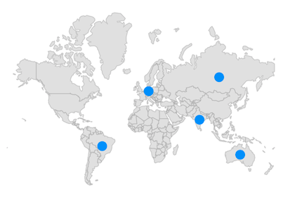
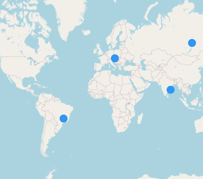
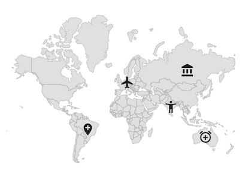
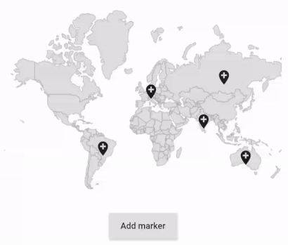
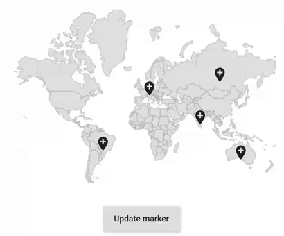
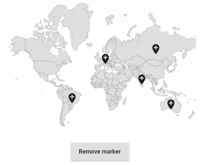

# Markers in the Flutter Maps

Markers can be used to denote the locations. It is possible to use the built-in symbols or display a custom widget at a specific latitude and longitude on a map.

## Adding markers

### Shape layer

You can show markers at any position on the map by providing latitude and longitude position to the [`MapMarker`](https://pub.dev/documentation/syncfusion_flutter_maps/latest/maps/MapMarker-class.html), which is the widget returns from the [`MapShapeLayer.markerBuilder`](https://pub.dev/documentation/syncfusion_flutter_maps/latest/maps/MapShapeLayer/markerBuilder.html) property.

The [`markerBuilder`](https://pub.dev/documentation/syncfusion_flutter_maps/latest/maps/MapShapeLayer/markerBuilder.html) callback will be called number of times equal to the value specified in the [`initialMarkersCount`](https://pub.dev/documentation/syncfusion_flutter_maps/latest/maps/MapShapeLayer/initialMarkersCount.html) property. The default value of the [`initialMarkersCount`](https://pub.dev/documentation/syncfusion_flutter_maps/latest/maps/MapShapeLayer/initialMarkersCount.html) property is `null`.




List<Model> data;

@override
void initState() {
    data = const <Model>[
      Model('Brazil', -14.235004, -51.92528),
      Model('Germany', 51.16569, 10.451526),
      Model('Australia', -25.274398, 133.775136),
      Model('India', 20.593684, 78.96288),
      Model('Russia', 61.52401, 105.318756)
    ];

    super.initState();
}

@override
Widget build(BuildContext context) {
   return Scaffold(
      body: Center(
          child: Container(
        height: 350,
        child: Padding(
          padding: EdgeInsets.only(left: 15, right: 15),
          child: SfMaps(
            layers: <MapLayer>[
              MapShapeLayer(
                delegate: MapShapeLayerDelegate(
                  shapeFile: 'assets/world_map.json',
                  shapeDataField: 'name',
                  dataCount: data.length,
                  primaryValueMapper: (index) => data[index].country,
                ),
                initialMarkersCount: 5,
                markerBuilder: (BuildContext context, int index) {
                  return MapMarker(
                    latitude: data[index].latitude,
                    longitude: data[index].longitude,
                  );
                },
              ),
            ],
          ),
        ),
      )),
   );
}

class Model {
  const Model(this.country, this.latitude, this.longitude);

  final String country;
  final double latitude;
  final double longitude;
}




N>
* Refer the [`markerBuilder`](https://pub.dev/documentation/syncfusion_flutter_maps/latest/maps/MapShapeLayer/markerBuilder.html), for returning the [`MapMarker`](https://pub.dev/documentation/syncfusion_flutter_maps/latest/maps/MapMarker-class.html).
* Refer the [`controller`](https://pub.dev/documentation/syncfusion_flutter_maps/latest/maps/MapShapeLayer/controller.html), for dynamically updating the markers.

### Tile layer

You can show markers at any position on the map by providing latitude and longitude position to the [`MapMarker`](https://pub.dev/documentation/syncfusion_flutter_maps/latest/maps/MapMarker-class.html), which is the widget returns from the [`MapTileLayer.markerBuilder`] property.

The [`markerBuilder`] callback will be called number of times equal to the value specified in the [`initialMarkersCount`] property. The default value of the [`initialMarkersCount`] property is `null`.




List<Model> data;

@override
void initState() {
    data = const <Model>[
      Model('Brazil', -14.235004, -51.92528),
      Model('Germany', 51.16569, 10.451526),
      Model('Australia', -25.274398, 133.775136),
      Model('India', 20.593684, 78.96288),
      Model('Russia', 61.52401, 105.318756)
    ];

    super.initState();
}

@override
Widget build(BuildContext context) {
  return Scaffold(
    body: Center(
      child: Container(
        height: 350,
        child: SfMaps(
          layers: <MapLayer>[
            MapTileLayer(
              urlTemplate: 'https://tile.openstreetmap.org/{z}/{x}/{y}.png',
              initialMarkersCount: 5,
              markerBuilder: (BuildContext context, int index) {
                return MapMarker(
                  latitude: data[index].latitude,
                  longitude: data[index].longitude,
                  iconColor: Colors.blue,
                );
              },
            ),
          ],
        ),
      ),
    ),
  );
}

class Model {
  const Model(this.country, this.latitude, this.longitude);

  final String country;
  final double latitude;
  final double longitude;
}




N>
* Refer the [`markerBuilder`], for returning the [`MapMarker`](https://pub.dev/documentation/syncfusion_flutter_maps/latest/maps/MapMarker-class.html).
* Refer the [`controller`] for dynamically updating the markers.

## Appearance customization

You can customize the built-in markers appearance using the [`iconType`](https://pub.dev/documentation/syncfusion_flutter_maps/latest/maps/MapMarker/iconType.html), [`iconColor`](https://pub.dev/documentation/syncfusion_flutter_maps/latest/maps/MapMarker/iconColor.html), [`iconStrokeColor`](https://pub.dev/documentation/syncfusion_flutter_maps/latest/maps/MapMarker/iconStrokeColor.html), [`iconStrokeWidth`](https://pub.dev/documentation/syncfusion_flutter_maps/latest/maps/MapMarker/iconStrokeWidth.html), and [`size`](https://pub.dev/documentation/syncfusion_flutter_maps/latest/maps/MapMarker/size.html) properties of the [`MapMarker`](https://pub.dev/documentation/syncfusion_flutter_maps/latest/maps/MapMarker-class.html).

N>
* The default value of the [`iconType`](https://pub.dev/documentation/syncfusion_flutter_maps/latest/maps/MapMarker/iconType.html) is `MapIconType.circle`.
* The default value of the [`iconStrokeWidth`](https://pub.dev/documentation/syncfusion_flutter_maps/latest/maps/MapMarker/iconStrokeWidth.html) is `1.0`.
* The default value of the [`iconColor`](https://pub.dev/documentation/syncfusion_flutter_maps/latest/maps/MapMarker/iconColor.html) is `Colors.blue`.
* The default value of the [`size`](https://pub.dev/documentation/syncfusion_flutter_maps/latest/maps/MapMarker/size.html) is `Size(14.0, 14.0)`.




List<Model> data;

@override
void initState() {
    data = <Model>[
      Model(-14.235004, -51.92528),
      Model(51.16569, 10.451526),
      Model(-25.274398, 133.775136),
      Model(20.593684, 78.96288),
      Model(61.52401, 105.318756)
    ];

    super.initState();
}

@override
Widget build(BuildContext context) {
    return Scaffold(
      body: Center(
          child: Container(
            height: 350,
            child: Padding(
              padding: EdgeInsets.only(left: 15, right: 15),
              child: SfMaps(
                layers: <MapLayer>[
                  MapShapeLayer(
                    delegate: MapShapeLayerDelegate(
                      shapeFile: 'assets/world_map.json',
                      shapeDataField: 'name',
                    ),
                    initialMarkersCount: 5,
                    markerBuilder: (BuildContext context, int index){
                      return MapMarker(
                        latitude: data[index].latitude,
                        longitude: data[index].longitude,
                        iconType: MapIconType.triangle,
                        size: Size(18, 18),
                        iconColor: Colors.green[200],
                        iconStrokeColor: Colors.green[900],
                        iconStrokeWidth: 2,
                      );
                    },
                  ),
                ],
              ),
            ),
          )
      ),
   );
}

class Model {
  Model(this.latitude, this.longitude);

  final double latitude;
  final double longitude;
}




## Adding custom markers

You can show custom marker using the `child` property of the [`MapMarker`](https://pub.dev/documentation/syncfusion_flutter_maps/latest/maps/MapMarker-class.html) which returns from the [`markerBuilder`](https://pub.dev/documentation/syncfusion_flutter_maps/latest/maps/MapShapeLayer/markerBuilder.html).




List<Model> data;
List<Widget> iconsList;

@override
void initState() {
     data = <Model>[
       Model(-14.235004, -51.92528),
       Model(51.16569, 10.451526),
       Model(-25.274398, 133.775136),
       Model(20.593684, 78.96288),
       Model(61.52401, 105.318756)
     ];

     iconsList = <Widget>[
       Icon(Icons.add_location),
       Icon(Icons.airplanemode_active),
       Icon(Icons.add_alarm),
       Icon(Icons.accessibility_new),
       Icon(Icons.account_balance)
     ];

     super.initState();
}

@override
Widget build(BuildContext context) {
     return Scaffold(
       body: Center(
           child: Container(
             height: 350,
             child: Padding(
               padding: EdgeInsets.only(left: 15, right: 15),
               child: SfMaps(
                 layers: <MapLayer>[
                   MapShapeLayer(
                     delegate: MapShapeLayerDelegate(
                       shapeFile: 'assets/world_map.json',
                       shapeDataField: 'name',
                     ),
                     initialMarkersCount: 5,
                     markerBuilder: (BuildContext context, int index){
                       return MapMarker(
                         latitude: data[index].latitude,
                         longitude: data[index].longitude,
                         child: iconsList[index],
                       );
                     },
                   ),
                 ],
               ),
             ),
           )
       ),
     );
  }
}

class Model {
   Model(this.latitude, this.longitude);

   final double latitude;
   final double longitude;
}




## Adding markers dynamically

You can add markers dynamically using the [`MapShapeLayerController.insertMarker`](https://pub.dev/documentation/syncfusion_flutter_maps/latest/maps/MapShapeLayerController/insertMarker.html) method. The [`markerBuilder`](https://pub.dev/documentation/syncfusion_flutter_maps/latest/maps/MapShapeLayer/markerBuilder.html) will be called for the respective index once [`insertMarker`](https://pub.dev/documentation/syncfusion_flutter_maps/latest/maps/MapShapeLayerController/insertMarker.html) method is called. The [`controller`](https://pub.dev/documentation/syncfusion_flutter_maps/latest/maps/MapShapeLayer/controller.html) property of [`MapShapeLayer`](https://pub.dev/documentation/syncfusion_flutter_maps/latest/maps/MapShapeLayer-class.html) has to be set with the new instance of [`MapShapeLayerController`](https://pub.dev/documentation/syncfusion_flutter_maps/latest/maps/MapShapeLayerController-class.html).

Marker will be inserted at the given index if the index value is less than or equal to the current available index and the marker will be added as a last item if the index value is greater than the current available index.

N> You can get the current markers count from [`MapShapeLayerController.markersCount`](https://pub.dev/documentation/syncfusion_flutter_maps/latest/maps/MapShapeLayerController/markersCount.html).




List<Model> data;
MapShapeLayerController controller;
Random random = Random();

@override
void initState() {
    data = <Model>[
      Model(-14.235004, -51.92528),
      Model(51.16569, 10.451526),
      Model(-25.274398, 133.775136),
      Model(20.593684, 78.96288),
      Model(61.52401, 105.318756)
    ];

    controller = MapShapeLayerController();
    super.initState();
}

@override
Widget build(BuildContext context) {
    return Scaffold(
      body: Center(
          child: Container(
            height: 350,
            child: Padding(
              padding: EdgeInsets.only(left: 15, right: 15),
              child: Column(
                children: [
                  SfMaps(
                    layers: <MapLayer>[
                      MapShapeLayer(
                        delegate: MapShapeLayerDelegate(
                          shapeFile: 'assets/world_map.json',
                          shapeDataField: 'name',
                        ),
                        initialMarkersCount: 5,
                        markerBuilder: (BuildContext context, int index){
                          return MapMarker(
                            latitude: data[index].latitude,
                            longitude: data[index].longitude,
                            child: Icon(Icons.add_location),
                          );
                        },
                        controller: controller,
                      ),
                    ],
                  ),
                  RaisedButton(
                    child: Text('Add marker'),
                    onPressed: () {
                      data.add(Model(
                          -180 + random.nextInt(360).toDouble(),
                          -55 + random.nextInt(139).toDouble()));
                      controller.insertMarker(5);
                    },
                  ),
                ],
              ),
            ),
          )
      ),
   );
}

class Model {
  Model(this.latitude, this.longitude);

  final double latitude;
  final double longitude;
}




## Updating the existing markers

You can update multiple markers at a same time by passing indices to the [`updateMarkers`](https://pub.dev/documentation/syncfusion_flutter_maps/latest/maps/MapShapeLayerController/updateMarkers.html) method in the [`MapShapeLayerController`](https://pub.dev/documentation/syncfusion_flutter_maps/latest/maps/MapShapeLayerController-class.html). The [`markerBuilder`](https://pub.dev/documentation/syncfusion_flutter_maps/latest/maps/MapShapeLayer/markerBuilder.html) will be called again for the respective indices once [`updateMarkers`](https://pub.dev/documentation/syncfusion_flutter_maps/latest/maps/MapShapeLayerController/updateMarkers.html) method is called.

N> You can get the current markers count from [`MapShapeLayerController.markersCount`](https://pub.dev/documentation/syncfusion_flutter_maps/latest/maps/MapShapeLayerController/markersCount.html).




List<Model> data;
MapShapeLayerController controller;
Widget markerWidget;

@override
void initState() {
    data = <Model>[
      Model(-14.235004, -51.92528),
      Model(51.16569, 10.451526),
      Model(-25.274398, 133.775136),
      Model(20.593684, 78.96288),
      Model(61.52401, 105.318756)
    ];

    controller = MapShapeLayerController();
    markerWidget =  Icon(Icons.add_location);
    super.initState();
}

@override
Widget build(BuildContext context) {
    return Scaffold(
      body: Center(
          child: Container(
            height: 350,
            child: Padding(
              padding: EdgeInsets.only(left: 15, right: 15),
              child: Column(
                children: [
                  SfMaps(
                    layers: <MapLayer>[
                      MapShapeLayer(
                        delegate: MapShapeLayerDelegate(
                          shapeFile: 'assets/world_map.json',
                          shapeDataField: 'name',
                        ),
                        initialMarkersCount: 5,
                        markerBuilder: (BuildContext context, int index){
                          return MapMarker(
                            latitude: data[index].latitude,
                            longitude: data[index].longitude,
                            child: markerWidget,
                          );
                        },
                        controller: controller,
                      ),
                    ],
                  ),
                  RaisedButton(
                    child: Text('Update marker'),
                    onPressed: () {
                      List<int> updateList = <int>[1, 2];
                      markerWidget = Icon(Icons.airplanemode_active);
                      controller.updateMarkers(updateList);
                    },
                  ),
                ],
              ),
            ),
          )
      ),
   );
}

class Model {
  Model(this.latitude, this.longitude);

  final double latitude;
  final double longitude;
}




## Deleting a marker

You can remove marker at any index using the [`removeMarkerAt`](https://pub.dev/documentation/syncfusion_flutter_maps/latest/maps/MapShapeLayerController/removeMarkerAt.html) method.

N> You can get the current markers count from [`MapShapeLayerController.markersCount`](https://pub.dev/documentation/syncfusion_flutter_maps/latest/maps/MapShapeLayerController/markersCount.html).




List<Model> data;
MapShapeLayerController controller;

@override
void initState() {
    data = <Model>[
      Model(-14.235004, -51.92528),
      Model(51.16569, 10.451526),
      Model(-25.274398, 133.775136),
      Model(20.593684, 78.96288),
      Model(61.52401, 105.318756)
    ];
    controller = MapShapeLayerController();
    super.initState();
}

@override
Widget build(BuildContext context) {
    return Scaffold(
      body: Center(
          child: Container(
            height: 350,
            child: Padding(
              padding: EdgeInsets.only(left: 15, right: 15),
              child: Column(
                children: [
                  SfMaps(
                    layers: <MapLayer>[
                      MapShapeLayer(
                        delegate: MapShapeLayerDelegate(
                          shapeFile: 'assets/world_map.json',
                          shapeDataField: 'name',
                        ),
                        initialMarkersCount: 5,
                        markerBuilder: (BuildContext context, int index){
                          return MapMarker(
                            latitude: data[index].latitude,
                            longitude: data[index].longitude,
                            child: Icon(Icons.add_location),
                          );
                        },
                        controller: controller,
                      ),
                    ],
                  ),
                  RaisedButton(
                    child: Text('Remove marker'),
                    onPressed: () {
                      controller.removeMarkerAt(4);
                    },
                  ),
                ],
              ),
            ),
          )
      ),
   );
}

class Model {
  Model(this.latitude, this.longitude);

  final double latitude;
  final double longitude;
}




## Clearing the markers

You can clear all markers using the [`clearMarkers`](https://pub.dev/documentation/syncfusion_flutter_maps/latest/maps/MapShapeLayerController/clearMarkers.html) method.

N> You can get the current markers count from [`MapShapeLayerController.markersCount`](https://pub.dev/documentation/syncfusion_flutter_maps/latest/maps/MapShapeLayerController/markersCount.html).




List<Model> data;
MapShapeLayerController controller;

@override
void initState() {
    data = <Model>[
      Model(-14.235004, -51.92528),
      Model(51.16569, 10.451526),
      Model(-25.274398, 133.775136),
      Model(20.593684, 78.96288),
      Model(61.52401, 105.318756)
    ];

    controller = MapShapeLayerController();
    super.initState();
}

@override
Widget build(BuildContext context) {
    return Scaffold(
      body: Center(
          child: Container(
            height: 350,
            child: Padding(
              padding: EdgeInsets.only(left: 15, right: 15),
              child: Column(
                children: [
                  SfMaps(
                    layers: <MapLayer>[
                      MapShapeLayer(
                        delegate: MapShapeLayerDelegate(
                          shapeFile: 'assets/world_map.json',
                          shapeDataField: 'name',
                        ),
                        initialMarkersCount: 5,
                        markerBuilder: (BuildContext context, int index){
                          return MapMarker(
                            latitude: data[index].latitude,
                            longitude: data[index].longitude,
                            child: Icon(Icons.add_location),
                          );
                        },
                        controller: controller,
                      ),
                    ],
                  ),
                  RaisedButton(
                    child: Text('Clear marker'),
                    onPressed: () {
                      controller.clearMarkers();
                    },
                  ),
                ],
              ),
            ),
          )
      ),
   );
}

class Model {
  Model(this.latitude, this.longitude);

  final double latitude;
  final double longitude;
}



