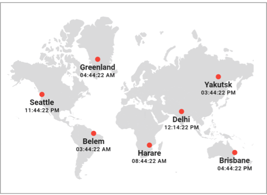

# Overview of Flutter Maps

Syncfusion Flutter Maps is a highly interactive UI control, allowing users to visualize GeoJSON data as a geographical area. It provides rich features, such as data labels, selection, markers, bubbles, assignable colors based on region, and legends.

## Features

* **Data labels** - Provides identification for the shapes by displaying their names. Trim or hide the labels if they exceed shape bounds.

* **Markers** - Denote a location with built-in symbols or display a custom widget at a specific latitude and longitude on a map.

* **Bubbles** - Add information to shapes such as population density, number of users, and more. Bubbles can be rendered in different colors and sizes based on the data values of their assigned shape.

* **Shape selection** - Select a shape in order to highlight that area on a map. You can use the callback for performing any action during shape selection.

* **Legend** - Use legends to provide clear information on the data plotted in the map. You can use the legend toggling feature to visualize only the shapes to which the legend applies.

* **Colors** - Categorize the shapes on a map by customizing their color based on the underlying value. It is possible to set the shape color for a specific value or for a range of values.

* **Tooltip** - Display additional information about shapes and bubbles using the customizable tooltip on a map.
