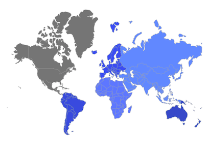
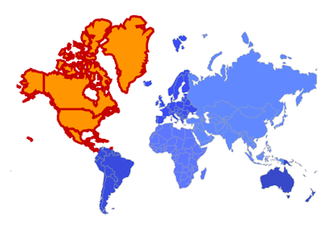

# Shape selection in the Flutter Maps

You can select a shape in order to highlight that area on a map. You can use the callback for performing any action during shape selection.

## Enable shape selection

You can enable shape selection on a map using the `MapShapeLayer.enableSelection` property. The default value of the `enableSelection` property is `false`.




List<Model> data;

@override
void initState() {
    super.initState();
    data = const <Model>[
        Model('Asia', 'Asia', Color.fromRGBO(60, 120, 255, 0.8)),
        Model('Africa', 'Africa', Color.fromRGBO(51, 102, 255, 0.8)),
        Model('Europe', 'Europe', Color.fromRGBO(0, 57, 230, 0.8)),
        Model('South America', 'SA', Color.fromRGBO(0, 51, 204, 0.8)),
        Model('Australia', 'Australia', Color.fromRGBO(0, 45, 179, 0.8)),
        Model('North America', 'NA', Color.fromRGBO(0, 38, 153, 0.8))
    ];
}

@override
Widget build(BuildContext context) {
   return Scaffold(
      body: Center(
        child: Container(
          height: 350,
          child: Padding(
            padding: EdgeInsets.only(left: 15, right: 15),
            child: SfMaps(
              layers: [
                MapShapeLayer(
                  delegate: MapShapeLayerDelegate(
                    shapeFile: "assets/world_map.json",
                    shapeDataField: "continent",
                    dataCount: data.length,
                    primaryValueMapper: (int index) => data[index].continent,
                    shapeColorValueMapper: (int index) => data[index].color,
                  ),
                  enableSelection: true,
                ),
              ],
            ),
          ),
        ),
      ),
   );
}

class Model {
  const Model(this.continent, this.code, this.color);

  final String continent;
  final String code;
  final Color color;
}




## Selection on initial rendering

You can programmatically select a shape on a map using the `MapShapeLayer.initialSelectedIndex` property.




List<Model> data;

@override
void initState() {
    super.initState();
    data = const <Model>[
        Model('Asia', 'Asia', Color.fromRGBO(60, 120, 255, 0.8)),
        Model('Africa', 'Africa', Color.fromRGBO(51, 102, 255, 0.8)),
        Model('Europe', 'Europe', Color.fromRGBO(0, 57, 230, 0.8)),
        Model('South America', 'SA', Color.fromRGBO(0, 51, 204, 0.8)),
        Model('Australia', 'Australia', Color.fromRGBO(0, 45, 179, 0.8)),
        Model('North America', 'NA', Color.fromRGBO(0, 38, 153, 0.8))
    ];
}

@override
Widget build(BuildContext context) {
   return Scaffold(
      body: Center(
        child: Container(
          height: 350,
          child: Padding(
            padding: EdgeInsets.only(left: 15, right: 15),
            child: SfMaps(
              layers: [
                MapShapeLayer(
                  delegate: MapShapeLayerDelegate(
                    shapeFile: "assets/world_map.json",
                    shapeDataField: "continent",
                    dataCount: data.length,
                    primaryValueMapper: (int index) => data[index].continent,
                    shapeColorValueMapper: (int index) => data[index].color,
                  ),
                  enableSelection: true,
                  initialSelectedIndex: 5,
                ),
              ],
            ),
          ),
        ),
      ),
   );
}

class Model {
  const Model(this.continent, this.code, this.color);

  final String continent;
  final String code;
  final Color color;
}




## Customization

You can customize the selected shape using the `color`, `strokeColor`, `strokeWidth`, and `opacity` properties in the `selectionSettings` property.




List<Model> data;

@override
void initState() {
    super.initState();
    data = const <Model>[
        Model('Asia', 'Asia', Color.fromRGBO(60, 120, 255, 0.8)),
        Model('Africa', 'Africa', Color.fromRGBO(51, 102, 255, 0.8)),
        Model('Europe', 'Europe', Color.fromRGBO(0, 57, 230, 0.8)),
        Model('South America', 'SA', Color.fromRGBO(0, 51, 204, 0.8)),
        Model('Australia', 'Australia', Color.fromRGBO(0, 45, 179, 0.8)),
        Model('North America', 'NA', Color.fromRGBO(0, 38, 153, 0.8))
    ];
}

@override
Widget build(BuildContext context) {
   return Scaffold(
      body: Center(
        child: Container(
          height: 350,
          child: Padding(
            padding: EdgeInsets.only(left: 15, right: 15),
            child: SfMaps(
              layers: [
                MapShapeLayer(
                  delegate: MapShapeLayerDelegate(
                    shapeFile: "assets/world_map.json",
                    shapeDataField: "continent",
                    dataCount: data.length,
                    primaryValueMapper: (int index) => data[index].continent,
                    shapeColorValueMapper: (int index) => data[index].color,
                  ),
                  enableSelection: true,
                  selectionSettings: MapSelectionSettings(
                    color: Colors.orange,
                    strokeColor: Colors.red[900],
                    strokeWidth: 3,
                  ),
                ),
              ],
            ),
          ),
        ),
      ),
   );
}

class Model {
  const Model(this.continent, this.code, this.color);

  final String continent;
  final String code;
  final Color color;
}




## onSelectionChanged

The `onSelectionChanged` callback is used to pass the index of the selected shape when the user is selecting a shape by tapping or clicking.

If the selected shape is tapped or clicked again, the index will be passed as -1. It means that, the shape is unselected.




List<Model> data;

@override
void initState() {
   super.initState();
    data = const <Model>[
    Model('Asia', 'Asia', Color.fromRGBO(60, 120, 255, 0.8)),
    Model('Africa', 'Africa', Color.fromRGBO(51, 102, 255, 0.8)),
    Model('Europe', 'Europe', Color.fromRGBO(0, 57, 230, 0.8)),
    Model('South America', 'SA', Color.fromRGBO(0, 51, 204, 0.8)),
    Model('Australia', 'Australia', Color.fromRGBO(0, 45, 179, 0.8)),
    Model('North America', 'NA', Color.fromRGBO(0, 38, 153, 0.8))
   ];
}

@override
Widget build(BuildContext context) {
   return Scaffold(
      body: Center(
        child: Container(
          height: 350,
          child: Padding(
            padding: EdgeInsets.only(left: 15, right: 15),
            child: SfMaps(
              layers: [
                MapShapeLayer(
                  delegate: MapShapeLayerDelegate(
                    shapeFile: "assets/world_map.json",
                    shapeDataField: "continent",
                    dataCount: data.length,
                    primaryValueMapper: (int index) => data[index].continent,
                    shapeColorValueMapper: (int index) => data[index].color,
                  ),
                  enableSelection: true,
                  onSelectionChanged: (int index) {
                    print('The selected region is ${data[index].code}');
                  },
                ),
              ],
            ),
          ),
        ),
      ),
   );
}

class Model {
  const Model(this.continent, this.code, this.color);

  final String continent;
  final String code;
  final Color color;
}



