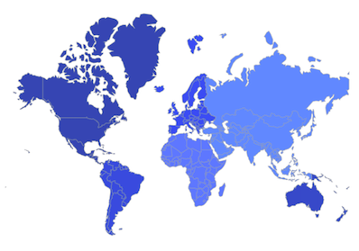
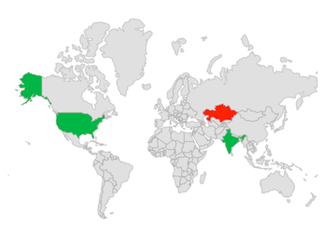

# Shape colors in the Flutter Maps

You can categorize the shapes on a map by customizing their color based on the underlying value. It is possible to set the shape color for a specific value or for a range of values.

## Based on underlying value

You can apply color to the shape by setting the color directly to the [`shapeColorValueMapper`] property in the [MapShapeLayerDelegate] based on the color of underlying model. You can either set color or value to the [`shapeColorValueMapper`] property.

If you set a color to the [`shapeColorValueMapper`] property, then the color will be applied to the shape
straightaway.

If you set a value other than the color to the [`shapeColorValueMapper`] property, then you must set the [`MapShapeLayer.shapeColorMappers`] property which is a collection of [`MapColorMapper`].

```dart
List<Model> data;

@override
void initState() {
    data = const <Model>[
      Model('Asia', Color.fromRGBO(60, 120, 255, 0.8)),
      Model('Africa', Color.fromRGBO(51, 102, 255, 0.8)),
      Model('Europe', Color.fromRGBO(0, 57, 230, 0.8)),
      Model('South America', Color.fromRGBO(0, 51, 204, 0.8)),
      Model('Australia', Color.fromRGBO(0, 45, 179, 0.8)),
      Model('North America', Color.fromRGBO(0, 38, 153, 0.8))
    ];
    super.initState();
}

@override
Widget build(BuildContext context) {
    return Scaffold(
      backgroundColor: Colors.white,
      body: Center(
          child: Container(
            height: 350,
            child: Padding(
              padding: EdgeInsets.only(left: 15, right: 15),
              child: SfMaps(
                layers: <MapLayer>[
                  MapShapeLayer(
                    delegate: MapShapeLayerDelegate(
                      shapeFile: 'assets/world_map.json',
                      shapeDataField: 'continent',
                      dataCount: data.length,
                      primaryValueMapper: (index) => data[index].country,
                      shapeColorValueMapper: (index) => data[index].color,
                    ),
                  ),
                ],
              ),
            ),
          )
      ),
  );
}

class Model {
  const Model(this.country, this.color);

  final String country;
  final Color color;
}
```



## Equal color mapping

You can apply color to the shape based on the specific value set to the [`MapColorMapper.value`] and [`MapColorMapper.color`] properties of the [`shapeColorMappers`].

I> The legend icon color and text color will be applied based on the value of [`MapColorMapper.color`] and [`MapColorMapper.text`] properties respectively.

```dart
 List<Model> data;

  @override
  void initState() {
    super.initState();

    data = <Model>[
      Model('India', "Low"),
      Model('United States of America', "High"),
      Model('Pakistan', "Low"),
    ];
  }

  @override
  Widget build(BuildContext context) {
    return Scaffold(
        backgroundColor: Colors.white,
        body: Padding(
          padding: EdgeInsets.only(left: 15, right: 15),
          child: SfMaps(
            layers: <MapShapeLayer>[
              MapShapeLayer(
                delegate: MapShapeLayerDelegate(
                    shapeFile: "assets/world_map.json",
                    shapeDataField: "name",
                    dataCount: data.length,
                    primaryValueMapper: (index) {
                      return data[index].country;
                    },
                    shapeColorValueMapper: (index) {
                      return data[index].storage;
                    },
                    shapeColorMappers: [
                      MapColorMapper(value: "Low", color: Colors.red),
                      MapColorMapper(value: "High", color: Colors.green)
                    ]),
              )
            ],
          ),
        ),
    );
  }
}

class Model {
  const Model(this.country, this.storage);

  final String country;
  final String storage;
}
```


## Range color mapping

You can apply color to the shape based on the range of values set to the [`MapColorMapper.from`], [`MapColorMapper.to`], and [`MapColorMapper.color`] properties of the [`shapeColorMappers`].

I> The legend icon color and text color will be applied based on the value of [`MapColorMapper.color`] and [`MapColorMapper.text`] properties respectively.

```dart
List<Model> data;

@override
void initState() {
    super.initState();

    data = <Model>[
      Model('India', 280),
      Model('United States of America', 190),
      Model('Kazakhstan', 37),
    ];
}

@override
Widget build(BuildContext context) {
    return Scaffold(
      backgroundColor: Colors.white,
      body: Padding(
        padding: EdgeInsets.only(left: 15, right: 15),
        child: SfMaps(
          layers: [
            MapShapeLayer(
              delegate: MapShapeLayerDelegate(
                  shapeFile: "assets/world_map.json",
                  shapeDataField: "name",
                  dataCount: data.length,
                  primaryValueMapper: (int index) => data[index].country,
                  shapeColorValueMapper: (int index) => data[index].count,
                  shapeColorMappers: [
                    MapColorMapper(from: 0, to: 100, color: Colors.red),
                    MapColorMapper(from: 101, to: 300, color: Colors.green)
                  ]),
            )
          ],
        ),
      ),
   );
}

class Model {
  const Model(this.country, this.count);

  final String country;
  final double count;
}
```


