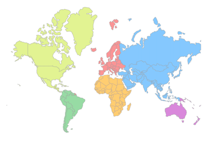
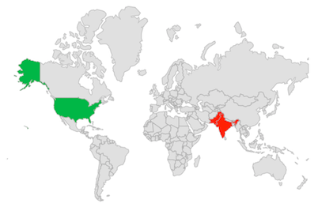

# Shapes in the Flutter Maps

This section explains about shapes and how to apply colors to the shapes based on specific values in the Flutter maps.

## Loading progress indicator

You can notify the user that the map is being loaded using the `MapShapeLayer.loadingBuilder`. It returns the widget which will be visible till the maps is loaded. 




@override
Widget build(BuildContext context) {
   return Scaffold(c
      body: Padding(
        padding: EdgeInsets.all(15),
        child: SfMaps(
          layers: <MapLayer>[
            MapShapeLayer(
              delegate: MapShapeLayerDelegate(
                shapeFile: 'assets/world_map.json',
                shapeDataField: 'continent',
              ),
              loadingBuilder: (_) {
                return Container(
                  height: 25,
                  width: 25,
                  child: const CircularProgressIndicator(
                    strokeWidth: 3,
                  ),
                );
              },
            ),
          ],
        ),
      ),
   );
}




## Shape color

You can apply color, stroke color and stroke width to the shapes using the `MapShapeLayer.color`, `MapShapeLayer.strokeColor` and `MapShapeLayer.strokeWidth` properties respectively.




@override
Widget build(BuildContext context) {
   return Scaffold(
      body: Padding(
        padding: EdgeInsets.all(15),
        child: SfMaps(
          layers: <MapLayer>[
            MapShapeLayer(
              color: Colors.blue[100],
              strokeColor: Colors.blue,
              strokeWidth: 2,
              delegate: MapShapeLayerDelegate(
                shapeFile: 'assets/world_map.json',
                shapeDataField: 'continent',
              ),
            ),
          ],
        ),
      ),
   );
}




<b>Using SfMapsTheme</b>

You can customize the below appearance of the shape.

* **Color** - Change the color of the shapes using the `SfMapsThemeData.layerColor` property.
* **Stroke color** - Change the stroke color of the shapes using the `SfMapsThemeData.layerStrokeColor` property.
* **Stroke width** - Change the stroke width of the shapes using the `SfMapsThemeData.layerStrokeWidth` property.

N> You must import the `theme.dart` library from the [`Core`](https://pub.dev/packages/syncfusion_flutter_core) package to use [`SfMapsTheme`](https://pub.dev/documentation/syncfusion_flutter_core/latest/theme/SfMapsTheme-class.html).




@override
Widget build(BuildContext context) {
   return Scaffold(
      body: Padding(
        padding: EdgeInsets.all(15),
        child: SfMapsTheme(
          data: SfMapsThemeData(
            layerColor: Colors.blue[100],
            layerStrokeColor: Colors.blue,
            layerStrokeWidth: 2
          ),
          child: SfMaps(
            layers: <MapLayer>[
              MapShapeLayer(
                delegate: MapShapeLayerDelegate(
                  shapeFile: 'assets/world_map.json',
                  shapeDataField: 'continent',
                ),
              ),
            ],
          ),
        )
      ),
   );
}




## Palette

You can color the shape based on the list of colors in a sequential order.

If the number of shapes exceeds the length of this collections, once the last color is used for a shape, color in the 0th index will be used for the next shape and so on.




@override
Widget build(BuildContext context) {
   return Scaffold(
      body: Padding(
        padding: EdgeInsets.all(15),
        child: SfMaps(
          layers: <MapLayer>[
            MapShapeLayer(
              delegate: MapShapeLayerDelegate(
                shapeFile: 'assets/world_map.json',
                shapeDataField: 'continent',
              ),
              palette: [
                Colors.blue[200],
                Colors.orange[200],
                Colors.red[200],
                Colors.green[200],
                Colors.purple[200],
                Colors.lime[200]
              ],
            ),
          ],
        ),
      ),
   );
}




## Applying colors based on the data

If you return a color from the `shapeColorValueMapper`, then the color will be applied to the respective shape straightaway.

If you return a value of different type other than the color from the `shapeColorValueMapper`, then you must set the `MapShapeLayer.shapeColorMappers` property which is a collection of `MapColorMapper` to apply colors for the respective shapes.

N> You can show legend using the `showLegend` property in the `MapShapeLayer`. The icon color of the legend is applied based on the color returned in the `shapeColorValueMapper` property in the `MapShapeLayerDelegate` and the text will be taken from `primaryValueMapper`. It is possible to customize the legend item's color and text using the `shapeColorMappers` property in the `MapShapeLayerDelegate`.




List<Model> data;

@override
void initState() {
    data = const <Model>[
      Model('Asia', Color.fromRGBO(60, 120, 255, 0.8)),
      Model('Africa', Color.fromRGBO(51, 102, 255, 0.8)),
      Model('Europe', Color.fromRGBO(0, 57, 230, 0.8)),
      Model('South America', Color.fromRGBO(0, 51, 204, 0.8)),
      Model('Australia', Color.fromRGBO(0, 45, 179, 0.8)),
      Model('North America', Color.fromRGBO(0, 38, 153, 0.8))
    ];
    super.initState();
}

@override
Widget build(BuildContext context) {
    return Scaffold(
      backgroundColor: Colors.white,
      body: Center(
          child: Container(
            height: 350,
            child: Padding(
              padding: EdgeInsets.only(left: 15, right: 15),
              child: SfMaps(
                layers: <MapLayer>[
                  MapShapeLayer(
                    delegate: MapShapeLayerDelegate(
                      shapeFile: 'assets/world_map.json',
                      shapeDataField: 'continent',
                      dataCount: data.length,
                      primaryValueMapper: (index) => data[index].country,
                      shapeColorValueMapper: (index) => data[index].color,
                    ),
                  ),
                ],
              ),
            ),
          )
      ),
  );
}

class Model {
  const Model(this.country, this.color);

  final String country;
  final Color color;
}




## Equal color mapping

You can apply color to the shape by comparing a value that returns from the `shapeColorValueMapper` with the `MapColorMapper.value`. For the matched values, the `MapColorMapper.color` will be applied to the respective shapes.




List<Model> data;

@override
void initState() {
    super.initState();

    data = <Model>[
      Model('India', "Low"),
      Model('United States of America', "High"),
      Model('Pakistan', "Low"),
    ];
}

@override
Widget build(BuildContext context) {
    return Scaffold(
        body: Padding(
          padding: EdgeInsets.only(left: 15, right: 15),
          child: SfMaps(
            layers: <MapShapeLayer>[
              MapShapeLayer(
                delegate: MapShapeLayerDelegate(
                    shapeFile: "assets/world_map.json",
                    shapeDataField: "name",
                    dataCount: data.length,
                    primaryValueMapper: (index) {
                      return data[index].country;
                    },
                    shapeColorValueMapper: (index) {
                      return data[index].storage;
                    },
                    shapeColorMappers: [
                      MapColorMapper(value: "Low", color: Colors.red),
                      MapColorMapper(value: "High", color: Colors.green)
                    ]),
              )
            ],
          ),
        ),
    );
  }
}

class Model {
  const Model(this.country, this.storage);

  final String country;
  final String storage;
}




## Range color mapping

You can apply color to the shape based on whether the value returned from `shapeColorValueMapper` falls within the `MapColorMapper.from` and `MapColorMapper.to`. Then, the `MapColorMapper.color` will be applied to the respective shapes.




List<Model> data;

@override
void initState() {
    super.initState();

    data = <Model>[
      Model('India', 280),
      Model('United States of America', 190),
      Model('Kazakhstan', 37),
    ];
}

@override
Widget build(BuildContext context) {
    return Scaffold(
      body: Padding(
        padding: EdgeInsets.only(left: 15, right: 15),
        child: SfMaps(
          layers: [
            MapShapeLayer(
              delegate: MapShapeLayerDelegate(
                  shapeFile: "assets/world_map.json",
                  shapeDataField: "name",
                  dataCount: data.length,
                  primaryValueMapper: (int index) => data[index].country,
                  shapeColorValueMapper: (int index) => data[index].count,
                  shapeColorMappers: [
                    MapColorMapper(from: 0, to: 100, color: Colors.red),
                    MapColorMapper(from: 101, to: 300, color: Colors.green)
                  ]
               ),
            )
          ],
        ),
      ),
   );
}

class Model {
  const Model(this.country, this.count);

  final String country;
  final double count;
}




