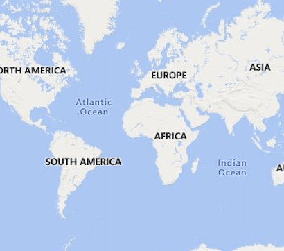

# Tile layer features in Maps

The tile layer renders the tiles returned from web map tile services such as Bing Maps, OpenStreetMaps, Google Maps, TomTom, etc.

## Setting URL template

The `MapTileLayer` needs to be added in the [layers](https://pub.dev/documentation/syncfusion_flutter_maps/latest/maps/SfMaps/layers.html) collection in [`SfMaps`](https://pub.dev/documentation/syncfusion_flutter_maps/latest/maps/SfMaps-class.html). The URL of the providers must be set in the `MapTileLayer.urlTemplate` property.

The `urlTemplate` property accepts the URL in WMTS format i.e. {z} — zoom level, {x} and {y} — tile coordinates. This URL might vary slightly depends on the providers. The formats can be,
    https://example_provider/{z}/{x}/{y}.png,
    https://example_provider/z={z}/x={x}/y={y}.png,
    https://example_provider/z={z}/x={x}/y={y}.png?key=subscription_key, etc. We will replace the {z}, {x}, {y} internally based on the current focal latitude and longitude and the zoom level.

Some of the providers may need subscription key. Please include them in the `urlTemplate` itself as mentioned in the above example. Please note that the format may vary between each map providers. You can check the exact URL format needed for the providers on their official websites.




@override
Widget build(BuildContext context) {
    return SfMaps(
        layers: [
            MapTileLayer(
                urlTemplate: 'https://tile.openstreetmap.org/{z}/{x}/{y}.png',
            ),
        ],
    );
}
 



**For Bing maps**

An additional step is required for the Bing maps. The format of the required URL varies from the other tile services. Hence, we have added a top-level [getBingUrlTemplate] method which returns the URL in the required format. You can use the URL returned from this method to pass it to the [urlTemplate] property.

Some of the providers provide different map types. For example, Bing Maps provide map types like Road, Aerial, AerialWithLabels etc. These types too can be passed in the [urlTemplate] itself as shown in the below example. You can check the official websites of the tile providers to know about the available types and the code for it.




@override
Widget build(BuildContext context) {
    return FutureBuilder(
        future: getBingUrlTemplate(
            'https://dev.virtualearth.net/REST/V1/Imagery/Metadata/RoadOnDemand?output=json&uriScheme=https&include=ImageryProviders&key=YOUR_KEY'),
        builder: (context, snapshot) {
            if (snapshot.hasData) {
                return SfMaps(
                    layers: [
                        MapTileLayer(
                            urlTemplate: snapshot.data,
                        ),
                    ],
                );
           }
        return CircularProgressIndicator();
        }
    );
}
 



## Changing the center latitude and longitude

You can set the initial focalLatLng by setting the `MapTileLayer.initialFocalLatLng` property. It represents the initial focal latitude and longitude position of the map layer.

Based on the size of the [SfMaps](https://pub.dev/documentation/syncfusion_flutter_maps/latest/maps/SfMaps-class.html) widget, [initialFocalLatLng] and [initialZoomLevel] number of initial tiles needed in the view port alone will be rendered. For enabling [zooming and panning](https://help.syncfusion.com/flutter/maps/zoom-pan), refer this section.

This property cannot be changed dynamically. Defaults to `MapLatLng(0.0, 0.0)`.




@override
Widget build(BuildContext context) {
    return SfMaps(
        layers: [
            MapTileLayer(
                urlTemplate: 'https://tile.openstreetmap.org/{z}/{x}/{y}.png',
                initialFocalLatLng: MapLatLng(27.1751, 50.0421),
            ),
        ],
    );
}
 



## Changing the initial zoom level

You can set the initial zoom level by setting the `MapTileLayer.initialZoomLevel` property. This property cannot be changed dynamically. By default, it will be 1. The current zoom level can be obtained from the [MapZoomPanBehavior.zoomLevel].




@override
Widget build(BuildContext context) {
    return SfMaps(
        layers: [
            MapTileLayer(
                urlTemplate: 'https://tile.openstreetmap.org/{z}/{x}/{y}.png',
                initialFocalLatLng: MapLatLng(27.1751, 78.0421),
                initialZoomLevel: 5,
            ),
        ],
    );
}
 



## Markers

You can add markers in the tile layer. The procedure is very similar to the shape layer. Kindly refer the [markers](https://help.syncfusion.com/flutter/maps/markers#adding-markers) section.
