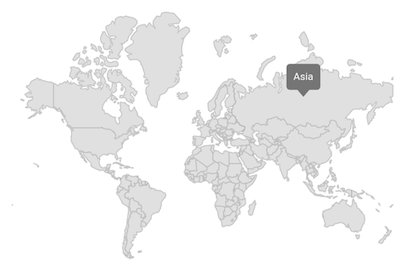
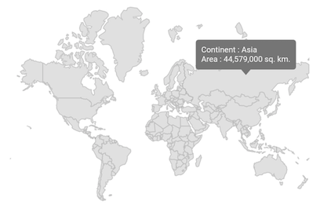

# Tooltip features in maps

Tooltip is used to indicate the shape, bubble information during the tap, or click interaction. This section helps to learn about how to enable tooltip for the shapes and bubbles in the maps and customize them.

## Tooltip for the shapes

It is used to clearly indicate the shape information on the tap or click. By default, the shape tooltip text is based on `shapeDataField` value of the respective shape.

You can use the `shapeTooltipTextMapper` for changing the text of the shape tooltip.




@override
Widget build(BuildContext context) {
  return Scaffold(
    body: Padding(
      padding: EdgeInsets.only(left: 15, right: 15),
      child: SfMaps(
        layers: [
          MapShapeLayer(
            delegate: MapShapeLayerDelegate(
              shapeFile: "assets/world_map.json",
              shapeDataField: "continent",
            ),
            enableShapeTooltip: true,
          ),
        ],
      ),
    ),
  );
}




N>
* Refer the `MapTooltipSettings`, for customizing the tooltip.

## Customizing the shape tooltip text

You can customize the shape tooltip text with the `shapeTooltipTextMapper`. The `shapeTooltipTextMapper` will be called with the corresponding index every time when you tap or click on a shape. You can change the format or the entire text and return it from this callback.




List<Model> data;

@override
void initState() {
    super.initState();

    data = <Model>[
      Model('Asia', '44,579,000 sq. km.'),
      Model('Africa', '30,370,000 sq. km.'),
      Model('Europe', '10,180,000 sq. km.'),
      Model('North America', '24,709,000 sq. km.'),
      Model('South America', '17,840,000 sq. km.'),
      Model('Australia', '8,600,000 sq. km.'),
    ];
}

@override
Widget build(BuildContext context) {
    return Scaffold(
      body: Padding(
        padding: EdgeInsets.only(left: 15, right: 15),
        child: SfMaps(
          layers: [
            MapShapeLayer(
              delegate: MapShapeLayerDelegate(
                shapeFile: "assets/world_map.json",
                shapeDataField: "continent",
                dataCount: data.length,
                primaryValueMapper: (int index) => data[index].continent,
                shapeTooltipTextMapper: (int index) =>
                'Continent : ' +
                    data[index].continent +
                    '\nArea : ' +
                    data[index].area,
              ),
              enableShapeTooltip: true,
            ),
          ],
        ),
      ),
   );
}

class Model {
  const Model(this.continent, this.area);

  final String continent;
  final String area;
}




## Tooltip for the bubbles

It is used to clearly indicate the bubble information on the tap or click. By default, the bubble tooltip text is based on `shapeDataField` value of the respective shape.

You can use the `bubbleTooltipTextMapper` for changing the text of the bubble tooltip.




List<Model> data;

@override
void initState() {
  super.initState();

  data = <Model>[
    Model('Asia', 50, '44,579,000 sq. km.'),
    Model('Africa', 54, '30,370,000 sq. km.'),
    Model('Europe', 51, '10,180,000 sq. km.'),
    Model('North America', 23, '24,709,000 sq. km.'),
    Model('South America', 12, '17,840,000 sq. km.'),
    Model('Australia', 14, '8,600,000 sq. km.'),
  ];
}

@override
Widget build(BuildContext context) {
  return Scaffold(
    body: Padding(
      padding: EdgeInsets.only(left: 15, right: 15),
      child: SfMaps(
        layers: [
          MapShapeLayer(
            delegate: MapShapeLayerDelegate(
              shapeFile: "assets/world_map.json",
              shapeDataField: "continent",
              dataCount: data.length,
              primaryValueMapper: (int index) => data[index].continent,
              bubbleSizeMapper: (int index) => data[index].countriesCount,
              bubbleTooltipTextMapper: (int index) =>
                  'Continent : ' +
                  data[index].continent +
                  '\nTotal Countries : ' +
                  data[index].countriesCount.toStringAsFixed(0),
            ),
            showBubbles: true,
            enableBubbleTooltip: true,
          ),
        ],
      ),
    ),
  );
}

class Model {
  const Model(this.continent, this.countriesCount, this.area);

  final String continent;
  final double countriesCount;
  final String area;
}




N>
* Refer the `MapTooltipSettings`, for customizing the tooltip.

## Appearance customization

You can customize the below appearance of the tooltip.

* **Background color** - Change the background color of the tooltip in the maps using the `MapTooltipSettings.color` property.
* **Stroke color** - Change the stroke color of the tooltip in the maps using the `MapTooltipSettings.strokeColor` property.
* **Stroke width** - Change the stroke width of the tooltip in the maps using the `MapTooltipSettings.strokeWidth` property.
* **Text style** - Change the appearance of the tooltip text in the maps using the `MapTooltipSettings.textStyle` property.




List<Model> data;

@override
void initState() {
  super.initState();

  data = <Model>[
    Model('Asia', 50, '44,579,000 sq. km.'),
    Model('Africa', 54, '30,370,000 sq. km.'),
    Model('Europe', 51, '10,180,000 sq. km.'),
    Model('North America', 23, '24,709,000 sq. km.'),
    Model('South America', 12, '17,840,000 sq. km.'),
    Model('Australia', 14, '8,600,000 sq. km.'),
  ];
}

@override
Widget build(BuildContext context) {
  return Scaffold(
    body: Padding(
      padding: EdgeInsets.only(left: 15, right: 15),
      child: SfMaps(
        layers: [
          MapShapeLayer(
            delegate: MapShapeLayerDelegate(
              shapeFile: "assets/world_map.json",
              shapeDataField: "continent",
              dataCount: data.length,
              primaryValueMapper: (int index) => data[index].continent,
              bubbleSizeMapper: (int index) => data[index].countriesCount,
              shapeTooltipTextMapper: (int index) =>
                  'Continent : ' +
                  data[index].continent +
                  '\nArea : ' +
                  data[index].area,
              bubbleTooltipTextMapper: (int index) =>
                  'Continent : ' +
                  data[index].continent +
                  '\nTotal Countries : ' +
                  data[index].countriesCount.toStringAsFixed(0),
            ),
            showBubbles: true,
            enableBubbleTooltip: true,
            enableShapeTooltip: true,
            tooltipSettings: const MapTooltipSettings(
              color: const Color.fromRGBO(98, 0, 238, 1),
              strokeColor: const Color.fromRGBO(252, 187, 15, 1),
              strokeWidth: 3,
              textStyle: TextStyle(
                color: Colors.white,
                fontSize: 14,
                fontStyle: FontStyle.italic,
                fontFamily: 'Times',
              ),
            ),
          ),
        ],
      ),
    ),
  );
}

class Model {
  const Model(this.continent, this.countriesCount, this.area);

  final String continent;
  final double countriesCount;
  final String area;
}




<b>Using SfMapsTheme</b>

You can customize the below appearance of the tooltip using `SfMapsTheme`.

* **Background color** - Change the background color of the tooltip in the maps using the `SfMapsThemeData.tooltipColor` property.
* **Stroke color** - Change the stroke color of the tooltip in the maps using the `SfMapsThemeData.tooltipStrokeColor` property.
* **Stroke width** - Change the stroke width of the tooltip in the maps using the `SfMapsThemeData.tooltipStrokeWidth` property.
* **Text style** - Change the appearance of the tooltip text in the maps using the `SfMapsThemeData.tooltipTextStyle` property.

N> You must import the `theme.dart` library from the [`Core`](https://pub.dev/packages/syncfusion_flutter_core) package to use [`SfMapsTheme`](https://pub.dev/documentation/syncfusion_flutter_core/latest/theme/SfMapsTheme-class.html).




List<Model> data;

@override
void initState() {
  super.initState();

  data = <Model>[
    Model('Asia', 50, '44,579,000 sq. km.'),
    Model('Africa', 54, '30,370,000 sq. km.'),
    Model('Europe', 51, '10,180,000 sq. km.'),
    Model('North America', 23, '24,709,000 sq. km.'),
    Model('South America', 12, '17,840,000 sq. km.'),
    Model('Australia', 14, '8,600,000 sq. km.'),
  ];
}

@override
Widget build(BuildContext context) {
  return Scaffold(
    body: Padding(
      padding: EdgeInsets.only(left: 15, right: 15),
      child: SfMapsTheme(
        data: SfMapsThemeData(
          tooltipColor: const Color.fromRGBO(98, 0, 238, 1),
          tooltipStrokeColor: const Color.fromRGBO(252, 187, 15, 1),
          tooltipStrokeWidth: 3,
          tooltipTextStyle: TextStyle(
            color: Colors.white,
            fontSize: 14,
            fontStyle: FontStyle.italic,
            fontFamily: 'Times',
          ),
        ),
        child: SfMaps(
          layers: [
            MapShapeLayer(
              delegate: MapShapeLayerDelegate(
                shapeFile: "assets/world_map.json",
                shapeDataField: "continent",
                dataCount: data.length,
                primaryValueMapper: (int index) => data[index].continent,
                bubbleSizeMapper: (int index) => data[index].countriesCount,
                shapeTooltipTextMapper: (int index) =>
                    'Continent : ' +
                    data[index].continent +
                    '\nArea : ' +
                    data[index].area,
                bubbleTooltipTextMapper: (int index) =>
                    'Continent : ' +
                  data[index].continent +
                    '\nTotal Countries : ' +
                    data[index].countriesCount.toStringAsFixed(0),
              ),
              showBubbles: true,
              enableBubbleTooltip: true,
              enableShapeTooltip: true,
            ),
          ],
        ),
      ),
    ),
  );
}

class Model {
  const Model(this.continent, this.countriesCount, this.area);

  final String continent;
  final double countriesCount;
  final String area;
}




N>
* Refer the `MapShapeLayer.enableBubbleTooltip`, for enabling tooltip for the bubbles.
* Refer the `MapShapeLayer.enableShapeTooltip`, for enabling tooltip for the shapes.
