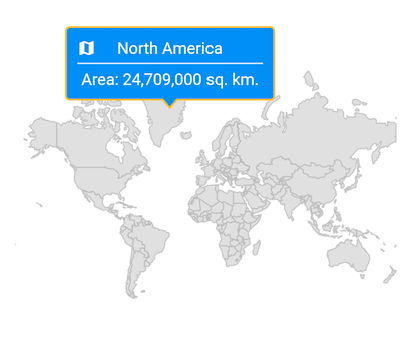
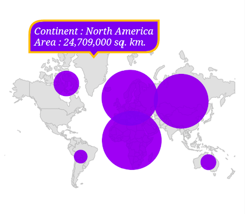

# Tooltip features in maps

Tooltip is used to indicate the shape, bubble, marker information during the tap, or click interaction. This section helps to learn about how to show tooltip for the shapes, bubbles, and markers in the maps and customize them.

## Tooltip for the shapes

It is used to clearly indicate the shape information on the tap or click. To show tooltip for the shape, return a widget in [`MapShapeLayer.shapeTooltipBuilder`](https://pub.dev/documentation/syncfusion_flutter_maps/latest/maps/MapShapeLayer/shapeTooltipBuilder.html). This widget will then be wrapped in the existing tooltip shape which comes with the nose at the bottom. The [`MapShapeLayer.shapeTooltipBuilder`](https://pub.dev/documentation/syncfusion_flutter_maps/latest/maps/MapShapeLayer/shapeTooltipBuilder.html) will be called with the corresponding index every time when you interacts with the shapes i.e., while tapping in touch devices and hovering in the mouse enabled devices.




List<Model> data;

@override
void initState() {
  super.initState();

  data = <Model>[
    Model('Asia', 50, '44,579,000 sq. km.'),
    Model('Africa', 54, '30,370,000 sq. km.'),
    Model('Europe', 51, '10,180,000 sq. km.'),
    Model('North America', 23, '24,709,000 sq. km.'),
    Model('South America', 12, '17,840,000 sq. km.'),
    Model('Australia', 14, '8,600,000 sq. km.'),
  ];
}

@override
Widget build(BuildContext context) {
  return Scaffold(
    body: Padding(
      padding: EdgeInsets.only(left: 15, right: 15),
      child: SfMaps(
        layers: [
          MapShapeLayer(
            source: MapShapeSource.asset(
              "assets/world_map.json",
              shapeDataField: "continent",
              dataCount: data.length,
              primaryValueMapper: (int index) => data[index].continent,
            ),
            shapeTooltipBuilder: (context, index) {
              return Container(
                width: 180,
                padding: EdgeInsets.all(10),
                child: Column(
                  mainAxisSize: MainAxisSize.min,
                  children: [
                    Stack(
                      children: [
                        Center(
                          child: Text(
                            data[index].continent,
                            style: TextStyle(
                              color: Colors.white,
                              fontSize: Theme.of(context)
                                      .textTheme
                                      .bodyText2
                                      .fontSize),
                          ),
                        ),
                        Icon(
                          Icons.map,
                          color: Colors.white,
                          size: 16,
                        ),
                      ],
                    ),
                    SizedBox(
                      height: 5,
                    ),
                    Container(
                      color: Colors.white,
                      height: 1,
                    ),
                    SizedBox(
                      height: 5,
                    ),
                    Text(
                      'Area : ' + data[index].area,
                      style: TextStyle(
                      color: Colors.white,
                      fontSize:
                        Theme.of(context).textTheme.bodyText2.fontSize),
                    ),
                  ],
                ),
              );
            },
            tooltipSettings: MapTooltipSettings(
              color: Colors.blue,
              strokeColor: const Color.fromRGBO(252, 187, 15, 1),
              strokeWidth: 1.5),
          ),
        ],
      ),
    ),
  );
}

class Model {
  const Model(this.continent, this.countriesCount, this.area);

  final String continent;
  final double countriesCount;
  final String area;
}




N>
* Refer the [`MapTooltipSettings`](https://pub.dev/documentation/syncfusion_flutter_maps/latest/maps/MapTooltipSettings-class.html), for customizing the tooltip.

## Tooltip for the bubbles

It is used to clearly indicate the bubble information on the tap or click. To show tooltip for the bubble, return a widget in [MapShapeLayer.bubbleTooltipBuilder](https://pub.dev/documentation/syncfusion_flutter_maps/latest/maps/MapShapeLayer/bubbleTooltipBuilder.html). This widget will then be wrapped in the existing tooltip shape which comes with the nose at the bottom. 

The [MapShapeLayer.bubbleTooltipBuilder](https://pub.dev/documentation/syncfusion_flutter_maps/latest/maps/MapShapeLayer/bubbleTooltipBuilder.html) will be called with the corresponding index every time when you interacts with the bubbles i.e., while tapping in touch devices and hovering in the mouse enabled devices.




List<Model> data;

@override
void initState() {
  super.initState();

  data = <Model>[
    Model('Asia', 50, '44,579,000 sq. km.'),
    Model('Africa', 54, '30,370,000 sq. km.'),
    Model('Europe', 51, '10,180,000 sq. km.'),
    Model('North America', 23, '24,709,000 sq. km.'),
    Model('South America', 12, '17,840,000 sq. km.'),
    Model('Australia', 14, '8,600,000 sq. km.'),
  ];
}

@override
Widget build(BuildContext context) {
  return Scaffold(
    body: Padding(
      padding: EdgeInsets.only(left: 15, right: 15),
      child: SfMaps(
        layers: [
          MapShapeLayer(
            source: MapShapeSource.asset(
              "assets/world_map.json",
              shapeDataField: "continent",
              dataCount: data.length,
              primaryValueMapper: (int index) => data[index].continent,
              bubbleSizeMapper: (int index) => data[index].countriesCount,
            ),
            bubbleTooltipBuilder: (context, index) {
              return Container(
                width: 150,
                padding: EdgeInsets.all(10),
                child: Column(
                  mainAxisSize: MainAxisSize.min,
                  children: [
                    Stack(
                      children: [
                        Center(
                          child: Text(
                            data[index].continent,
                            style: TextStyle(
                              color: Colors.white,
                              fontSize: Theme.of(context)
                                      .textTheme
                                      .bodyText2
                                      .fontSize),
                          ),
                        ),
                        Icon(
                          Icons.flag,
                          color: Colors.white,
                          size: 16,
                        ),
                      ],
                    ),
                    SizedBox(
                      height: 5,
                    ),
                    Container(
                      color: Colors.white,
                      height: 1,
                    ),
                    SizedBox(
                      height: 5,
                    ),
                    Text(
                      'Total Countries : ' +
                        data[index].countriesCount.toInt().toString(),
                      style: TextStyle(
                        color: Colors.white,
                        fontSize:
                          Theme.of(context).textTheme.bodyText2.fontSize),
                    ),
                  ],
                ),
              );
            },
            bubbleSettings: MapBubbleSettings(
                minRadius: 15,
                maxRadius: 35,
            ),
            tooltipSettings: MapTooltipSettings(
              color: const Color.fromRGBO(98, 0, 238, 1),
              strokeColor: const Color.fromRGBO(252, 187, 15, 1),
              strokeWidth: 1.5),
          ),
        ],
      ),
    ),
  );
}

class Model {
  const Model(this.continent, this.countriesCount, this.area);

  final String continent;
  final double countriesCount;
  final String area;
}




N>
* Refer the [`MapTooltipSettings`](https://pub.dev/documentation/syncfusion_flutter_maps/latest/maps/MapTooltipSettings-class.html), for customizing the tooltip.

## Tooltip for the markers

It is used to clearly indicate the marker information on the tap or click. To show tooltip for the marker, return a widget in [MapLayer.markerTooltipBuilder]. This widget will then be wrapped in the existing tooltip shape which comes with the nose at the bottom. 

The [MapLayer.markerTooltipBuilder] will be called with the corresponding index every time when you interacts with the markers i.e., while tapping in touch devices and hovering in the mouse enabled devices.




List<WorldWonderModel> _data;

@override
void initState() {
  super.initState();

  _data = <WorldWonderModel>[
    WorldWonderModel(
          place: 'Chichen Itza',
          country: 'Mexico',
          latitude: 20.6843,
          longitude: -88.5678),
    WorldWonderModel(
          place: 'Machu Picchu',
          country: 'Peru',
          latitude: -13.1631,
          longitude: -72.5450),
    WorldWonderModel(
          place: 'Christ the Redeemer',
          country: 'Brazil',
          latitude: -22.9519,
          longitude: -43.2105),
    WorldWonderModel(
          place: 'Colosseum',
          country: 'Rome',
          latitude: 41.8902,
          longitude: 12.4922),
    WorldWonderModel(
          place: 'Petra',
          country: 'Jordan',
          latitude: 30.3285,
          longitude: 35.4444),
    WorldWonderModel(
          place: 'Taj Mahal',
          country: 'India',
          latitude: 27.1751,
          longitude: 78.0421),
    WorldWonderModel(
          place: 'Great Wall of China',
          country: 'China',
          latitude: 40.4319,
          longitude: 116.5704)
  ];
}

@override
Widget build(BuildContext context) {
  return Scaffold(
    body: Padding(
      padding: EdgeInsets.only(left: 15, right: 15),
      child: SfMaps(
          layers: [
            MapShapeLayer(
              source: MapShapeSource.asset(
                "assets/world_map.json",
                shapeDataField: "country",
              ),
              initialMarkersCount: _data.length,
              markerBuilder: (BuildContext context, int index) {
                return MapMarker(
                  latitude: _data[index].latitude,
                  longitude: _data[index].longitude,
                  child: const Icon(
                    Icons.location_on,
                    color: Colors.red,
                  ),
                );
              },
              markerTooltipBuilder: (BuildContext context, int index) {
                return Container(
                  width: 150,
                  padding: EdgeInsets.all(10),
                  child: Column(
                    mainAxisSize: MainAxisSize.min,
                    children: [
                      Stack(
                        children: [
                          Center(
                            child: Text(
                              _data[index].country,
                              style: TextStyle(
                                  color: Colors.white,
                                  fontSize: Theme.of(context)
                                      .textTheme
                                      .bodyText2
                                      .fontSize),
                            ),
                          ),
                          Icon(
                            Icons.place,
                            color: Colors.white,
                            size: 16,
                          ),
                        ],
                      ),
                      SizedBox(
                        height: 5,
                      ),
                      Container(
                        color: Colors.white,
                        height: 1,
                      ),
                      SizedBox(
                        height: 5,
                      ),
                      Text(
                        _data[index].place,
                        style: TextStyle(
                            color: Colors.white,
                            fontSize:
                                Theme.of(context).textTheme.bodyText2.fontSize),
                      ),
                    ],
                  ),
                );
              },
              tooltipSettings: MapTooltipSettings(
                  color: Colors.red,
                  strokeColor: Colors.black,
                  strokeWidth: 1.5),
          ),
        ],
      ),
    ),
  );
}

class WorldWonderModel {
  const WorldWonderModel(
      {this.place, this.country, this.latitude, this.longitude});

  final String place;
  final String country;
  final double latitude;
  final double longitude;
}




N>
* Refer the [`MapTooltipSettings`](https://pub.dev/documentation/syncfusion_flutter_maps/latest/maps/MapTooltipSettings-class.html), for customizing the tooltip.

## Appearance customization

You can customize the below appearance of the tooltip.

* **Background color** - Change the background color of the tooltip in the maps using the [`MapTooltipSettings.color`](https://pub.dev/documentation/syncfusion_flutter_maps/latest/maps/MapTooltipSettings/color.html) property.
* **Stroke color** - Change the stroke color of the tooltip in the maps using the [`MapTooltipSettings.strokeColor`](https://pub.dev/documentation/syncfusion_flutter_maps/latest/maps/MapTooltipSettings/strokeColor.html) property.
* **Stroke width** - Change the stroke width of the tooltip in the maps using the [`MapTooltipSettings.strokeWidth`](https://pub.dev/documentation/syncfusion_flutter_maps/latest/maps/MapTooltipSettings/strokeWidth.html) property.




List<Model> data;

@override
void initState() {
  super.initState();

  data = <Model>[
    Model('Asia', 50, '44,579,000 sq. km.'),
    Model('Africa', 54, '30,370,000 sq. km.'),
    Model('Europe', 51, '10,180,000 sq. km.'),
    Model('North America', 23, '24,709,000 sq. km.'),
    Model('South America', 12, '17,840,000 sq. km.'),
    Model('Australia', 14, '8,600,000 sq. km.'),
  ];
}

@override
Widget build(BuildContext context) {
  return Scaffold(
    body: Padding(
      padding: EdgeInsets.only(left: 15, right: 15),
      child: SfMaps(
        layers: [
          MapShapeLayer(
            source: MapShapeSource.asset(
              "assets/world_map.json",
              shapeDataField: "continent",
              dataCount: data.length,
              primaryValueMapper: (int index) => data[index].continent,
              bubbleSizeMapper: (int index) => data[index].countriesCount,
            ),
            shapeTooltipBuilder: (BuildContext context, int index) {
              return Padding(
                padding: const EdgeInsets.all(7),
                  child: Text(
                    'Continent : ' +
                        data[index].continent +
                        '\nArea : ' +
                        data[index].area,
                    style: const TextStyle(
                      color: Colors.white,
                      fontSize: 14,
                      fontStyle: FontStyle.italic,
                      fontFamily: 'Times',
                  ),
                ),
              );
            },
            bubbleTooltipBuilder: (BuildContext context, int index) {
              return Padding(
                padding: const EdgeInsets.all(7),
                child: Text(
                    'Continent : ' +
                        data[index].continent +
                        '\nTotal Countries : ' +
                        data[index].countriesCount.toStringAsFixed(0),
                    style: const TextStyle(
                      color: Colors.white,
                      fontSize: 14,
                      fontStyle: FontStyle.italic,
                      fontFamily: 'Times',
                    ),
                ),
              );
            },
            tooltipSettings: const MapTooltipSettings(
              color: const Color.fromRGBO(98, 0, 238, 1),
              strokeColor: const Color.fromRGBO(252, 187, 15, 1),
              strokeWidth: 3,
            ),
          ),
        ],
      ),
    ),
  );
}

class Model {
  const Model(this.continent, this.countriesCount, this.area);

  final String continent;
  final double countriesCount;
  final String area;
}




<b>Using SfMapsTheme</b>

You can customize the below appearance of the tooltip using [`SfMapsTheme`](https://pub.dev/documentation/syncfusion_flutter_core/latest/theme/SfMapsTheme-class.html).

* **Background color** - Change the background color of the tooltip in the maps using the [`SfMapsThemeData.tooltipColor`](https://pub.dev/documentation/syncfusion_flutter_core/latest/theme/SfMapsThemeData/tooltipColor.html) property.
* **Stroke color** - Change the stroke color of the tooltip in the maps using the [`SfMapsThemeData.tooltipStrokeColor`](https://pub.dev/documentation/syncfusion_flutter_core/latest/theme/SfMapsThemeData/tooltipStrokeColor.html) property.
* **Stroke width** - Change the stroke width of the tooltip in the maps using the [`SfMapsThemeData.tooltipStrokeWidth`](https://pub.dev/documentation/syncfusion_flutter_core/latest/theme/SfMapsThemeData/tooltipStrokeWidth.html) property.
* **Border radius** - Change the appearance of the tooltip borders in the maps using the [`SfMapsThemeData.tooltipBorderRadius`](https://pub.dev/documentation/syncfusion_flutter_core/latest/theme/SfMapsThemeData/tooltipBorderRadius.html) property.

N> You must import the `theme.dart` library from the [`Core`](https://pub.dev/packages/syncfusion_flutter_core) package to use [`SfMapsTheme`](https://pub.dev/documentation/syncfusion_flutter_core/latest/theme/SfMapsTheme-class.html).




List<Model> data;

@override
void initState() {
  super.initState();

  data = <Model>[
    Model('Asia', 50, '44,579,000 sq. km.'),
    Model('Africa', 54, '30,370,000 sq. km.'),
    Model('Europe', 51, '10,180,000 sq. km.'),
    Model('North America', 23, '24,709,000 sq. km.'),
    Model('South America', 12, '17,840,000 sq. km.'),
    Model('Australia', 14, '8,600,000 sq. km.'),
  ];
}

@override
Widget build(BuildContext context) {
  return Scaffold(
    body: Padding(
      padding: EdgeInsets.only(left: 15, right: 15),
      child: SfMapsTheme(
        data: SfMapsThemeData(
          tooltipColor: const Color.fromRGBO(98, 0, 238, 1),
          tooltipStrokeColor: const Color.fromRGBO(252, 187, 15, 1),
          tooltipStrokeWidth: 3,
          tooltipBorderRadius: BorderRadiusDirectional.only(
            topStart: Radius.circular(20),
            bottomEnd: Radius.circular(20),
          ),
        ),
        child: SfMaps(
          layers: [
            MapShapeLayer(
              source: MapShapeSource.asset(
                "assets/world_map.json",
                shapeDataField: "continent",
                dataCount: data.length,
                primaryValueMapper: (int index) => data[index].continent,
                bubbleSizeMapper: (int index) => data[index].countriesCount,
              ),
              shapeTooltipBuilder: (BuildContext context, int index) {
                  return Padding(
                      padding: const EdgeInsets.all(7),
                        child: Text(
                          'Continent : ' +
                            data[index].continent +
                          '\nArea : ' +
                            data[index].area,
                          style: const TextStyle(
                            color: Colors.white,
                            fontSize: 14,
                            fontStyle: FontStyle.italic,
                            fontFamily: 'Times',
                      ),
                    ),
                );
              },
              bubbleTooltipBuilder: (BuildContext context, int index) {
                  return Padding(
                    padding: const EdgeInsets.all(7),
                    child: Text(
                        'Continent : ' +
                            data[index].continent +
                        '\nTotal Countries : ' +
                            data[index].countriesCount.toStringAsFixed(0),
                        style: const TextStyle(
                          color: Colors.white,
                          fontSize: 14,
                          fontStyle: FontStyle.italic,
                          fontFamily: 'Times',
                        ),
                      ),
                  );
              },
            ),
          ],
        ),
      ),
    ),
  );
}

class Model {
  const Model(this.continent, this.countriesCount, this.area);

  final String continent;
  final double countriesCount;
  final String area;
}




N>
* Refer the [`MapShapeLayer.enableBubbleTooltip`](https://pub.dev/documentation/syncfusion_flutter_maps/latest/maps/MapShapeLayer/enableBubbleTooltip.html), for enabling tooltip for the bubbles.
* Refer the [`MapShapeLayer.enableShapeTooltip`](https://pub.dev/documentation/syncfusion_flutter_maps/latest/maps/MapShapeLayer/enableShapeTooltip.html), for enabling tooltip for the shapes.