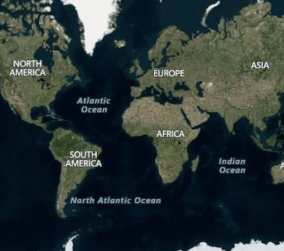
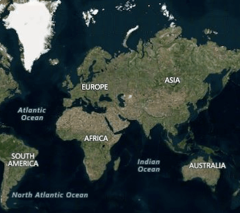
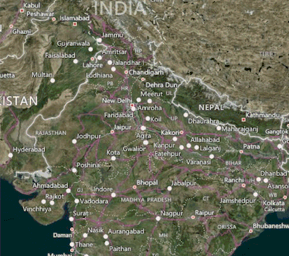

# Zooming and Panning features in Maps

It is possible to zoom in and out for any layer to take a closer look at a specific region by pinching the map, scrolling the mouse wheel or track pad, or using the toolbar on the web. Pan the map to navigate across the regions. You can also customize the zoom level and the center point of the initial rendering.

The procedure for zooming and panning for both layers is very similar.

**Shape layer**




MapZoomPanBehavior _zoomPanBehavior;

@override
void initState() {
    super.initState();
    _zoomPanBehavior = MapZoomPanBehavior();
}

@override
Widget build(BuildContext context) {
    return Scaffold(
        body: SfMaps(
            layers: [
                MapShapeLayer(
                    delegate: MapShapeLayerDelegate(
                        shapeFile: 'assets/world_map.json',
                        shapeDataField: 'continent',
                    ),
                    zoomPanBehavior: _zoomPanBehavior,
                ),
            ],
        ),
    );
}




**Tile layer**




MapZoomPanBehavior _zoomPanBehavior;

@override
void initState() {
    super.initState();
    _zoomPanBehavior = MapZoomPanBehavior();
}

@override
Widget build(BuildContext context) {
    return FutureBuilder(
        future: getBingUrlTemplate(
            'https://dev.virtualearth.net/REST/V1/Imagery/Metadata/AerialWithLabels?output=json&uriScheme=https&include=ImageryProviders&key=YOUR_KEY'),
        builder: (context, snapshot) {
            if (snapshot.hasData) {
                return SfMaps(
                    layers: [
                        MapTileLayer(
                            urlTemplate: snapshot.data,
                            zoomPanBehavior: _zoomPanBehavior,
                        ),
                    ],
                );
           }
        return CircularProgressIndicator();
        }
    );
}




## Customizing the center latitude and longitude

The `MapZoomPanBehavior.focalLatLng` is the focal point of the map layer based on which zooming happens. It represents the focal latitude and longitude position of the map layer. You can also get the current focalLatLng after interaction using the [MapZoomPanBehavior.focalLatLng] property.

To perform panning, enable the `MapZoomPanBehavior.enablePanning`property. By default it will be `true`.




MapZoomPanBehavior _zoomPanBehavior;

@override
void initState() {
    super.initState();
    _zoomPanBehavior = MapZoomPanBehavior(
        focalLatLng: MapLatLng(27.1751, 50.0421),
    );
}

@override
Widget build(BuildContext context) {
    return FutureBuilder(
        future: getBingUrlTemplate(
            'https://dev.virtualearth.net/REST/V1/Imagery/Metadata/AerialWithLabels?output=json&uriScheme=https&include=ImageryProviders&key=YOUR_KEY'),
        builder: (context, snapshot) {
            if (snapshot.hasData) {
                return SfMaps(
                    layers: [
                        MapTileLayer(
                            urlTemplate: snapshot.data,
                            zoomPanBehavior: _zoomPanBehavior,
                        ),
                    ],
                );
           }
        return CircularProgressIndicator();
        }
    );
}




N>
* Current map layer `onWillPan` should return `true`.

## Customizing the zoom level

You can set the current zoom level of the map layer by using `MapZoomPanBehavior.zoomLevel`property.

The default [MapZoomPanBehavior.zoomLevel] value is 1 which will show the whole map in the viewport for [MapShapeLayer] and the possible bounds for the [MapShapeLayer] based on the [MapZoomPanBehavior.focalLatLng]. You can also get the current zoom level after interaction using the [MapZoomPanBehavior.zoomLevel] property.

To perform zooming, enable the `MapZoomPanBehavior.enablePinching` property. By default it will be `true`.




MapZoomPanBehavior _zoomPanBehavior;

@override
void initState() {
    super.initState();
    _zoomPanBehavior = MapZoomPanBehavior(
        focalLatLng: MapLatLng(27.1751, 78.0421),
        zoomLevel: 5,
    );
}

@override
Widget build(BuildContext context) {
    return FutureBuilder(
        future: getBingUrlTemplate(
            'https://dev.virtualearth.net/REST/V1/Imagery/Metadata/AerialWithLabels?output=json&uriScheme=https&include=ImageryProviders&key=YOUR_KEY'),
        builder: (context, snapshot) {
            if (snapshot.hasData) {
                return SfMaps(
                    layers: [
                        MapTileLayer(
                            urlTemplate: snapshot.data,
                            zoomPanBehavior: _zoomPanBehavior,
                        ),
                    ],
                );
           }
        return CircularProgressIndicator();
        }
    );
}




N>
* Current map layer `onWillZoom` should return `true`.

## Customizing min and max zoom level

You can set the min and max zoom level of the map layer by setting the value to `MapZoomPanBehavior.minZoomLevel` and `MapZoomPanBehavior.maxZoomLevel`properties. The minimum and maximum zooming levels can be restricted using these properties respectively. The default values of `MapZoomPanBehavior.minZoomLevel` and `MapZoomPanBehavior.maxZoomLevel` are 0 and 15 respectively.

However, for [MapTileLayer], [MapZoomPanBehavior.maxZoomLevel] may slightly vary depends on the providers. Kindly check the respective official website of the map tile providers to know about the maximum zoom level it supports.




MapZoomPanBehavior _zoomPanBehavior;

@override
void initState() {
    super.initState();
    _zoomPanBehavior = MapZoomPanBehavior(
        focalLatLng: MapLatLng(27.1751, 78.0421),
        zoomLevel: 5,
        minZoomLevel: 3,
        maxZoomLevel: 10,
    );
}

@override
Widget build(BuildContext context) {
    return FutureBuilder(
        future: getBingUrlTemplate(
            'https://dev.virtualearth.net/REST/V1/Imagery/Metadata/AerialWithLabels?output=json&uriScheme=https&include=ImageryProviders&key=YOUR_KEY'),
        builder: (context, snapshot) {
            if (snapshot.hasData) {
                return SfMaps(
                    layers: [
                        MapTileLayer(
                            urlTemplate: snapshot.data,
                            zoomPanBehavior: _zoomPanBehavior,
                        ),
                    ],
                );
           }
        return CircularProgressIndicator();
        }
    );
}




## Toolbar

You can use the toolbar to customize the visible bound for the web platform. By default, the [MapZoomPanBehavior.showToolbar] property is `true`.

N>
* Refer [MapZoomPanBehavior.toolbarSettings] for customizing the appearance of the toolbar. You can customize its positions, direction, icon color, item hover color and item background color.

## Zooming callback

Whenever zooming happens, this method is called. If it returns false, zooming will not happen.

[MapZoomDetails] contains following properties.
    * [MapZoomDetails.previousVisibleBounds] - provides the visible bounds before the current zooming operation completes i.e. current visible bounds.
    * [MapZoomDetails.newVisibleBounds] - provides the new visible bounds when the current zoom completes. Hence, if it returns false, there will be no changes in the UI.
    * [MapZoomDetails.previousZoomLevel] - provides the zoom level before the current zooming operation completes i.e. current zoom level.
    * [MapZoomDetails.newZoomLevel] - provides the new zoom level when the current zoom completes. Hence, if it returns false, there will be no changes in the UI.
    * [MapZoomDetails.globalFocalPoint] - The global focal point of the pointers in contact with the screen.
    * [MapZoomDetails.localFocalPoint] - The local focal point of the pointers in contact with the screen.




MapZoomPanBehavior _zoomPanBehavior;

@override
void initState() {
    super.initState();
    _zoomPanBehavior = _CustomZoomPanBehavior();
}

@override
Widget build(BuildContext context) {
    return FutureBuilder(
        future: getBingUrlTemplate(
            'https://dev.virtualearth.net/REST/V1/Imagery/Metadata/AerialWithLabels?output=json&uriScheme=https&include=ImageryProviders&key=YOUR_KEY'),
        builder: (context, snapshot) {
            if (snapshot.hasData) {
                return SfMaps(
                    layers: [
                        MapTileLayer(
                            urlTemplate: snapshot.data,
                            zoomPanBehavior: _zoomPanBehavior,
                            onWillZoom: (MapZoomDetails detail) {
                                return true;
                            },
                        ),
                    ],
                );
           }
        return CircularProgressIndicator();
        }
    );
}




## Panning callback

Whenever panning happens, this method is called. If it returns false, panning will not happen.
 
[MapPanDetails] contains following properties.
    * [MapPanDetails.previousVisibleBounds] - provides the visible bounds before the current panning operation completes i.e. current visible bounds.
    * [MapPanDetails.newVisibleBounds] - provides the new visible bounds when the current pan completes. Hence, if it returns false, there will be no changes in the UI.
    * [MapPanDetails.zoomLevel] - provides the current zoom level.
    * [MapPanDetails.delta] - The difference in pixels between touch start and current touch position.
    * [MapPanDetails.globalFocalPoint] - The global focal point of the pointers in contact with the screen.
    * [MapPanDetails.localFocalPoint] - The local focal point of the pointers in contact with the screen.




MapZoomPanBehavior _zoomPanBehavior;

@override
void initState() {
    super.initState();
    _zoomPanBehavior = _CustomZoomPanBehavior();
}

@override
Widget build(BuildContext context) {
    return FutureBuilder(
        future: getBingUrlTemplate(
            'https://dev.virtualearth.net/REST/V1/Imagery/Metadata/AerialWithLabels?output=json&uriScheme=https&include=ImageryProviders&key=YOUR_KEY'),
        builder: (context, snapshot) {
            if (snapshot.hasData) {
                return SfMaps(
                    layers: [
                        MapTileLayer(
                            urlTemplate: snapshot.data,
                            zoomPanBehavior: _zoomPanBehavior,
                            onWillPan: (MapPanDetails detail) {
                                return true;
                            },
                        ),
                    ],
                );
           }
        return CircularProgressIndicator();
        }
    );
}




## Overriding the zoom pan behavior

### Zooming

Whenever zooming happens, this method is called. Subclasses can override this method to do any custom operations based on the details provided in the [MapZoomDetails].

[MapZoomDetails] contains following properties,
    * [MapZoomDetails.previousVisibleBounds] - provides the visible bounds before the current zooming operation completes i.e. current visible bounds.
    * [MapZoomDetails.newVisibleBounds] - provides the new visible bounds when the current zoom completes. Hence, if the
    `super.onZooming(details)` is not called, there will be no changes in the UI.
    * [MapZoomDetails.previousZoomLevel] - provides the zoom level before the current zooming operation completes i.e. current zoom level.
    * [MapZoomDetails.newZoomLevel] - provides the new zoom level when the current zoom completes. Hence, if the
    `super.onZooming(details)` is not called, there will be no changes in the UI.
    * [MapZoomDetails.globalFocalPoint] - The global focal point of the pointers in contact with the screen.
    * [MapZoomDetails.localFocalPoint] - The local focal point of the pointers in contact with the screen.




MapZoomPanBehavior _zoomPanBehavior;

@override
void initState() {
    super.initState();
    _zoomPanBehavior = _CustomZoomPanBehavior();
}

@override
Widget build(BuildContext context) {
    return FutureBuilder(
        future: getBingUrlTemplate(
            'https://dev.virtualearth.net/REST/V1/Imagery/Metadata/AerialWithLabels?output=json&uriScheme=https&include=ImageryProviders&key=YOUR_KEY'),
        builder: (context, snapshot) {
            if (snapshot.hasData) {
                return SfMaps(
                    layers: [
                        MapTileLayer(
                            urlTemplate: snapshot.data,
                            zoomPanBehavior: _zoomPanBehavior,
                        ),
                    ],
                );
           }
        return CircularProgressIndicator();
        }
    );
}

class _CustomZoomPanBehavior extends MapZoomPanBehavior {

  @override
  void onZooming(MapZoomDetails details) {
    super.onZooming(details);
    // Add the code here.
  }
}




N>
* When `super.onZooming(details)` is not called, zooming will not happen.

### Panning

Whenever panning happens, this method is called. Subclasses can override this method to do any custom operations based on the details provided in the [MapPanDetails]. 
  
[MapPanDetails] contains following properties,
    * [MapPanDetails.previousVisibleBounds] - provides the visible bounds before the current panning operation completes i.e. current visible bounds.
    * [MapPanDetails.newVisibleBounds] - provides the new visible bounds when the current pan completes. Hence, if the
    `super.onPanning(details)` is not called, there will be no changes in the UI.
    * [MapPanDetails.zoomLevel] - provides the current zoom level.
    * [MapPanDetails.delta] - The difference in pixels between touch start and current touch position.
    * [MapPanDetails.globalFocalPoint] - The global focal point of the pointers in contact with the screen.
    * [MapPanDetails.localFocalPoint] - The local focal point of the pointers in contact with the screen.




MapZoomPanBehavior _zoomPanBehavior;

@override
void initState() {
    super.initState();
    _zoomPanBehavior = _CustomZoomPanBehavior();
}

@override
Widget build(BuildContext context) {
    return FutureBuilder(
        future: getBingUrlTemplate(
            'https://dev.virtualearth.net/REST/V1/Imagery/Metadata/AerialWithLabels?output=json&uriScheme=https&include=ImageryProviders&key=YOUR_KEY'),
        builder: (context, snapshot) {
            if (snapshot.hasData) {
                return SfMaps(
                    layers: [
                        MapTileLayer(
                            urlTemplate: snapshot.data,
                            zoomPanBehavior: _zoomPanBehavior,
                        ),
                    ],
                );
           }
        return CircularProgressIndicator();
        }
    );
}

class _CustomZoomPanBehavior extends MapZoomPanBehavior {

  @override
  void onPanning(MapPanDetails details) {
    super.onPanning(details);
    // Add the code here
  }
}




N>
* When `super.onPanning(details)` is not called, panning will not happen.

### reset

You can reset the map to the [MapZoomPanBehavior.minZoomLevel] by calling this method.




MapZoomPanBehavior _zoomPanBehavior;

@override
void initState() {
    super.initState();
    _zoomPanBehavior = _CustomZoomPanBehavior();
}

@override
Widget build(BuildContext context) {
    return FutureBuilder(
        future: getBingUrlTemplate(
            'https://dev.virtualearth.net/REST/V1/Imagery/Metadata/AerialWithLabels?output=json&uriScheme=https&include=ImageryProviders&key=YOUR_KEY'),
        builder: (context, snapshot) {
            if (snapshot.hasData) {
                return SfMaps(
                    layers: [
                        MapTileLayer(
                            urlTemplate: snapshot.data,
                            zoomPanBehavior: _zoomPanBehavior,
                        ),
                    ],
                );
           }
        return CircularProgressIndicator();
        }
    );
}

class _CustomZoomPanBehavior extends MapZoomPanBehavior {

  @override
  void reset() {
    super.reset();
    // Add the code here
  }
}




### handleEvent

You can override this method to handle pointer events that hit this render object.




MapZoomPanBehavior _zoomPanBehavior;

@override
void initState() {
    super.initState();
    _zoomPanBehavior = _CustomZoomPanBehavior();
}

@override
Widget build(BuildContext context) {
    return FutureBuilder(
        future: getBingUrlTemplate(
            'https://dev.virtualearth.net/REST/V1/Imagery/Metadata/AerialWithLabels?output=json&uriScheme=https&include=ImageryProviders&key=YOUR_KEY'),
        builder: (context, snapshot) {
            if (snapshot.hasData) {
                return SfMaps(
                    layers: [
                        MapTileLayer(
                            urlTemplate: snapshot.data,
                            zoomPanBehavior: _zoomPanBehavior,
                        ),
                    ],
                );
           }
        return CircularProgressIndicator();
        }
    );
}

class _CustomZoomPanBehavior extends MapZoomPanBehavior {

  @override
  void handleEvent(PointerEvent event, HitTestEntry entry) {
    super.handleEvent(event, entry);
    // Add the code here
  }
}




### paint

You can paint this render object into the given context at the given offset.




MapZoomPanBehavior _zoomPanBehavior;

@override
void initState() {
    super.initState();
    _zoomPanBehavior = _CustomZoomPanBehavior();
}

@override
Widget build(BuildContext context) {
    return FutureBuilder(
        future: getBingUrlTemplate(
            'https://dev.virtualearth.net/REST/V1/Imagery/Metadata/AerialWithLabels?output=json&uriScheme=https&include=ImageryProviders&key=YOUR_KEY'),
        builder: (context, snapshot) {
            if (snapshot.hasData) {
                return SfMaps(
                    layers: [
                        MapTileLayer(
                            urlTemplate: snapshot.data,
                            zoomPanBehavior: _zoomPanBehavior,
                        ),
                    ],
                );
           }
        return CircularProgressIndicator();
        }
    );
}

class _CustomZoomPanBehavior extends MapZoomPanBehavior {

  @override
  void paint(PaintingContext context, Offset offset) {
    super.paint(context, offset);
    // Add the code here
  }
 
}



