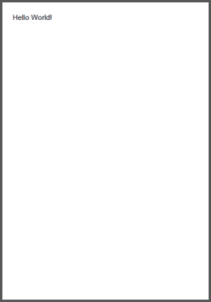
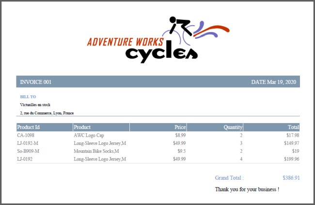

# Getting Started for Syncfusion Flutter PDF

This section explains the steps required to create a PDF document by a single button click. This section covers only the minimal features needed to learn to get started with the PDF.

## Steps to create PDF document in Flutter application

Create a simple project using the instructions given in the [`Getting Started with your first Flutter app'](https://flutter.dev/docs/get-started/test-drive?tab=vscode#create-app) documentation.

**Add dependency**

Add the Syncfusion Flutter PDF dependency to your pub spec file.

 

dependencies:

syncfusion_flutter_pdf: ^1.0.0-beta.3



**Get packages**

Run the following command to get the required packages.

 

$ flutter pub get



**Import package**

Import the following package in your Dart code.

 

import 'package:syncfusion_flutter_pdf/pdf.dart';



Add a new button widget as a child of your container widget.

 

@override
Widget build(BuildContext context) {
  return Scaffold(
	body: Center(
	  child: RaisedButton(
		onPressed: _createPDF,
		  child: Text('Create PDF')
		)
	 )
  );
}



Include the following code snippet in the button click event to create a PDF file.



void _createPDF() async {
  //Create a new PDF document
  PdfDocument document = PdfDocument();

  //Add a new page and draw text
  document.pages.add().graphics.drawString(
	  'Hello World!', PdfStandardFont(PdfFontFamily.helvetica, 12),
	  brush: PdfSolidBrush(PdfColor(0, 0, 0)),
	  bounds: Rect.fromLTWH(0, 0, 150, 20));

  //Save the document
  List<int> bytes = document.save();

  //Dispose the document
  document.dispose();
}



## Save and open a PDF document in mobile

You can save and open a PDF document in mobile by using the following steps:

**Add dependency**

Add the following packages to your pub spec file.

 

path_provider: ^1.6.5
open_file: ^3.0.1



**Import package**



import 'dart:io';
import 'package:open_file/open_file.dart';
import 'package:path_provider/path_provider.dart';



Include the following code snippet in _createPDF method to open the PDF document in mobile device after saving it.



final directory = await getExternalStorageDirectory();
final path = directory.path;
File file = File('$path/Output.pdf');
await file.writeAsBytes(bytes, flush: true);
OpenFile.open('$path/Output.pdf');



## Save and download a PDF document in web

You can save and download a PDF document in web by using the following steps.

**Import package**



import 'dart:async';
import 'dart:convert';
import 'dart:js' as js;



Include the following code snippet in _createPDF method to open the document in web after saving it.



js.context['pdfData'] = base64.encode(bytes);
js.context['filename'] = fileName;
Timer.run(() {
  js.context.callMethod('download');
});



Add the following code in the header section of index.html file under the web folder.





By executing the above code sample, you will get the PDF document as follows.

## Creating a PDF document with image

The following code example shows how to create a PDF document with an image.



//Creates a new PDF document
PdfDocument document = PdfDocument();

//Draw the image
document.pages.add().graphics.drawImage(
	PdfBitmap(File('image.jpg'). readAsBytesSync()),
	Rect.fromLTWH(0, 0, 100, 100));

//Saves the document
File('Output.pdf').writeAsBytes(document.save());

//Dispose the document
document.dispose();



## Creating a PDF document with table



//Creates a new PDF document
PdfDocument document = PdfDocument();

//Create a DataTable
DataTable dataTable = DataTable(columns: const <DataColumn>[
  DataColumn(label: Text('RollNo')),
  DataColumn(label: Text('Name')),
  DataColumn(label: Text('Class')),
], rows: const <DataRow>[
  DataRow(cells: <DataCell>[
	DataCell(Text('1')),
	DataCell(Text('Arya')),
	DataCell(Text('6'))
  ]),
  DataRow(cells: <DataCell>[
	DataCell(Text('12')),
	DataCell(Text('John')),
	DataCell(Text('9'))
  ]),
  DataRow(cells: <DataCell>[
	DataCell(Text('42')),
	DataCell(Text('Tony')),
	DataCell(Text('8'))
  ]),
]);

//Create a PdfGrid
PdfGrid grid = PdfGrid();

//Assign data source
grid.dataSource = dataTable;

//Draw grid to the page of the PDF document
grid.draw(
  page: document.pages.add(), bounds: const Rect.fromLTWH(0, 0, 0, 0));

//Saves the document
File('Output.pdf').writeAsBytes(document.save());

//Dispose the document
document.dispose();



## Creating a simple PDF document with basic elements

The PdfDocument object represents an entire PDF document that is being created. The following code example shows how to create a PDF document and add a PdfPage to it along with the PdfPageSettings.



//Creates a new PDF document
PdfDocument document = PdfDocument();

//Adds page settings
document.pageSettings.orientation = PdfPageOrientation.landscape;
document.pageSettings.margins.all = 50;

//Adds a page to the document
PdfPage page = document.pages.add();
PdfGraphics graphics = page.graphics;



* All the units are measured in point instead of pixel.
* In PDF, all the elements are placed in absolute positions and has the possibility for content overlapping if misplaced.
* Syncfusion PDF provides the rendered bounds for each and every element added through PdfLayoutResult objects. This can be used to add successive elements and prevent content overlap.

The following code example explains how to add an image from base64 string to a PDF document, by providing the rectangle coordinates.



//Loads the image from base64 string
PdfImage image = PdfBitmap.fromBase64String('/9j/4AAQSkZJRgABAQEAYABgAAD/4Q');

//Draws the image to the PDF page
page.graphics.drawImage(image, Rect.fromLTWH(176, 0, 390, 130));



The following methods can be used to add text to a PDF document.

* drawString method of the PdfGraphics
* PdfTextElement class.

The PdfTextElement provides the layout result of the added text by using the location of the next element that decides to prevent content overlapping. This is not available in the drawString method.

The following code example adds the necessary text such as address, invoice number and date to create a basic invoice application.



PdfBrush solidBrush = PdfSolidBrush(PdfColor(126, 151, 173));
Rect bounds = Rect.fromLTWH(0, 160, graphics.clientSize.width, 30);

//Draws a rectangle to place the heading in that region
graphics.drawRectangle(brush: solidBrush, bounds: bounds);

//Creates a font for adding the heading in the page
PdfFont subHeadingFont = PdfStandardFont(PdfFontFamily.timesRoman, 14);

//Creates a text element to add the invoice number
PdfTextElement element =
  PdfTextElement(text: 'INVOICE 001', font: subHeadingFont);
element.brush = PdfBrushes.white;

//Draws the heading on the page
PdfLayoutResult result =
  element.draw(page: page, bounds: Rect.fromLTWH(10, bounds.top + 8, 0, 0));
String currentDate = 'DATE ' + DateFormat.yMMMd().format(DateTime.now());

//Measures the width of the text to place it in the correct location
Size textSize = subHeadingFont.measureString(currentDate);
Offset textPosition = Offset(
  graphics.clientSize.width - textSize.width - 10, result.bounds.top);

//Draws the date by using drawString method
graphics.drawString(currentDate, subHeadingFont,
  brush: element.brush,
  bounds: Offset(graphics.clientSize.width - textSize.width - 10,
		  result.bounds.top) &
	  Size(textSize.width + 2, 20));

PdfFont timesRoman = PdfStandardFont(PdfFontFamily.timesRoman, 10);

//Creates text elements to add the address and draw it to the page
element = PdfTextElement(text: 'BILL TO ', font: timesRoman);
element.brush = PdfSolidBrush(PdfColor(126, 155, 203));
result = element.draw(
page: page, bounds: Rect.fromLTWH(10, result.bounds.bottom + 25, 0, 0));

element = PdfTextElement(text: 'Victuailles en stock ', font: timesRoman);
element.brush = PdfBrushes.black;
result = element.draw(
page: page, bounds: Rect.fromLTWH(10, result.bounds.bottom + 10, 0, 0));

element = PdfTextElement(text: '2, rue du Commerce, Lyon, France ', font: timesRoman);
element.brush = PdfBrushes.black;
result = element.draw(
  page: page, bounds: Rect.fromLTWH(10, result.bounds.bottom + 10, 0, 0));

//Draws a line at the bottom of the address
graphics.drawLine(PdfPen(PdfColor(126, 151, 173), width: 0.7), Offset(0, result.bounds.bottom + 3),
  Offset(graphics.clientSize.width, result.bounds.bottom + 3));



Since the invoice document requires only simple cell customizations, the given code example explains how to create a simple invoice table by using PdfGrid.



//Creates the datasource for the table
DataTable invoiceDetails = getProductDetailsAsDataTable();

//Creates a PDF grid
PdfGrid grid = PdfGrid();

//Adds the data source
grid.dataSource = invoiceDetails;

//Creates the grid cell styles
PdfGridCellStyle cellStyle = PdfGridCellStyle();
cellStyle.borders.all = PdfPens.white;
PdfGridRow header = grid.headers[0];

//Creates the header style
PdfGridCellStyle headerStyle = PdfGridCellStyle();
headerStyle.borders.all = PdfPen(PdfColor(126, 151, 173));
headerStyle.backgroundBrush = PdfSolidBrush(PdfColor(126, 151, 173));
headerStyle.textBrush = PdfBrushes.white;
headerStyle.font = PdfStandardFont(PdfFontFamily.timesRoman, 14,
  style: PdfFontStyle.regular);

//Adds cell customizations
for (int i = 0; i < header.cells.count; i++) {
  if (i == 0 || i == 1) {
	header.cells[i].stringFormat = PdfStringFormat(
	  alignment: PdfTextAlignment.left,
	  lineAlignment: PdfVerticalAlignment.middle);
  }
  else {
	header.cells[i].stringFormat = PdfStringFormat(
	  alignment: PdfTextAlignment.right,
	  lineAlignment: PdfVerticalAlignment.middle);
  }
  header.cells[i].style = headerStyle;
}
cellStyle.borders.bottom = PdfPen(PdfColor(217, 217, 217), width: 0.70);
cellStyle.font = PdfStandardFont(PdfFontFamily.timesRoman, 12);
cellStyle.textBrush = PdfSolidBrush(PdfColor(131, 130, 136));

//Creates layout format settings to allow the table pagination
PdfLayoutFormat layoutFormat = PdfLayoutFormat(layoutType : PdfLayoutType.paginate);

//Draws the grid to the PDF page
PdfLayoutResult gridResult = grid.draw(
  page: page,
  bounds: Rect.fromLTWH(0, result.bounds.bottom + 20,
	graphics.clientSize.width, graphics.clientSize.height - 100),
  format: layoutFormat);

gridResult.page.graphics.drawString(
  'Total Due :             1329', subHeadingFont,
  brush : PdfSolidBrush(PdfColor(126, 155, 203)),
  bounds: Rect.fromLTWH(520, gridResult.bounds.bottom + 30, 0, 0));

gridResult.page.graphics.drawString(
  'Thank you for your business !', subHeadingFont,
  brush: PdfBrushes.black,
  bounds: Rect.fromLTWH(520, gridResult.bounds.bottom + 60, 0, 0));



The following code example shows how to save the invoice document and dispose the PdfDocument object.



//Saves the document
File('Output.pdf').writeAsBytes(document.save());

//Dispose the document
document.dispose();



The following screenshot shows the invoice PDF document created by the Syncfusion Flutter PDF.

