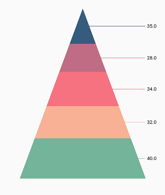
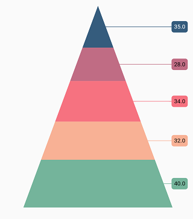
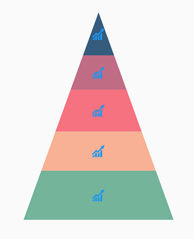
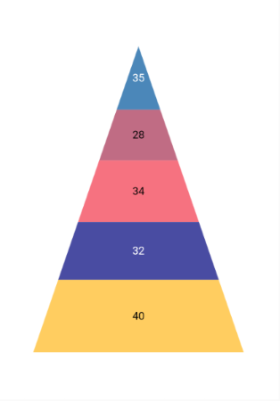

# Data label in Flutter Pyramid Chart (SfPyramidChart)

Data label can be added to a chart series by enabling the [`isVisible`](https://pub.dev/documentation/syncfusion_flutter_charts/latest/charts/DataLabelSettings/isVisible.html) option in the [`dataLabelSettings`](https://pub.dev/documentation/syncfusion_flutter_charts/latest/charts/PyramidSeries/dataLabelSettings.html). You can use the following properties to customize the appearance.

* [`color`](https://pub.dev/documentation/syncfusion_flutter_charts/latest/charts/DataLabelSettings/color.html) - used to change the background color of the data label shape.
* [`borderWidth`](https://pub.dev/documentation/syncfusion_flutter_charts/latest/charts/DataLabelSettings/borderWidth.html) - used to change the stroke width of the data label shape.
* [`borderColor`](https://pub.dev/documentation/syncfusion_flutter_charts/latest/charts/DataLabelSettings/borderColor.html) - used to change the stroke color of the data label shape.
* [`alignment`](https://pub.dev/documentation/syncfusion_flutter_charts/latest/charts/DataLabelSettings/alignment.html) - aligns the data label text to [`ChartAlignment.near`](https://pub.dev/documentation/syncfusion_flutter_charts/latest/charts/ChartAlignment.html), [`ChartAlignment.center`](https://pub.dev/documentation/syncfusion_flutter_charts/latest/charts/ChartAlignment.html) and [`ChartAlignment.far`](https://pub.dev/documentation/syncfusion_flutter_charts/latest/charts/ChartAlignment.html).
* [`textStyle`](https://pub.dev/documentation/syncfusion_flutter_charts/latest/charts/DataLabelSettings/textStyle.html) - used to change the data label text color, size, font family, font style, and font weight.
* [`color`](https://pub.dev/documentation/syncfusion_flutter_charts/latest/charts/DataLabelSettings/color.html) - used to change the color of the data label.
* [`fontFamily`](https://api.flutter.dev/flutter/painting/TextStyle/fontFamily.html) - used to change the font family for the data label.
* [`fontStyle`](https://api.flutter.dev/flutter/painting/TextStyle/fontStyle.html) - used to change the font style for the data label.
* [`fontWeight`](https://api.flutter.dev/flutter/painting/TextStyle/fontWeight.html) - used to change the font weight for the data label.
* [`fontSize`](https://api.flutter.dev/flutter/painting/TextStyle/fontSize.html) - used to change the font size for the data label.
* [`margin`](https://pub.dev/documentation/syncfusion_flutter_charts/latest/charts/DataLabelSettings/margin.html) - used to change the margin size for data labels.
* [`opacity`](https://pub.dev/documentation/syncfusion_flutter_charts/latest/charts/DataLabelSettings/opacity.html) - used to control the transparency of the data label.
* [`labelAlignment`](https://pub.dev/documentation/syncfusion_flutter_charts/latest/charts/DataLabelSettings/labelAlignment.html) - used to align the Pyramid data label positions. The available options to customize the positions are [`ChartDataLabelAlignment.outer`](https://pub.dev/documentation/syncfusion_flutter_charts/latest/charts/ChartDataLabelAlignment.html), [`ChartDataLabelAlignment.auto`](https://pub.dev/documentation/syncfusion_flutter_charts/latest/charts/ChartDataLabelAlignment.html), [`ChartDataLabelAlignment.top`](https://pub.dev/documentation/syncfusion_flutter_charts/latest/charts/ChartDataLabelAlignment.html), [`ChartDataLabelAlignment.bottom`](https://pub.dev/documentation/syncfusion_flutter_charts/latest/charts/ChartDataLabelAlignment.html) and [`ChartDataLabelAlignment.middle`](https://pub.dev/documentation/syncfusion_flutter_charts/latest/charts/ChartDataLabelAlignment.html).
* [`borderRadius`](https://pub.dev/documentation/syncfusion_flutter_charts/latest/charts/DataLabelSettings/borderRadius.html) - used to add the rounded corners to the data label shape.
* [`angle`](https://pub.dev/documentation/syncfusion_flutter_charts/latest/charts/DataLabelSettings/angle.html) - used to rotate the labels.
* [`offset`](https://pub.dev/documentation/syncfusion_flutter_charts/latest/charts/DataLabelSettings/offset.html) - used to move the data label vertically or horizontally from its position.
* [`showCumulativeValues`](https://pub.dev/documentation/syncfusion_flutter_charts/latest/charts/DataLabelSettings/showCumulativeValues.html) - to show the cumulative values in stacked type series charts.
* [`labelIntersectAction`](https://pub.dev/documentation/syncfusion_flutter_charts/latest/charts/DataLabelSettings/labelIntersectAction.html) - action on data labels intersection. The intersecting data labels can be hidden.

 

    @override
    Widget build(BuildContext context) {
        return Scaffold(
            body: Center(
                child: Container(
                    child: SfPyramidChart(
                        series: PyramidSeries<SalesData, String>(
                                dataSource: chartData,
                                pointColorMapper: (SalesData data, _) => data.color,
                                xValueMapper: (SalesData data, _) => data.x,
                                yValueMapper: (SalesData data, _) => data.y,
                                dataLabelSettings: DataLabelSettings(
                                    // Renders the data label
                                    isVisible: true
                                )
                            )
                    )
                )
            )
        );
    }



## Connector line

This feature is used to connect label and data point using a line. It can be enabled for [`PyramidSeries`](https://pub.dev/documentation/syncfusion_flutter_charts/latest/charts/PyramidSeries-class.html) chart type. The [`connectorLineSettings`](https://pub.dev/documentation/syncfusion_flutter_charts/latest/charts/DataLabelSettings/connectorLineSettings.html) property used to customize the connector line.

* [`color`](https://pub.dev/documentation/syncfusion_flutter_charts/latest/charts/ConnectorLineSettings/color.html) - used to change the color of the line
* [`width`](https://pub.dev/documentation/syncfusion_flutter_charts/latest/charts/ConnectorLineSettings/width.html) - used to change the stroke thickness of the line
* [`length`](https://pub.dev/documentation/syncfusion_flutter_charts/latest/charts/ConnectorLineSettings/length.html) - specifies the length of the connector line.
* [`type`](https://pub.dev/documentation/syncfusion_flutter_charts/latest/charts/ConnectorLineSettings/type.html) - specifies the shape of connector line either [`ConnectorType.curve`](https://pub.dev/documentation/syncfusion_flutter_charts/latest/charts/ConnectorType.html) or [`ConnectorType.line`](https://pub.dev/documentation/syncfusion_flutter_charts/latest/charts/ConnectorType.html). 

 

    @override
    Widget build(BuildContext context) {
        return Scaffold(
            body: Center(
                child: Container(
                    child: SfPyramidChart(
                        series: <PyramidSeries>[
                            PyramidSeries<ChartData, double>(
                                enableSmartLabels: true,
                                dataSource: chartData,
                                xValueMapper: (ChartData data, _) => data.x,
                                yValueMapper: (ChartData data, _) => data.y,
                                dataLabelSettings: DataLabelSettings(
                                    isVisible: true,
                                    labelPosition: ChartDataLabelPosition.outside,
                                    connectorLineSettings: ConnectorLineSettings(
                                        // Type of the connector line
                                        type: ConnectorType.curve
                                    )
                                )
                            )
                        ]
                    )
                )
            )
        );
    }



## Positioning the labels

The [`labelAlignment`](https://pub.dev/documentation/syncfusion_flutter_charts/latest/charts/ChartDataLabelAlignment.html) property is used to position the Pyramid chart type data labels at [`ChartDataLabelAlignment.top`](https://pub.dev/documentation/syncfusion_flutter_charts/latest/charts/ChartDataLabelAlignment.html), [`ChartDataLabelAlignment.bottom`](https://pub.dev/documentation/syncfusion_flutter_charts/latest/charts/ChartDataLabelAlignment.html), [`ChartDataLabelAlignment.auto`](https://pub.dev/documentation/syncfusion_flutter_charts/latest/charts/ChartDataLabelAlignment.html), [`ChartDataLabelAlignment.outer`](https://pub.dev/documentation/syncfusion_flutter_charts/latest/charts/ChartDataLabelAlignment.html) and [`ChartDataLabelAlignment.middle`](https://pub.dev/documentation/syncfusion_flutter_charts/latest/charts/ChartDataLabelAlignment.html) position of the actual data point position. By default, labels are [`ChartDataLabelAlignment.auto`](https://pub.dev/documentation/syncfusion_flutter_charts/latest/charts/ChartDataLabelAlignment.html) positioned. You can move the labels horizontally and vertically using OffsetX and OffsetY properties respectively.

The [`labelPosition`](https://pub.dev/documentation/syncfusion_flutter_charts/latest/charts/DataLabelSettings/labelPosition.html) property is used to place the Pyramid series data labels either [`ChartDataLabelPosition.inside`](https://pub.dev/documentation/syncfusion_flutter_charts/latest/charts/ChartDataLabelPosition.html) or [`ChartDataLabelPosition.outside`](https://pub.dev/documentation/syncfusion_flutter_charts/latest/charts/ChartDataLabelPosition.html). By default the label of Pyramid chart is placed [`ChartDataLabelPosition.inside`](https://pub.dev/documentation/syncfusion_flutter_charts/latest/charts/ChartDataLabelPosition.html) the series.

 

    @override
    Widget build(BuildContext context) {
        return Scaffold(
            body: Center(
                child: Container(
                    child: SfPyramidChart(
                        series: PyramidSeries<SalesData, String>(
                                dataSource: chartData,
                                xValueMapper: (SalesData data, _) => data.x,
                                yValueMapper: (SalesData data, _) => data.y,
                                dataLabelSettings: DataLabelSettings(
                                    isVisible: true,
                                    // Positioning the data label
                                    labelPosition: ChartDataLabelPosition.outside
                                )
                            )
                    )
                )
            )
        );
    }



N> The [`labelAlignment`](https://pub.dev/documentation/syncfusion_flutter_charts/latest/charts/DataLabelSettings/labelAlignment.html) property is used to position the Cartesian chart labels whereas [`labelPosition`](https://pub.dev/documentation/syncfusion_flutter_charts/latest/charts/DataLabelSettings/labelPosition.html) property is used to position the Pyramid chart labels.

## Apply series color

The [`useSeriesColor`](https://pub.dev/documentation/syncfusion_flutter_charts/latest/charts/DataLabelSettings/useSeriesColor.html) property is used to apply the series color to background color of the data labels. The default value of this property is false.

 

    @override
    Widget build(BuildContext context) {
        return Scaffold(
            body: Center(
                child: Container(
                    child: SfPyramidChart(
                        series: PyramidSeries<SalesData, String>(
                                dataSource: chartData,
                                xValueMapper: (SalesData data, _) => data.x,
                                yValueMapper: (SalesData data, _) => data.y,
                                dataLabelSettings: DataLabelSettings(
                                    isVisible: true,
                                    // Positioning the data label
                                    labelPosition: ChartDataLabelPosition.outside,
                                    // Renders background rectangle and fills it with series color
                                    useSeriesColor: true
                                )
                            )
                    )
                )
            )
        );
    }



## Templating the labels

You can customize the appearance of the data label with your own template using the [`builder`](https://pub.dev/documentation/syncfusion_flutter_charts/latest/charts/DataLabelSettings/builder.html) property of [`dataLabelSettings`](https://pub.dev/documentation/syncfusion_flutter_charts/latest/charts/PyramidSeries/dataLabelSettings.html).

 

    @override
    Widget build(BuildContext context) {
        return Scaffold(
            body: Center(
                child: Container(
                    child: SfPyramidChart(
                        series: PyramidSeries<SalesData, String>(
                                dataSource: chartData,
                                xValueMapper: (SalesData data, _) => data.x,
                                yValueMapper: (SalesData data, _) => data.y,
                                dataLabelSettings: DataLabelSettings(
                                    isVisible: true,
                                    // Templating the data label
                                    builder: (dynamic data, dynamic point, dynamic series, int pointIndex, int seriesIndex) {
                                        return Container(
                                        height: 30,
                                        width: 30,
                                        child: Image.asset('images/livechart.png')
                                        );
                                    }
                                )
                            )
                    )
                )
            )
        );
    }



## Hide data label for 0 value

Data label and its connector line in the Pyramid charts for the point value 0 can be hidden using the [`showZeroValue`](https://pub.dev/documentation/syncfusion_flutter_charts/latest/charts/DataLabelSettings/showZeroValue.html) property. This defaults to true.

 

    @override
    Widget build(BuildContext context) {
        return Scaffold(
            body: Center(
                    child:SfPyramidChart(
                        series: PyramidSeries<SalesData, num>(
                            dataSource: [
                                SalesData(11, 35),
                                SalesData(12, 28),
                                SalesData(13, 0),
                                SalesData(14, 32),
                                SalesData(15, 40)
                            ],
                            xValueMapper: (SalesData sales, _) => sales.xValue,
                            yValueMapper: (SalesData sales, _) => sales.yValue,
                            dataLabelSettings: DataLabelSettings(
                                showZeroValue: false, 
                                isVisible: true
                            ),
                        )
                    )
            )
        );
    }


### Data label saturation color

If the user didn’t provide text color to the data label, then by default, the saturation color is applied to the data label text. i.e., if the data points background color intensity is dark, then the data label will render in white color (#FFFFFF) and if the data points background color intensity is light, data label will render in black color (#000000).

