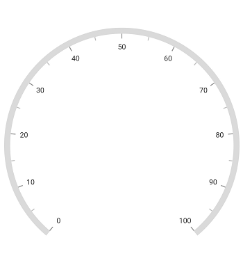
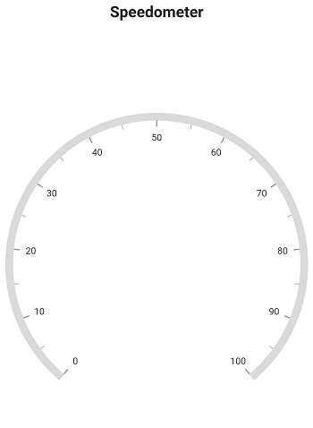
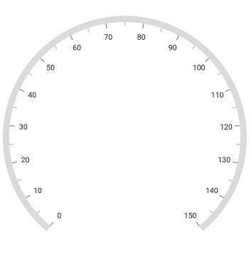
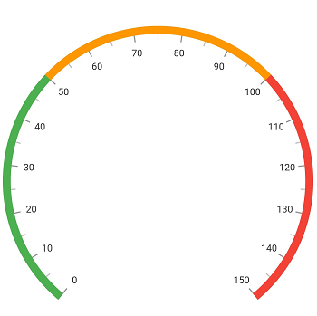
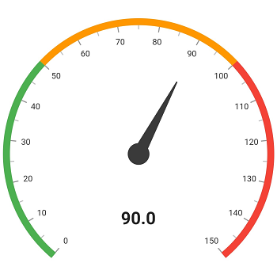

# Getting Started

This section explains the steps required to add the radial gauge and its elements such as title, axis, range, pointer and annotation. This section covers only basic features needed to know to get started with Syncfusion radial gauge. 

## Add Flutter Radial Gauge to an application

Create a simple project using the instructions given in the [Getting Started with your first Flutter app](https://flutter.dev/docs/get-started/test-drive?tab=vscode#create-app) documentation.

**Add dependency**

Add the Syncfusion Flutter Gauge dependency to your pub spec file.

 

    dependencies:

    syncfusion_flutter_gauges: ^1.0.0-beta



**Get packages**

Run the following command to get the required packages.

 

    $ flutter pub get



**Import package**

Import the following package in your Dart code.

 

    import 'package:syncfusion_flutter_gauges/gauges.dart';



## Initialize the radial gauge

After the package has been imported, initialize the SfRadialGauge as a child of any widget such as container widget.

 

    @override
    Widget build(BuildContext context) {
        return MaterialApp(
            home: Scaffold(
                body: Center(
                    child: Container(
                        child:SfRadialGauge()
                        )
                    )
                )      
            );
        }



## Add title

You can add a title to the radial gauge to provide information to users about the designed gauge. The title can be set to gauge as demonstrated in following code snippet. 

 

    @override
    Widget build(BuildContext context) {
        return MaterialApp(
            home: Scaffold(
                body: Center(
                    child: Container(
                        child: SfRadialGauge(
                            title:GaugeTitle(text: 'Speedometer', textStyle: TextStyle(
                            fontSize: 20.0,fontWeight: FontWeight.bold))
                        )
                    )
                )
            )      
        );
    }



## Add axis

Axes contain a list of axis elements, where you can add any number of radial axes inside the gauge. You can specify the minimum and maximum values of axis using the [`minimum`](https://pub.dev/documentation/syncfusion_flutter_gauges/latest/gauges/GaugeAxis/minimum.html) and [`maximum`](https://pub.dev/documentation/syncfusion_flutter_gauges/latest/gauges/GaugeAxis/maximum.html) properties as demonstrated in the following code snippet.

 

    @override
    Widget build(BuildContext context) {
        return MaterialApp(
            home: Scaffold(
                body: Center(
                    child: Container(
                    child: SfRadialGauge(
                        axes: <RadialAxis>[
                            RadialAxis(minimum: 0, maximum: 150)]
                        )
                    )
                )
            )      
        );
    }



## Add range

Ranges contain a list of range elements, where you can add any number of ranges inside the axis. You can specify the start value, end value, and color for range using the [`startValue`](https://pub.dev/documentation/syncfusion_flutter_gauges/latest/gauges/GaugeRange/startValue.html), [`endValue`](https://pub.dev/documentation/syncfusion_flutter_gauges/latest/gauges/GaugeRange/endValue.html), and color properties as demonstrated in the following code.   

 

    axes: <RadialAxis>[
        RadialAxis(minimum: 0,maximum: 150,
                ranges: <GaugeRange>[
                    GaugeRange(startValue: 0,endValue: 50,color: Colors.green,startWidth: 10,endWidth:10),
                    GaugeRange(startValue: 50,endValue: 100,color: Colors.orange,startWidth: 10,endWidth: 10),
                    GaugeRange(startValue: 100,endValue: 150,color: Colors.red,startWidth: 10,endWidth: 10)]
                )]



## Add pointer

Pointers contains a list of pointer elements, where you can add any number of gauge pointers such as [`needlePointer`](https://pub.dev/documentation/syncfusion_flutter_gauges/latest/gauges/NeedlePointer-class.html), [`rangePointer`](https://pub.dev/documentation/syncfusion_flutter_gauges/latest/gauges/RangePointer-class.html) and [`markerPointer`](https://pub.dev/documentation/syncfusion_flutter_gauges/latest/gauges/MarkerPointer-class.html) inside the axis to indicate the value. 

 

    axes: <RadialAxis>[
        RadialAxis(minimum: 0,maximum: 150,
        pointers: <GaugePointer>[NeedlePointer(value:90)]
        )]



## Add annotation

You can add any number of widgets such as text or image as an annotation inside the axis. The position of annotation can be customized using the [`angle`](https://pub.dev/documentation/syncfusion_flutter_gauges/latest/gauges/GaugeAnnotation/angle.html) and [`positionFactor`](https://pub.dev/documentation/syncfusion_flutter_gauges/latest/gauges/GaugeAnnotation/positionFactor.html) properties as demonstrated in the following code.

 

    axes: <RadialAxis>[
        RadialAxis(minimum: 0,maximum: 150,
        annotations: <GaugeAnnotation>[
            GaugeAnnotation(widget: Container(child:
            Text('90.0',style: TextStyle(fontSize: 25,fontWeight: FontWeight.bold))),
            angle: 90,positionFactor: 0.5)]
            )]



The following code example gives you the complete code of above configurations.

 

    import 'package:flutter/material.dart';
    import 'package:syncfusion_flutter_gauges/gauges.dart';

    void main() => runApp(ChartApp());

    class ChartApp extends StatelessWidget {

    @override
    Widget build(BuildContext context) {
        return MaterialApp(
            home: Scaffold(
                body: Center(
                    child: Container(
                        child: SfRadialGauge(
                            axes: <RadialAxis>[
                                RadialAxis(minimum: 0,maximum: 150,
                                ranges: <GaugeRange>[
                                    GaugeRange(startValue: 0,endValue: 50,color: Colors.green,startWidth: 10,endWidth: 10),
                                    GaugeRange(startValue: 50,endValue: 100,color: Colors.orange,startWidth: 10,endWidth: 10),
                                    GaugeRange(startValue: 100,endValue: 150,color: Colors.red,startWidth: 10,endWidth: 10)],
                                    pointers: <GaugePointer>[NeedlePointer(value:90)],
                                    annotations: <GaugeAnnotation>[
                                        GaugeAnnotation(widget: Container(child:
                                        Text('90.0',style: TextStyle(fontSize: 25,fontWeight:FontWeight.bold))),
                                        angle: 90,positionFactor: 0.5)]
                                )]
                            )
                        )
                    )
                )
            );
        }
    }

