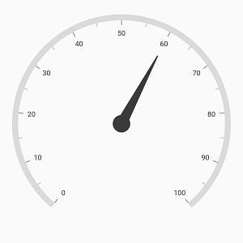
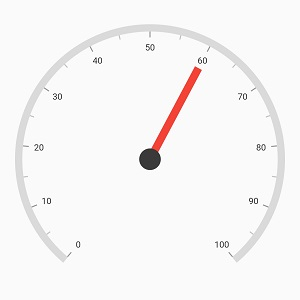
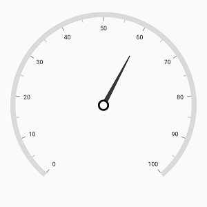
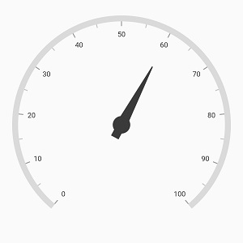
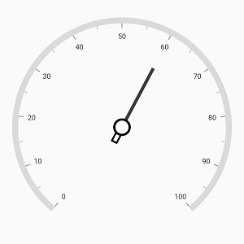

# Pointers

 Pointer is used to indicate values on an axis. It has three types of pointers: 
[`needle pointer`](https://pub.dev/documentation/syncfusion_flutter_gauges/latest/gauges/NeedlePointer-class.html), [`marker pointer`](https://pub.dev/documentation/syncfusion_flutter_gauges/latest/gauges/MarkerPointer-class.html), and [`range pointer`](https://pub.dev/documentation/syncfusion_flutter_gauges/latest/gauges/RangePointer-class.html). All the pointers can be customized as needed. You can add multiple pointers to the gauge to point multiple values on the same scale. The value of the pointer is set by using the [`value`](https://pub.dev/documentation/syncfusion_flutter_gauges/latest/gauges/GaugePointer/value.html) property.

## Needle Pointer


@override
Widget build(BuildContext context) {
  return Scaffold(
    body: Center(
              child: SfRadialGauge(
                axes: <RadialAxis>[RadialAxis(
                  pointers: <GaugePointer>[NeedlePointer(value: 60)]
                )],
              )
    ),
  );
}



The needle can be customized with the following properties,

* [`needleLength`](https://pub.dev/documentation/syncfusion_flutter_gauges/latest/gauges/NeedlePointer/needleLength.html) – used to customizes the length of the needle. The length of the pointer can be set either in logical pixel
* [‘lengthUnit`](https://pub.dev/documentation/syncfusion_flutter_gauges/latest/gauges/NeedlePointer/lengthUnit.html) – used to specifies whether to set the length in logical pixel or factor. 
* [`startWidth`](https://pub.dev/documentation/syncfusion_flutter_gauges/latest/gauges/NeedlePointer/needleStartWidth.html) – used to specifies the start width of the needle
* [`endWidth`](https://pub.dev/documentation/syncfusion_flutter_gauges/latest/gauges/NeedlePointer/needleEndWidth.html) – used to specifies the end width of the needle
* [`needleColor`](https://pub.dev/documentation/syncfusion_flutter_gauges/latest/gauges/NeedlePointer/needleColor.html) – used to specifies the needle color

**Customizing the needle length**

The needle length can be controlled by [‘needleLength`](https://pub.dev/documentation/syncfusion_flutter_gauges/latest/gauges/NeedlePointer/needleLength.html) and [‘lengthUnit`](https://pub.dev/documentation/syncfusion_flutter_gauges/latest/gauges/NeedlePointer/lengthUnit.html) property. The length can be set either in logical pixel or factor using [`lengthUnit`](https://pub.dev/documentation/syncfusion_flutter_gauges/latest/gauges/NeedlePointer/lengthUnit.html). 

If the [‘lengthUnit`](https://pub.dev/documentation/syncfusion_flutter_gauges/latest/gauges/NeedlePointer/lengthUnit.html) is set as logical pixel, the logical pixel value will be set to the [`needleLength`](https://pub.dev/documentation/syncfusion_flutter_gauges/latest/gauges/NeedlePointer/needleLength.html)
If the [`lengthUnit`](https://pub.dev/documentation/syncfusion_flutter_gauges/latest/gauges/NeedlePointer/lengthUnit.html) is set as factor, then the factor value will be set to the [`needleLength`](https://pub.dev/documentation/syncfusion_flutter_gauges/latest/gauges/NeedlePointer/needleLength.html). The factor value ranges from 0 to 1. For example, if the needle length is set as 0.5, the half of the radius value of [`axis`] is set as needle length. The default value of [`lengthUnit`](https://pub.dev/documentation/syncfusion_flutter_gauges/latest/gauges/NeedlePointer/lengthUnit.html) is SizeUnit.factor


@override
Widget build(BuildContext context) {
  return Scaffold(
    body: Center(
              child: SfRadialGauge(
                axes: <RadialAxis>[RadialAxis(
                  pointers: <GaugePointer>[NeedlePointer(value: 60,
                    lengthUnit: GaugeSizeUnit.logicalPixel,
                    needleLength: 130)]
                )],
              )
    ),
  );
}


**Customizing needle width**

The width of the needle pointer can be customized using its [`needleStartWidth`](https://pub.dev/documentation/syncfusion_flutter_gauges/latest/gauges/NeedlePointer/needleStartWidth.html) and [`needleEndWidth`](https://pub.dev/documentation/syncfusion_flutter_gauges/latest/gauges/NeedlePointer/needleEndWidth.html) property.


@override
Widget build(BuildContext context) {
  return Scaffold(
    body: Center(
              child: SfRadialGauge(
                axes: <RadialAxis>[RadialAxis(
                  pointers: <GaugePointer>[NeedlePointer(value: 60,
                      lengthUnit: GaugeSizeUnit.factor,
                  needleLength: 0.75, needleColor: Colors.red, needleStartWidth: 6,
                      needleEndWidth: 6)]
                )],
              )
    ),
  );
}



**Knob customization**

The knob can be customized with its following properties,

* [`knobRadius`](https://pub.dev/documentation/syncfusion_flutter_gauges/latest/gauges/KnobStyle/knobRadius.html) – used to specify the knob radius either in logical pixel or factor
* [`color`](https://pub.dev/documentation/syncfusion_flutter_gauges/latest/gauges/KnobStyle/color.html) – used to specify the knob color
* [`borderWidth`](https://pub.dev/documentation/syncfusion_flutter_gauges/latest/gauges/KnobStyle/borderWidth.html) – used to specify the border width of knob either in logical pixel or factor
* [`borderColor`](https://pub.dev/documentation/syncfusion_flutter_gauges/latest/gauges/KnobStyle/borderColor.html) – used to specify the border color of knob
* [`sizeUnit`](https://pub.dev/documentation/syncfusion_flutter_gauges/latest/gauges/KnobStyle/sizeUnit.html) – allows to specify whether the value of knob radius and border width is in logical pixel or in factor

**Knob radius customization**

The radius of the knob can be customized using the [`knobRadius`](https://pub.dev/documentation/syncfusion_flutter_gauges/latest/gauges/KnobStyle/knobRadius.html) and [`sizeUnit`](https://pub.dev/documentation/syncfusion_flutter_gauges/latest/gauges/KnobStyle/sizeUnit.html). 
The logical pixel value can be set to knob radius when the [`sizeUnit`](https://pub.dev/documentation/syncfusion_flutter_gauges/latest/gauges/KnobStyle/sizeUnit.html) is set as logical pixel



@override
Widget build(BuildContext context) {
  return Scaffold(
    body: Center(
              child: SfRadialGauge(
                axes: <RadialAxis>[RadialAxis(
                  pointers: <GaugePointer>[NeedlePointer(value: 60, needleStartWidth: 1, needleEndWidth: 5,
                    knobStyle: KnobStyle(knobRadius: 10,
                        sizeUnit: GaugeSizeUnit.logicalPixel, color: Colors.red)
                     )]
                )],
              )
    ),
  );
}



If the [`sizeUnit`](https://pub.dev/documentation/syncfusion_flutter_gauges/latest/gauges/KnobStyle/sizeUnit.html) is set as factor, the factor value will be set to knob radius. The factor value ranges from 0 to 1. For example, if the needle length is set as 0.1, the 10% of the radius value of [`axis`](https://pub.dev/documentation/syncfusion_flutter_gauges/latest/gauges/RadialAxis-class.html) will be set to knob radius. By default, the value of [`sizeUnit`](https://pub.dev/documentation/syncfusion_flutter_gauges/latest/gauges/KnobStyle/sizeUnit.html) is GaugeSizeUnit.factor

**Knob border customization**

As like radius, the [`borderWidth`](https://pub.dev/documentation/syncfusion_flutter_gauges/latest/gauges/KnobStyle/borderWidth.html) can be specifies either in logical pixel or factor. The [`sizeUnit`](https://pub.dev/documentation/syncfusion_flutter_gauges/latest/gauges/KnobStyle/sizeUnit.html) property of [`knob style`](https://pub.dev/documentation/syncfusion_flutter_gauges/latest/gauges/KnobStyle-class.html) is common for both [`knobRadius`](https://pub.dev/documentation/syncfusion_flutter_gauges/latest/gauges/KnobStyle/knobRadius.html) and [`borderWidth`](https://pub.dev/documentation/syncfusion_flutter_gauges/latest/gauges/KnobStyle/borderWidth.html) property.



@override
Widget build(BuildContext context) {
  return Scaffold(
    body: Center(
              child: SfRadialGauge(
                axes: <RadialAxis>[RadialAxis(
                  pointers: <GaugePointer>[NeedlePointer(value: 60, needleStartWidth: 1, needleEndWidth: 5,
                    knobStyle: KnobStyle(knobRadius: 0.05, borderColor: Colors.black, borderWidth: 0.02,
                        color: Colors.white)
                     )]
                )],
              )
    ),
  );
}



**Tail Customization**

The [`tail`](https://pub.dev/documentation/syncfusion_flutter_gauges/latest/gauges/NeedlePointer/tailStyle.html) of the needle can be customized using the following properties,

* [`length`](https://pub.dev/documentation/syncfusion_flutter_gauges/latest/gauges/TailStyle/length.html) – used to specifies the length of tail either in logical pixel or factor
* [`lengthUnit`](https://pub.dev/documentation/syncfusion_flutter_gauges/latest/gauges/TailStyle/lengthUnit.html) – used to specify whether the tail length value is defined in logical pixel or factor
* [`width`](https://pub.dev/documentation/syncfusion_flutter_gauges/latest/gauges/TailStyle/width.html) – used to specify the width for the tail
* [`borderColor`](https://pub.dev/documentation/syncfusion_flutter_gauges/latest/gauges/TailStyle/borderColor.html) – allows to specify the border color of tail
* [`borderWidth`](https://pub.dev/documentation/syncfusion_flutter_gauges/latest/gauges/TailStyle/borderWidth.html) – allows to specify the border width of tail

By default, the value of [`lengthUnit`](https://pub.dev/documentation/syncfusion_flutter_gauges/latest/gauges/TailStyle/lengthUnit.html) is GaugeSizeUnit.factor
The following code example shows to specify the length in factor. The factor value ranges from 0 to 1. When the length is set as 0.2, then 20 % of axis radius value will be considered as tail length.



@override
Widget build(BuildContext context) {
  return Scaffold(
    body: Center(
              child: SfRadialGauge(
                axes: <RadialAxis>[RadialAxis(
                  pointers: <GaugePointer>[NeedlePointer(value: 60,
                      tailStyle: TailStyle(width: 8, length: 0.15)
                     )]
                )],
              )
    ),
  );
}



The following code example shows to specify the length in logical pixel



@override
Widget build(BuildContext context) {
  return Scaffold(
    body: Center(
              child: SfRadialGauge(
                axes: <RadialAxis>[RadialAxis(
                  pointers: <GaugePointer>[NeedlePointer(value: 60,needleStartWidth: 3, needleEndWidth: 3,
                      knobStyle: KnobStyle(color: Colors.white, knobRadius: 0.07,
                          borderColor: Colors.black, borderWidth: 0.02),
                      tailStyle: TailStyle(width: 5, length: 30, lengthUnit: GaugeSizeUnit.logicalPixel,
                      color: Colors.white, borderWidth: 3, borderColor: Colors.black)
                     )]
                )],
              )
    ),
  );
}



## Marker pointer

The different types of markers are used to mark the pointer values in a scale. You can change the marker type by using the [`markerType`](https://pub.dev/documentation/syncfusion_flutter_gauges/latest/gauges/MarkerPointer/markerType.html) property. Gauge supports the following types of marker types:

* Circle
* Diamond
* Image
* Inverted triangle
* Rectangle
* Text
* Triangle


@override
Widget build(BuildContext context) {
  return Scaffold(
    body: Center(
              child: SfRadialGauge(
                axes: <RadialAxis>[RadialAxis(
                  pointers: <GaugePointer>[MarkerPointer(value: 60)]
                )],
              )
    ),
  );
}



The marker pointer can be customized with the below properties,

* [`color`](https://pub.dev/documentation/syncfusion_flutter_gauges/latest/gauges/MarkerPointer/color.html) – allows to customize the marker color
* [`markerHeight`](https://pub.dev/documentation/syncfusion_flutter_gauges/latest/gauges/MarkerPointer/markerHeight.html) – allows to specify the marker height
* [`markerWidth`](https://pub.dev/documentation/syncfusion_flutter_gauges/latest/gauges/MarkerPointer/markerWidth.html) – allows to specify the marker width
* [`borderColor`](https://pub.dev/documentation/syncfusion_flutter_gauges/latest/gauges/MarkerPointer/borderColor.html) – allows to specify the border color for the marker
* [‘borderWidth`](https://pub.dev/documentation/syncfusion_flutter_gauges/latest/gauges/MarkerPointer/borderWidth.html) – allows to specify the border width of the marker



@override
Widget build(BuildContext context) {
  return Scaffold(
    body: Center(
              child: SfRadialGauge(
                axes: <RadialAxis>[RadialAxis(
                  pointers: <GaugePointer>[MarkerPointer(value: 60, markerHeight: 30, markerWidth: 30,
                      markerType: MarkerType.circle, color: Colors.lightBlue,
                      borderWidth: 3, borderColor: Colors.black)]
                )],
              )
    ),
  );
}



**Image pointer**

Image is used to denote the current pointer values instead of shape. It can be achieved using by specifying the [`markerType`](https://pub.dev/documentation/syncfusion_flutter_gauges/latest/gauges/MarkerPointer/markerType.html) as image and specifying the [`imageUrl`](https://pub.dev/documentation/syncfusion_flutter_gauges/latest/gauges/MarkerPointer/imageUrl.html) property of marker pointer.



@override
Widget build(BuildContext context) {
  return Scaffold(
    body: Center(
              child: SfRadialGauge(
                axes: <RadialAxis>[RadialAxis(
                  pointers: <GaugePointer>[MarkerPointer(value: 60,
                      markerType: MarkerType.image,markerHeight: 30, markerWidth: 30,
                      imageUrl: 'images/pin.png')]
                )],
              )
    ),
  );
}



## Text pointer

Text is used to denote the current pointer value instead of any marker shape. It can be achieved using by setting the [`markerType`](https://pub.dev/documentation/syncfusion_flutter_gauges/latest/gauges/MarkerPointer/markerType.html) as text. The provided text can be customized using [`textStyle`](https://pub.dev/documentation/syncfusion_flutter_gauges/latest/gauges/MarkerPointer/textStyle.html) property of marker pointer.



@override
Widget build(BuildContext context) {
  return Scaffold(
    body: Center(
              child: SfRadialGauge(
                axes: <RadialAxis>[RadialAxis(
                  pointers: <GaugePointer>[MarkerPointer(value: 50,
                      markerType: MarkerType.text, text: 'Average',
                    textStyle: GaugeTextStyle(fontSize: 15, fontWeight: FontWeight.bold,
                        fontStyle: FontStyle.italic)
                      )]
                )],
              )
    ),
  );
}



**Marker position customization**

The marker pointer can be moved near or far from its actual position with the [`markerOffset`](https://pub.dev/documentation/syncfusion_flutter_gauges/latest/gauges/MarkerPointer/markerOffset.html) and [`offsetUnit`](https://pub.dev/documentation/syncfusion_flutter_gauges/latest/gauges/MarkerPointer/offsetUnit.html) property. 

When you set the [`offsetUnit`](https://pub.dev/documentation/syncfusion_flutter_gauges/latest/gauges/MarkerPointer/offsetUnit.html) as logical pixel, then the marker pointer will be moved based on the logical pixel value. If you set the [`offsetUnit`](https://pub.dev/documentation/syncfusion_flutter_gauges/latest/gauges/MarkerPointer/offsetUnit.html) as factor, then provided factor will be multiplied with the axis radius value and then the pointer will be moved to corresponding value. The default value of [`offsetUnit`](https://pub.dev/documentation/syncfusion_flutter_gauges/latest/gauges/MarkerPointer/offsetUnit.html) is GaugeSizeUnit.logicalPixel.



@override
Widget build(BuildContext context) {
  return Scaffold(
    body: Center(
              child: SfRadialGauge(
                axes: <RadialAxis>[RadialAxis( radiusFactor: 0.9, centerY: 0.65,
                  pointers: <GaugePointer>[MarkerPointer(value: 60,
                    markerOffset: -5
                      )]
                )],
              )
    ),
  );
}



## Range Pointer

A range pointer is an accenting line or shaded background range that can be placed on a gauge to mark the current value.



@override
Widget build(BuildContext context) {
  return Scaffold(
    body: Center(
              child: SfRadialGauge(
                axes: <RadialAxis>[RadialAxis(
                  pointers: <GaugePointer>[RangePointer(value: 30)]
                )],
              )
    ),
  );
}



The following properties are used to customize the range pointer,

* [`color`](https://pub.dev/documentation/syncfusion_flutter_gauges/latest/gauges/RangePointer/color.html) – used to customize the color of the range pointer
* [`width`](https://pub.dev/documentation/syncfusion_flutter_gauges/latest/gauges/RangePointer/width.html)  - used to specify the width of pointer either in the logical pixel or factor
* [`sizeUnit`](https://pub.dev/documentation/syncfusion_flutter_gauges/latest/gauges/RangePointer/sizeUnit.html) – specifies whether the [`width`](https://pub.dev/documentation/syncfusion_flutter_gauges/latest/gauges/RangePointer/width.html) and the [`pointerOffset`](https://pub.dev/documentation/syncfusion_flutter_gauges/latest/gauges/RangePointer/pointerOffset.html) is defined in logical pixel or factor

The [`width`](https://pub.dev/documentation/syncfusion_flutter_gauges/latest/gauges/RangePointer/width.html) of the pointer can be specified wither in logical pixel or factor. If the [`sizeUnit`](https://pub.dev/documentation/syncfusion_flutter_gauges/latest/gauges/RangePointer/sizeUnit.html) is specified as logicalPixel, then the range will be rendered based on the provided pixel value. If the [`sizeUnit`](https://pub.dev/documentation/syncfusion_flutter_gauges/latest/gauges/RangePointer/sizeUnit.html) is set as factor. Then the provided factor value will be multiplied with axis radius.
For example, if the width is set as 0.1, then 10% of axis radius is considered as range pointer width



@override
Widget build(BuildContext context) {
  return Scaffold(
    body: Center(
              child: SfRadialGauge(
                axes: <RadialAxis>[RadialAxis(
                  pointers: <GaugePointer>[RangePointer(value: 30, width: 0.1,
                      color: Colors.indigo, sizeUnit: GaugeSizeUnit.factor)]
                )],
              )
    ),
  );
}



 The default value of [`SizeUnit`](https://pub.dev/documentation/syncfusion_flutter_gauges/latest/gauges/RangePointer/sizeUnit.html) is [`GaugeSizeUnit.logicalPixel`](https://pub.dev/documentation/syncfusion_flutter_gauges/latest/gauges/GaugeSizeUnit-class.html).

 **Corner customization**

 The [`cornerStyle`](https://pub.dev/documentation/syncfusion_flutter_gauges/latest/gauges/RangePointer/cornerStyle.html) property of [`range pointer`](https://pub.dev/documentation/syncfusion_flutter_gauges/latest/gauges/RangePointer-class.html) specifies the corner type for pointer. The corners can be customized using the bothFlat, bothCurve, startCurve, and endCurve options. The default value of this property is bothFlat.

 

@override
Widget build(BuildContext context) {
  return Scaffold(
    body: Center(
              child: SfRadialGauge(
                axes: <RadialAxis>[RadialAxis(pointers:<GaugePointer>[RangePointer(value: 30, 
cornerStyle: CornerStyle.bothCurve)]
                )],
              )
    ),
  );
}



**Position customization**

The range pointer can be moved far or near to the axis line by using it [`pointerOffset`](https://pub.dev/documentation/syncfusion_flutter_gauges/latest/gauges/RangePointer/pointerOffset.html) property. The [`pointerOffset`](https://pub.dev/documentation/syncfusion_flutter_gauges/latest/gauges/RangePointer/pointerOffset.html) can be set either in logical pixel or factor value using its [`sizeUnit`](https://pub.dev/documentation/syncfusion_flutter_gauges/latest/gauges/RangePointer/sizeUnit.html). The [`sizeUnit`](https://pub.dev/documentation/syncfusion_flutter_gauges/latest/gauges/RangePointer/sizeUnit.html) property is common for both its [`width`](https://pub.dev/documentation/syncfusion_flutter_gauges/latest/gauges/RangePointer/width.html) and [`pointerOffset`](https://pub.dev/documentation/syncfusion_flutter_gauges/latest/gauges/RangePointer/pointerOffset.html)



@override
Widget build(BuildContext context) {
  return Scaffold(
    body: Center(
              child: SfRadialGauge(
                axes: <RadialAxis>[RadialAxis( radiusFactor: 0.9, centerY: 0.65,
                  pointers: <GaugePointer>[RangePointer(value: 30, pointerOffset: 50)]
                )],
              )
    ),
  );
}



When you set the [`sizeUnit`](https://pub.dev/documentation/syncfusion_flutter_gauges/latest/gauges/RangePointer/sizeUnit.html) as logical pixel, the pointer will be moved to the provided logical pixel value. 

If the [`sizeUnit`](https://pub.dev/documentation/syncfusion_flutter_gauges/latest/gauges/RangePointer/sizeUnit.html) is specifies as factor. Then the factor value will be multiplied with the axis radius For example, if you set the [`pointerOffset`](https://pub.dev/documentation/syncfusion_flutter_gauges/latest/gauges/RangePointer/pointerOffset.html) as 0.1, then the pointer offset is considered as 10% of axis radius.

## Multiple pointers

In addition to the default pointer, you can add n number of pointers to an axis by adding in its [`pointers`](https://pub.dev/documentation/syncfusion_flutter_gauges/latest/gauges/GaugeAxis/pointers.html) property.



@override
Widget build(BuildContext context) {
  return Scaffold(
    body: Center(
              child: SfRadialGauge(
                axes: <RadialAxis>[RadialAxis(
                  pointers: <GaugePointer>[RangePointer(value: 30, ), NeedlePointer(value: 60)]
                )],
              )
    ),
  );
}



## Pointer Animation
The [`enableAnimation`](https://pub.dev/documentation/syncfusion_flutter_gauges/latest/gauges/GaugePointer/enableAnimation.html) property of pointer allows to enable or disable animation for pointer. The gauge pointers has following animation type.

* [`bounceOut`]
* [`ease`]
* [`easeInCirc`]
* [`easeOutBack`]
* [`elasticOut`]
* [`linear`]
* [`slowMiddle`]

The animation type can be changed with [`animationType`](https://pub.dev/documentation/syncfusion_flutter_gauges/latest/gauges/GaugePointer/animationType.html) property of pointer. By default the animation type is linear.



@override
Widget build(BuildContext context) {
  return Scaffold(
    body: Center(
              child: SfRadialGauge(
                axes: <RadialAxis>[RadialAxis( 
                 axisLineStyle: AxisLineStyle(thickness: 30), showTicks: false,
                 pointers: <GaugePointer>[NeedlePointer(value: 60, enableAnimation: true,
                 needleStartWidth: 0,
                   needleEndWidth: 5, needleColor: Color(0xFFDADADA),
                   knobStyle: KnobStyle(color: Colors.white, borderColor: Color(0xFFDADADA),
                       knobRadius: 0.06,
                       borderWidth: 0.04),
                   tailStyle: TailStyle(color:Color(0xFFDADADA), width: 5,
                   length: 0.15)
                    ),
                   RangePointer(value: 60, width: 30, enableAnimation: true, color: Colors.orange)
                 ]
                )],
              )
    ),
  );
}



## Pointer Dragging

Pointers can be dragged over the scale value. It can be achieved by clicking and dragging the pointer. To enable or disable the pointer drag, use the [`enableDragging`](https://pub.dev/documentation/syncfusion_flutter_gauges/latest/gauges/GaugePointer/enableDragging.html) property.



@override
Widget build(BuildContext context) {
  return Scaffold(
    body: Center(
              child: SfRadialGauge(
                axes: <RadialAxis>[RadialAxis( 
                 axisLineStyle: AxisLineStyle(thickness: 30, color: Colors.lightBlueAccent), 
                 showTicks: false,
                 pointers: <GaugePointer>[
                   MarkerPointer(value: 30, enableDragging: true, markerWidth: 30, markerHeight: 30, markerOffset: -15,
                   color: Colors.indigo)
                 ]
                )],
              )
    ),
  );
}



## Event

[`onValueChanged`](https://pub.dev/documentation/syncfusion_flutter_gauges/latest/gauges/GaugePointer/onValueChanged.html) occurs whenever the pointer value changed while dragging



@override
Widget build(BuildContext context) {
  return Scaffold(
    body: Center(
              child: SfRadialGauge(
                axes: <RadialAxis>[RadialAxis(
                  pointers: <GaugePointer>[RangePointer(value: 30, ), NeedlePointer(value: 60)]
                )],
              )
    ),
  );
}



