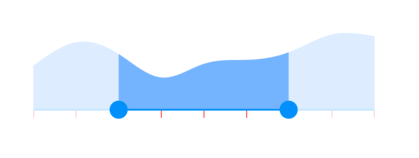
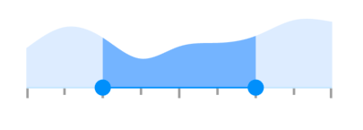
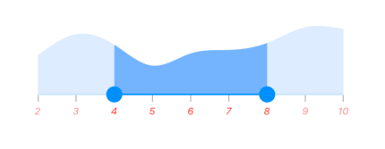
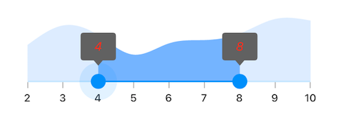
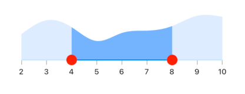
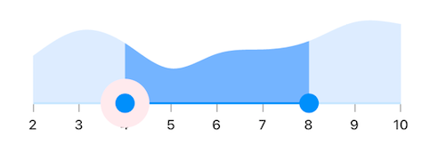
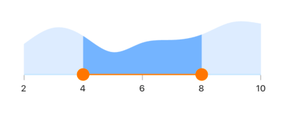
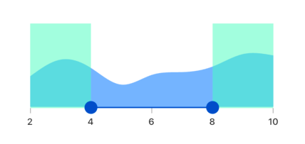
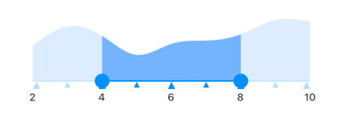

# Customization of range selector
This section explains about how to customize the range selector elements.

## Track customization

### Track color

You can change the active and inactive track color of the range selector using the `activeTrackColor` and `inactiveTrackColor` properties respectively.

N> You must import the `theme.dart' library from the [`Core`](https://pub.dev/packages/syncfusion_flutter_core) package to use [`SfRangeSelectorTheme`](https://help.syncfusion.com/flutter/range-selector/customization).




final double _min = 2.0;
final double _max = 10.0;
SfRangeValues _values = SfRangeValues(4.0, 7.0);

final List<Data> chartData = <Data>[
    Data(x:2.0, y: 2.2),
    Data(x:3.0, y: 3.4),
    Data(x:4.0, y: 2.8),
    Data(x:5.0, y: 1.6),
    Data(x:6.0, y: 2.3),
    Data(x:7.0, y: 2.5),
    Data(x:8.0, y: 2.9),
    Data(x:9.0, y: 3.8),
    Data(x:10.0, y: 3.7),
];

@override
Widget build(BuildContext context) {
  return MaterialApp(
      home: Scaffold(
          body: Center(
              child: SfRangeSelectorTheme(
                    data: SfRangeSliderThemeData(
                            activeTrackColor: Colors.red,
                            inactiveTrackColor: Colors.red[100],
                    ),
                    child:  SfRangeSelector(
                        min: _min,
                        max: _max,
                        initialValues: _values,
                        child: Container(
                        height: 130,
                        child: SfCartesianChart(
                            margin: const EdgeInsets.all(0),
                            primaryXAxis: NumericAxis(minimum: _min,
                                maximum: _max,
                                isVisible: false),
                            primaryYAxis: NumericAxis(isVisible: false),
                            plotAreaBorderWidth: 0,
                            series: <SplineAreaSeries<Data, double>>[
                                SplineAreaSeries<Data, double>(
                                    color: Color.fromARGB(255, 126, 184, 253),
                                        dataSource: chartData,
                                            xValueMapper: (Data sales, _) => sales.x,
                                            yValueMapper: (Data sales, _) => sales.y)
                                ],
                            ),
                        ),
                   ),
              ),
          )
      )
  );
}







class Data {
  Data({this.x, this.y});
  final double x;
  final double y;
}




### Track height

You can change the track height of the range selector using the `trackHeight` property. The default value of the `trackHeight` property is `2.0`.

N> You must import the `theme.dart' library from the [`Core`](https://pub.dev/packages/syncfusion_flutter_core) package to use [`SfRangeSelectorTheme`](https://help.syncfusion.com/flutter/range-selector/customization).




final double _min = 2.0;
final double _max = 10.0;
SfRangeValues _values = SfRangeValues(4.0, 7.0);

final List<Data> chartData = <Data>[
    Data(x:2.0, y: 2.2),
    Data(x:3.0, y: 3.4),
    Data(x:4.0, y: 2.8),
    Data(x:5.0, y: 1.6),
    Data(x:6.0, y: 2.3),
    Data(x:7.0, y: 2.5),
    Data(x:8.0, y: 2.9),
    Data(x:9.0, y: 3.8),
    Data(x:10.0, y: 3.7),
];

@override
Widget build(BuildContext context) {
  return MaterialApp(
      home: Scaffold(
          body: Center(
              child: SfRangeSelectorTheme(
                    data: SfRangeSliderThemeData(
                        trackHeight: 8,
                    ),
                    child:  SfRangeSelector(
                        min: _min,
                        max: _max,
                        initialValues: _values,
                        child: Container(
                        height: 130,
                        child: SfCartesianChart(
                            margin: const EdgeInsets.all(0),
                            primaryXAxis: NumericAxis(minimum: _min,
                                maximum: _max,
                                isVisible: false),
                            primaryYAxis: NumericAxis(isVisible: false),
                            plotAreaBorderWidth: 0,
                            series: <SplineAreaSeries<Data, double>>[
                                SplineAreaSeries<Data, double>(
                                    color: Color.fromARGB(255, 126, 184, 253),
                                        dataSource: chartData,
                                            xValueMapper: (Data sales, _) => sales.x,
                                            yValueMapper: (Data sales, _) => sales.y)
                                ],
                            ),
                        ),
                   ),
              ),
          )
      )
  );
}







class Data {
  Data({this.x, this.y});
  final double x;
  final double y;
}




### Track corner radius

You can change the corner of the track to be round in the range slider using the `trackCornerRadius` property. The default value of the `trackCornerRadius` property is `1.0`.

N> You must import the `theme.dart' library from the [`Core`](https://pub.dev/packages/syncfusion_flutter_core) package to use [`SfRangeSelectorTheme`](https://help.syncfusion.com/flutter/range-selector/customization).




final double _min = 2.0;
final double _max = 10.0;
SfRangeValues _values = SfRangeValues(4.0, 7.0);

final List<Data> chartData = <Data>[
    Data(x:2.0, y: 2.2),
    Data(x:3.0, y: 3.4),
    Data(x:4.0, y: 2.8),
    Data(x:5.0, y: 1.6),
    Data(x:6.0, y: 2.3),
    Data(x:7.0, y: 2.5),
    Data(x:8.0, y: 2.9),
    Data(x:9.0, y: 3.8),
    Data(x:10.0, y: 3.7),
];

@override
Widget build(BuildContext context) {
  return MaterialApp(
      home: Scaffold(
          body: Center(
              child: SfRangeSelectorTheme(
                    data: SfRangeSliderThemeData(
                        trackHeight: 10,
                        trackCornerRadius: 5,
                    ),
                    child:  SfRangeSelector(
                        min: _min,
                        max: _max,
                        initialValues: _values,
                        child: Container(
                        height: 130,
                        child: SfCartesianChart(
                            margin: const EdgeInsets.all(0),
                            primaryXAxis: NumericAxis(minimum: _min,
                                maximum: _max,
                                isVisible: false),
                            primaryYAxis: NumericAxis(isVisible: false),
                            plotAreaBorderWidth: 0,
                            series: <SplineAreaSeries<Data, double>>[
                                SplineAreaSeries<Data, double>(
                                    color: Color.fromARGB(255, 126, 184, 253),
                                        dataSource: chartData,
                                            xValueMapper: (Data sales, _) => sales.x,
                                            yValueMapper: (Data sales, _) => sales.y)
                                ],
                            ),
                        ),
                   ),
              ),
          )
      )
  );
}







class Data {
  Data({this.x, this.y});
  final double x;
  final double y;
}




## Ticks customization

### Ticks color

**Major ticks color**

You can change the active and inactive major ticks color of the range selector using the `activeTickColor` and `inactiveTickColor` properties respectively.

N> You must import the `theme.dart' library from the [`Core`](https://pub.dev/packages/syncfusion_flutter_core) package to use [`SfRangeSelectorTheme`](https://help.syncfusion.com/flutter/range-selector/customization).




final double _min = 2.0;
final double _max = 10.0;
SfRangeValues _values = SfRangeValues(4.0, 8.0);

final List<Data> chartData = <Data>[
    Data(x:2.0, y: 2.2),
    Data(x:3.0, y: 3.4),
    Data(x:4.0, y: 2.8),
    Data(x:5.0, y: 1.6),
    Data(x:6.0, y: 2.3),
    Data(x:7.0, y: 2.5),
    Data(x:8.0, y: 2.9),
    Data(x:9.0, y: 3.8),
    Data(x:10.0, y: 3.7),
];

@override
Widget build(BuildContext context) {
  return MaterialApp(
      home: Scaffold(
          body: Center(
              child: SfRangeSelectorTheme(
                    data: SfRangeSliderThemeData(
                        activeTickColor: Colors.red,
                        inactiveTickColor: Colors.red[100],
                    ),
                    child:  SfRangeSelector(
                        min: _min,
                        max: _max,
                        interval: 1,
                        showTicks: true,
                        initialValues: _values,
                        child: Container(
                        height: 130,
                        child: SfCartesianChart(
                            margin: const EdgeInsets.all(0),
                            primaryXAxis: NumericAxis(minimum: _min,
                                maximum: _max,
                                isVisible: false),
                            primaryYAxis: NumericAxis(isVisible: false),
                            plotAreaBorderWidth: 0,
                            series: <SplineAreaSeries<Data, double>>[
                                SplineAreaSeries<Data, double>(
                                    color: Color.fromARGB(255, 126, 184, 253),
                                        dataSource: chartData,
                                            xValueMapper: (Data sales, _) => sales.x,
                                            yValueMapper: (Data sales, _) => sales.y)
                                ],
                            ),
                        ),
                   ),
              ),
          )
      )
  );
}







class Data {
  Data({this.x, this.y});
  final double x;
  final double y;
}




**Minor ticks color**

You can change the active and inactive minor ticks color of the range selector using the `activeMinorTickColor` and `inactiveMinorTickColor` properties respectively.

N> You must import the `theme.dart' library from the [`Core`](https://pub.dev/packages/syncfusion_flutter_core) package to use [`SfRangeSelectorTheme`](https://help.syncfusion.com/flutter/range-selector/customization).




final double _min = 2.0;
final double _max = 10.0;
SfRangeValues _values = SfRangeValues(4.0, 8.0);

final List<Data> chartData = <Data>[
    Data(x:2.0, y: 2.2),
    Data(x:3.0, y: 3.4),
    Data(x:4.0, y: 2.8),
    Data(x:5.0, y: 1.6),
    Data(x:6.0, y: 2.3),
    Data(x:7.0, y: 2.5),
    Data(x:8.0, y: 2.9),
    Data(x:9.0, y: 3.8),
    Data(x:10.0, y: 3.7),
];

@override
Widget build(BuildContext context) {
  return MaterialApp(
      home: Scaffold(
          body: Center(
              child: SfRangeSelectorTheme(
                    data: SfRangeSliderThemeData(
                        activeMinorTickColor: Colors.red,
                        inactiveMinorTickColor: Colors.red[200],
                    ),
                    child:  SfRangeSelector(
                        min: _min,
                        max: _max,
                        interval: 2,
                        minorTicksPerInterval: 1,
                        showTicks: true,
                        initialValues: _values,
                        child: Container(
                        height: 130,
                        child: SfCartesianChart(
                            margin: const EdgeInsets.all(0),
                            primaryXAxis: NumericAxis(minimum: _min,
                                maximum: _max,
                                isVisible: false),
                            primaryYAxis: NumericAxis(isVisible: false),
                            plotAreaBorderWidth: 0,
                            series: <SplineAreaSeries<Data, double>>[
                                SplineAreaSeries<Data, double>(
                                    color: Color.fromARGB(255, 126, 184, 253),
                                        dataSource: chartData,
                                            xValueMapper: (Data sales, _) => sales.x,
                                            yValueMapper: (Data sales, _) => sales.y)
                                ],
                            ),
                        ),
                   ),
              ),
          )
      )
  );
}







class Data {
  Data({this.x, this.y});
  final double x;
  final double y;
}




### Ticks size

You can change the major and minor ticks size of the range selector using the `tickSize` and `minorTickSize` properties respectively. The default value of the `tickSize` property is `Size(1.0, 8.0)` and `minorTickSize` property is `Size(1.0, 5.0)`.

N> You must import the `theme.dart' library from the [`Core`](https://pub.dev/packages/syncfusion_flutter_core) package to use [`SfRangeSelectorTheme`](https://help.syncfusion.com/flutter/range-selector/customization).




final double _min = 2.0;
final double _max = 10.0;
SfRangeValues _values = SfRangeValues(4.0, 8.0);

final List<Data> chartData = <Data>[
    Data(x:2.0, y: 2.2),
    Data(x:3.0, y: 3.4),
    Data(x:4.0, y: 2.8),
    Data(x:5.0, y: 1.6),
    Data(x:6.0, y: 2.3),
    Data(x:7.0, y: 2.5),
    Data(x:8.0, y: 2.9),
    Data(x:9.0, y: 3.8),
    Data(x:10.0, y: 3.7),
];

@override
Widget build(BuildContext context) {
  return MaterialApp(
      home: Scaffold(
          body: Center(
              child: SfRangeSelectorTheme(
                    data: SfRangeSliderThemeData(
                        tickSize: Size(3.0, 12.0),
                        minorTickSize: Size(3.0, 8.0),
                    ),
                    child:  SfRangeSelector(
                        min: _min,
                        max: _max,
                        interval: 2,
                        minorTicksPerInterval: 1,
                        showTicks: true,
                        initialValues: _values,
                        child: Container(
                        height: 130,
                        child: SfCartesianChart(
                            margin: const EdgeInsets.all(0),
                            primaryXAxis: NumericAxis(minimum: _min,
                                maximum: _max,
                                isVisible: false),
                            primaryYAxis: NumericAxis(isVisible: false),
                            plotAreaBorderWidth: 0,
                            series: <SplineAreaSeries<Data, double>>[
                                SplineAreaSeries<Data, double>(
                                    color: Color.fromARGB(255, 126, 184, 253),
                                        dataSource: chartData,
                                            xValueMapper: (Data sales, _) => sales.x,
                                            yValueMapper: (Data sales, _) => sales.y)
                                ],
                            ),
                        ),
                   ),
              ),
          )
      )
  );
}







class Data {
  Data({this.x, this.y});
  final double x;
  final double y;
}




### Ticks offset

You can provide the empty space between the track and ticks of the range selector using the `tickOffset` property in the `SfRangeSliderThemeData`. The default value of the `tickOffset` is `null`.

N> You must import the `theme.dart' library from the [`Core`](https://pub.dev/packages/syncfusion_flutter_core) package to use [`SfRangeSelectorTheme`](https://help.syncfusion.com/flutter/range-selector/customization).




final double _min = 2.0;
final double _max = 10.0;
SfRangeValues _values = SfRangeValues(4.0, 8.0);

final List<Data> chartData = <Data>[
    Data(x:2.0, y: 2.2),
    Data(x:3.0, y: 3.4),
    Data(x:4.0, y: 2.8),
    Data(x:5.0, y: 1.6),
    Data(x:6.0, y: 2.3),
    Data(x:7.0, y: 2.5),
    Data(x:8.0, y: 2.9),
    Data(x:9.0, y: 3.8),
    Data(x:10.0, y: 3.7),
];

@override
Widget build(BuildContext context) {
  return MaterialApp(
      home: Scaffold(
          body: Center(
              child: SfRangeSelectorTheme(
                    data: SfRangeSliderThemeData(
                        tickOffset: Offset(0.0, 10.0),
                    ),
                    child:  SfRangeSelector(
                        min: _min,
                        max: _max,
                        interval: 2,
                        minorTicksPerInterval: 1,
                        showTicks: true,
                        initialValues: _values,
                        child: Container(
                        height: 130,
                        child: SfCartesianChart(
                            margin: const EdgeInsets.all(0),
                            primaryXAxis: NumericAxis(minimum: _min,
                                maximum: _max,
                                isVisible: false),
                            primaryYAxis: NumericAxis(isVisible: false),
                            plotAreaBorderWidth: 0,
                            series: <SplineAreaSeries<Data, double>>[
                                SplineAreaSeries<Data, double>(
                                    color: Color.fromARGB(255, 126, 184, 253),
                                        dataSource: chartData,
                                            xValueMapper: (Data sales, _) => sales.x,
                                            yValueMapper: (Data sales, _) => sales.y)
                                ],
                            ),
                        ),
                   ),
              ),
          )
      )
  );
}







class Data {
  Data({this.x, this.y});
  final double x;
  final double y;
}




## Labels customization

### Labels color

You can change the active and inactive label appearance of the range selector using the `activeLabelStyle` and `inactiveLabelStyle` properties respectively.

N> You must import the `theme.dart' library from the [`Core`](https://pub.dev/packages/syncfusion_flutter_core) package to use [`SfRangeSelectorTheme`](https://help.syncfusion.com/flutter/range-selector/customization).




final double _min = 2.0;
final double _max = 10.0;
SfRangeValues _values = SfRangeValues(4.0, 8.0);

final List<Data> chartData = <Data>[
    Data(x:2.0, y: 2.2),
    Data(x:3.0, y: 3.4),
    Data(x:4.0, y: 2.8),
    Data(x:5.0, y: 1.6),
    Data(x:6.0, y: 2.3),
    Data(x:7.0, y: 2.5),
    Data(x:8.0, y: 2.9),
    Data(x:9.0, y: 3.8),
    Data(x:10.0, y: 3.7),
];

@override
Widget build(BuildContext context) {
  return MaterialApp(
      home: Scaffold(
          body: Center(
              child: SfRangeSelectorTheme(
                    data: SfRangeSliderThemeData(
                        activeLabelStyle: TextStyle(color: Colors.red, fontSize: 12, fontStyle: FontStyle.italic),
                        inactiveLabelStyle: TextStyle(color: Colors.red[200], fontSize: 12, fontStyle: FontStyle.italic),
                    ),
                    child:  SfRangeSelector(
                        min: _min,
                        max: _max,
                        interval: 1,
                        showLabels: true,
                        showTicks: true,
                        initialValues: _values,
                        child: Container(
                        height: 130,
                        child: SfCartesianChart(
                            margin: const EdgeInsets.all(0),
                            primaryXAxis: NumericAxis(minimum: _min,
                                maximum: _max,
                                isVisible: false),
                            primaryYAxis: NumericAxis(isVisible: false),
                            plotAreaBorderWidth: 0,
                            series: <SplineAreaSeries<Data, double>>[
                                SplineAreaSeries<Data, double>(
                                    color: Color.fromARGB(255, 126, 184, 253),
                                        dataSource: chartData,
                                            xValueMapper: (Data sales, _) => sales.x,
                                            yValueMapper: (Data sales, _) => sales.y)
                                ],
                            ),
                        ),
                   ),
              ),
          )
      )
  );
}







class Data {
  Data({this.x, this.y});
  final double x;
  final double y;
}




### Labels offset

You can provide the empty space between the ticks and labels of the range selector using the `labelOffset` property.

The default value of `labelOffset` property is `Offset(0.0, 13.0)` if  the `showTicks` property is `false`.
The default value of `labelOffset` property is `Offset(0.0, 5.0)` if the `showTicks` property is `true`.

N> You must import the `theme.dart' library from the [`Core`](https://pub.dev/packages/syncfusion_flutter_core) package to use [`SfRangeSelectorTheme`](https://help.syncfusion.com/flutter/range-selector/customization).




final double _min = 2.0;
final double _max = 10.0;
SfRangeValues _values = SfRangeValues(4.0, 8.0);

final List<Data> chartData = <Data>[
    Data(x:2.0, y: 2.2),
    Data(x:3.0, y: 3.4),
    Data(x:4.0, y: 2.8),
    Data(x:5.0, y: 1.6),
    Data(x:6.0, y: 2.3),
    Data(x:7.0, y: 2.5),
    Data(x:8.0, y: 2.9),
    Data(x:9.0, y: 3.8),
    Data(x:10.0, y: 3.7),
];

@override
Widget build(BuildContext context) {
  return MaterialApp(
      home: Scaffold(
          body: Center(
              child: SfRangeSelectorTheme(
                    data: SfRangeSliderThemeData(
                         labelOffset: Offset(0.0, 10.0),
                    ),
                    child:  SfRangeSelector(
                        min: _min,
                        max: _max,
                        interval: 2,
                        showLabels: true,
                        showTicks: true,
                        initialValues: _values,
                        child: Container(
                        height: 130,
                        child: SfCartesianChart(
                            margin: const EdgeInsets.all(0),
                            primaryXAxis: NumericAxis(minimum: _min,
                                maximum: _max,
                                isVisible: false),
                            primaryYAxis: NumericAxis(isVisible: false),
                            plotAreaBorderWidth: 0,
                            series: <SplineAreaSeries<Data, double>>[
                                SplineAreaSeries<Data, double>(
                                    color: Color.fromARGB(255, 126, 184, 253),
                                        dataSource: chartData,
                                            xValueMapper: (Data sales, _) => sales.x,
                                            yValueMapper: (Data sales, _) => sales.y)
                                ],
                            ),
                        ),
                   ),
              ),
          )
      )
  );
}







class Data {
  Data({this.x, this.y});
  final double x;
  final double y;
}




## Divisor customization

### Divisor color

You can change the active and inactive divisor color of the range selector using the `activeDivisorColor` and `inactiveDivisorColor` properties respectively.

N> You must import the `theme.dart' library from the [`Core`](https://pub.dev/packages/syncfusion_flutter_core) package to use [`SfRangeSelectorTheme`](https://help.syncfusion.com/flutter/range-selector/customization).




final double _min = 2.0;
final double _max = 10.0;
SfRangeValues _values = SfRangeValues(4.0, 8.0);

final List<Data> chartData = <Data>[
    Data(x:2.0, y: 2.2),
    Data(x:3.0, y: 3.4),
    Data(x:4.0, y: 2.8),
    Data(x:5.0, y: 1.6),
    Data(x:6.0, y: 2.3),
    Data(x:7.0, y: 2.5),
    Data(x:8.0, y: 2.9),
    Data(x:9.0, y: 3.8),
    Data(x:10.0, y: 3.7),
];

@override
Widget build(BuildContext context) {
  return MaterialApp(
      home: Scaffold(
          body: Center(
              child: SfRangeSelectorTheme(
                    data: SfRangeSliderThemeData(
                        activeDivisorColor: Colors.red,
                        inactiveDivisorColor: Colors.red[200],
                    ),
                    child:  SfRangeSelector(
                        min: _min,
                        max: _max,
                        interval: 1,
                        showDivisors: true,
                        initialValues: _values,
                        child: Container(
                        height: 130,
                        child: SfCartesianChart(
                            margin: const EdgeInsets.all(0),
                            primaryXAxis: NumericAxis(minimum: _min,
                                maximum: _max,
                                isVisible: false),
                            primaryYAxis: NumericAxis(isVisible: false),
                            plotAreaBorderWidth: 0,
                            series: <SplineAreaSeries<Data, double>>[
                                SplineAreaSeries<Data, double>(
                                    color: Color.fromARGB(255, 126, 184, 253),
                                        dataSource: chartData,
                                            xValueMapper: (Data sales, _) => sales.x,
                                            yValueMapper: (Data sales, _) => sales.y)
                                ],
                            ),
                        ),
                   ),
              ),
          )
      )
  );
}







class Data {
  Data({this.x, this.y});
  final double x;
  final double y;
}




### Tooltip customization

### Tooltip color

You can change the background color of the tooltip in the range selector using the `tooltipBackgroundColor` property.

N> You must import the `theme.dart' library from the [`Core`](https://pub.dev/packages/syncfusion_flutter_core) package to use [`SfRangeSelectorTheme`](https://help.syncfusion.com/flutter/range-selector/customization).




final double _min = 2.0;
final double _max = 10.0;
SfRangeValues _values = SfRangeValues(4.0, 8.0);

final List<Data> chartData = <Data>[
    Data(x:2.0, y: 2.2),
    Data(x:3.0, y: 3.4),
    Data(x:4.0, y: 2.8),
    Data(x:5.0, y: 1.6),
    Data(x:6.0, y: 2.3),
    Data(x:7.0, y: 2.5),
    Data(x:8.0, y: 2.9),
    Data(x:9.0, y: 3.8),
    Data(x:10.0, y: 3.7),
];

@override
Widget build(BuildContext context) {
  return MaterialApp(
      home: Scaffold(
          body: Center(
              child: SfRangeSelectorTheme(
                    data: SfRangeSliderThemeData(
                        tooltipBackgroundColor: Colors.red[300],
                    ),
                    child:  SfRangeSelector(
                        min: _min,
                        max: _max,
                        interval: 1,
                        showTooltip: true,
                        showTicks: true,
                        showLabels: true,
                        initialValues: _values,
                        child: Container(
                        height: 130,
                        child: SfCartesianChart(
                            margin: const EdgeInsets.all(0),
                            primaryXAxis: NumericAxis(minimum: _min,
                                maximum: _max,
                                isVisible: false),
                            primaryYAxis: NumericAxis(isVisible: false),
                            plotAreaBorderWidth: 0,
                            series: <SplineAreaSeries<Data, double>>[
                                SplineAreaSeries<Data, double>(
                                    color: Color.fromARGB(255, 126, 184, 253),
                                        dataSource: chartData,
                                            xValueMapper: (Data sales, _) => sales.x,
                                            yValueMapper: (Data sales, _) => sales.y)
                                ],
                            ),
                        ),
                   ),
              ),
          )
      )
  );
}







class Data {
  Data({this.x, this.y});
  final double x;
  final double y;
}




### Tooltip label style

You can change the text color, font size, font style of the tooltip in the range selector using the `tooltipTextStyle` property.

N> You must import the `theme.dart' library from the [`Core`](https://pub.dev/packages/syncfusion_flutter_core) package to use [`SfRangeSelectorTheme`](https://help.syncfusion.com/flutter/range-selector/customization).




final double _min = 2.0;
final double _max = 10.0;
SfRangeValues _values = SfRangeValues(4.0, 8.0);

final List<Data> chartData = <Data>[
    Data(x:2.0, y: 2.2),
    Data(x:3.0, y: 3.4),
    Data(x:4.0, y: 2.8),
    Data(x:5.0, y: 1.6),
    Data(x:6.0, y: 2.3),
    Data(x:7.0, y: 2.5),
    Data(x:8.0, y: 2.9),
    Data(x:9.0, y: 3.8),
    Data(x:10.0, y: 3.7),
];

@override
Widget build(BuildContext context) {
  return MaterialApp(
      home: Scaffold(
          body: Center(
              child: SfRangeSelectorTheme(
                    data: SfRangeSliderThemeData(
                        tooltipTextStyle: TextStyle(color: Colors.red, fontSize: 16, fontStyle: FontStyle.italic),
                    ),
                    child:  SfRangeSelector(
                        min: _min,
                        max: _max,
                        interval: 1,
                        showTooltip: true,
                        showTicks: true,
                        showLabels: true,
                        initialValues: _values,
                        child: Container(
                        height: 130,
                        child: SfCartesianChart(
                            margin: const EdgeInsets.all(0),
                            primaryXAxis: NumericAxis(minimum: _min,
                                maximum: _max,
                                isVisible: false),
                            primaryYAxis: NumericAxis(isVisible: false),
                            plotAreaBorderWidth: 0,
                            series: <SplineAreaSeries<Data, double>>[
                                SplineAreaSeries<Data, double>(
                                    color: Color.fromARGB(255, 126, 184, 253),
                                        dataSource: chartData,
                                            xValueMapper: (Data sales, _) => sales.x,
                                            yValueMapper: (Data sales, _) => sales.y)
                                ],
                            ),
                        ),
                   ),
              ),
          )
      )
  );
}







class Data {
  Data({this.x, this.y});
  final double x;
  final double y;
}




## Thumb customization

### Thumb size

You can change the size of the thumb in the range selector using the `thumbRadius` property.

N> You must import the `theme.dart' library from the [`Core`](https://pub.dev/packages/syncfusion_flutter_core) package to use [`SfRangeSelectorTheme`](https://help.syncfusion.com/flutter/range-selector/customization).




final double _min = 2.0;
final double _max = 10.0;
SfRangeValues _values = SfRangeValues(4.0, 8.0);

final List<Data> chartData = <Data>[
    Data(x:2.0, y: 2.2),
    Data(x:3.0, y: 3.4),
    Data(x:4.0, y: 2.8),
    Data(x:5.0, y: 1.6),
    Data(x:6.0, y: 2.3),
    Data(x:7.0, y: 2.5),
    Data(x:8.0, y: 2.9),
    Data(x:9.0, y: 3.8),
    Data(x:10.0, y: 3.7),
];

@override
Widget build(BuildContext context) {
  return MaterialApp(
      home: Scaffold(
          body: Center(
              child: SfRangeSelectorTheme(
                    data: SfRangeSliderThemeData(
                        thumbRadius: 13,
                    ),
                    child:  SfRangeSelector(
                        min: _min,
                        max: _max,
                        interval: 1,
                        showTicks: true,
                        showLabels: true,
                        initialValues: _values,
                        child: Container(
                        height: 130,
                        child: SfCartesianChart(
                            margin: const EdgeInsets.all(0),
                            primaryXAxis: NumericAxis(minimum: _min,
                                maximum: _max,
                                isVisible: false),
                            primaryYAxis: NumericAxis(isVisible: false),
                            plotAreaBorderWidth: 0,
                            series: <SplineAreaSeries<Data, double>>[
                                SplineAreaSeries<Data, double>(
                                    color: Color.fromARGB(255, 126, 184, 253),
                                        dataSource: chartData,
                                            xValueMapper: (Data sales, _) => sales.x,
                                            yValueMapper: (Data sales, _) => sales.y)
                                ],
                            ),
                        ),
                   ),
              ),
          )
      )
  );
}







class Data {
  Data({this.x, this.y});
  final double x;
  final double y;
}




### Thumb color

You can change the color of the thumb in the range selector using the `thumbColor` property.

N> You must import the `theme.dart' library from the [`Core`](https://pub.dev/packages/syncfusion_flutter_core) package to use [`SfRangeSelectorTheme`](https://help.syncfusion.com/flutter/range-selector/customization).




final double _min = 2.0;
final double _max = 10.0;
SfRangeValues _values = SfRangeValues(4.0, 8.0);

final List<Data> chartData = <Data>[
    Data(x:2.0, y: 2.2),
    Data(x:3.0, y: 3.4),
    Data(x:4.0, y: 2.8),
    Data(x:5.0, y: 1.6),
    Data(x:6.0, y: 2.3),
    Data(x:7.0, y: 2.5),
    Data(x:8.0, y: 2.9),
    Data(x:9.0, y: 3.8),
    Data(x:10.0, y: 3.7),
];

@override
Widget build(BuildContext context) {
  return MaterialApp(
      home: Scaffold(
          body: Center(
              child: SfRangeSelectorTheme(
                    data: SfRangeSliderThemeData(
                        thumbColor: Colors.red,
                    ),
                    child:  SfRangeSelector(
                        min: _min,
                        max: _max,
                        interval: 1,
                        showTicks: true,
                        showLabels: true,
                        initialValues: _values,
                        child: Container(
                        height: 130,
                        child: SfCartesianChart(
                            margin: const EdgeInsets.all(0),
                            primaryXAxis: NumericAxis(minimum: _min,
                                maximum: _max,
                                isVisible: false),
                            primaryYAxis: NumericAxis(isVisible: false),
                            plotAreaBorderWidth: 0,
                            series: <SplineAreaSeries<Data, double>>[
                                SplineAreaSeries<Data, double>(
                                    color: Color.fromARGB(255, 126, 184, 253),
                                        dataSource: chartData,
                                            xValueMapper: (Data sales, _) => sales.x,
                                            yValueMapper: (Data sales, _) => sales.y)
                                ],
                            ),
                        ),
                   ),
              ),
          )
      )
  );
}







class Data {
  Data({this.x, this.y});
  final double x;
  final double y;
}




## Overlay customization

### Overlay size

You can change the size of the overlay in the range selector using the `overlayRadius` property.

N> You must import the `theme.dart' library from the [`Core`](https://pub.dev/packages/syncfusion_flutter_core) package to use [`SfRangeSelectorTheme`](https://help.syncfusion.com/flutter/range-selector/customization).




final double _min = 2.0;
final double _max = 10.0;
SfRangeValues _values = SfRangeValues(4.0, 8.0);

final List<Data> chartData = <Data>[
    Data(x:2.0, y: 2.2),
    Data(x:3.0, y: 3.4),
    Data(x:4.0, y: 2.8),
    Data(x:5.0, y: 1.6),
    Data(x:6.0, y: 2.3),
    Data(x:7.0, y: 2.5),
    Data(x:8.0, y: 2.9),
    Data(x:9.0, y: 3.8),
    Data(x:10.0, y: 3.7),
];

@override
Widget build(BuildContext context) {
  return MaterialApp(
      home: Scaffold(
          body: Center(
              child: SfRangeSelectorTheme(
                    data: SfRangeSliderThemeData(
                        overlayRadius: 25,
                    ),
                    child:  SfRangeSelector(
                        min: _min,
                        max: _max,
                        interval: 1,
                        showTicks: true,
                        showLabels: true,
                        initialValues: _values,
                        child: Container(
                        height: 130,
                        child: SfCartesianChart(
                            margin: const EdgeInsets.all(0),
                            primaryXAxis: NumericAxis(minimum: _min,
                                maximum: _max,
                                isVisible: false),
                            primaryYAxis: NumericAxis(isVisible: false),
                            plotAreaBorderWidth: 0,
                            series: <SplineAreaSeries<Data, double>>[
                                SplineAreaSeries<Data, double>(
                                    color: Color.fromARGB(255, 126, 184, 253),
                                        dataSource: chartData,
                                            xValueMapper: (Data sales, _) => sales.x,
                                            yValueMapper: (Data sales, _) => sales.y)
                                ],
                            ),
                        ),
                   ),
              ),
          )
      )
  );
}







class Data {
  Data({this.x, this.y});
  final double x;
  final double y;
}




### Overlay color

You can change the color of the overlay in the range selector using the `overlayColor` property.

N> You must import the `theme.dart' library from the [`Core`](https://pub.dev/packages/syncfusion_flutter_core) package to use [`SfRangeSelectorTheme`](https://help.syncfusion.com/flutter/range-selector/customization).




final double _min = 2.0;
final double _max = 10.0;
SfRangeValues _values = SfRangeValues(4.0, 8.0);

final List<Data> chartData = <Data>[
    Data(x:2.0, y: 2.2),
    Data(x:3.0, y: 3.4),
    Data(x:4.0, y: 2.8),
    Data(x:5.0, y: 1.6),
    Data(x:6.0, y: 2.3),
    Data(x:7.0, y: 2.5),
    Data(x:8.0, y: 2.9),
    Data(x:9.0, y: 3.8),
    Data(x:10.0, y: 3.7),
];

@override
Widget build(BuildContext context) {
  return MaterialApp(
      home: Scaffold(
          body: Center(
              child: SfRangeSelectorTheme(
                    data: SfRangeSliderThemeData(
                        overlayColor: Colors.red[50],
                    ),
                    child:  SfRangeSelector(
                        min: _min,
                        max: _max,
                        interval: 1,
                        showTicks: true,
                        showLabels: true,
                        initialValues: _values,
                        child: Container(
                        height: 130,
                        child: SfCartesianChart(
                            margin: const EdgeInsets.all(0),
                            primaryXAxis: NumericAxis(minimum: _min,
                                maximum: _max,
                                isVisible: false),
                            primaryYAxis: NumericAxis(isVisible: false),
                            plotAreaBorderWidth: 0,
                            series: <SplineAreaSeries<Data, double>>[
                                SplineAreaSeries<Data, double>(
                                    color: Color.fromARGB(255, 126, 184, 253),
                                        dataSource: chartData,
                                            xValueMapper: (Data sales, _) => sales.x,
                                            yValueMapper: (Data sales, _) => sales.y)
                                ],
                            ),
                        ),
                   ),
              ),
          )
      )
  );
}







class Data {
  Data({this.x, this.y});
  final double x;
  final double y;
}




## Common

### Active color

Represents the color applied to the active track, thumb, overlay, and inactive divisors. The `active` side of the range selector is between the left and right thumbs.




final double _min = 2.0;
final double _max = 10.0;
SfRangeValues _values = SfRangeValues(4.0, 8.0);

final List<Data> chartData = <Data>[
    Data(x:2.0, y: 2.2),
    Data(x:3.0, y: 3.4),
    Data(x:4.0, y: 2.8),
    Data(x:5.0, y: 1.6),
    Data(x:6.0, y: 2.3),
    Data(x:7.0, y: 2.5),
    Data(x:8.0, y: 2.9),
    Data(x:9.0, y: 3.8),
    Data(x:10.0, y: 3.7),
];

@override
Widget build(BuildContext context) {
  return MaterialApp(
      home: Scaffold(
          body: Center(
              child: SfRangeSelector(
                    min: _min,
                    max: _max,
                    interval: 1,
                    showLabels: true,
                    showTicks: true,
                    activeColor: Color.fromARGB(255, 253, 125, 0),
                    initialValues: _values,
                    child: Container(
                    height: 130,
                    child: SfCartesianChart(
                        margin: const EdgeInsets.all(0),
                        primaryXAxis: NumericAxis(minimum: _min,
                            maximum: _max,
                            isVisible: false,),
                        primaryYAxis: NumericAxis(isVisible: false),
                        plotAreaBorderWidth: 0,
                        series: <SplineAreaSeries<Data, double>>[
                            SplineAreaSeries<Data, double>(
                                color: Color.fromARGB(255, 126, 184, 253),
                                dataSource: chartData,
                                    xValueMapper: (Data sales, _) => sales.x,
                                    yValueMapper: (Data sales, _) => sales.y)
                            ],
                        ),
                   ),
              ),
          )
      )
  );
}







class Data {
  Data({this.x, this.y});
  final double x;
  final double y;
}




N> Refer the `SfRangeSliderThemeData` to know about updating the individual active range selector element’s visual.

### Inactive color

Represents the color applied to the inactive track and active divisors. The "inactive" side of the range selector is between the `min` value and the left thumb, and the right thumb and the `max` value.




final double _min = 2.0;
final double _max = 10.0;
SfRangeValues _values = SfRangeValues(4.0, 8.0);

final List<Data> chartData = <Data>[
    Data(x:2.0, y: 2.2),
    Data(x:3.0, y: 3.4),
    Data(x:4.0, y: 2.8),
    Data(x:5.0, y: 1.6),
    Data(x:6.0, y: 2.3),
    Data(x:7.0, y: 2.5),
    Data(x:8.0, y: 2.9),
    Data(x:9.0, y: 3.8),
    Data(x:10.0, y: 3.7),
];

@override
Widget build(BuildContext context) {
  return MaterialApp(
      home: Scaffold(
          body: Center(
              child: SfRangeSelector(
                    min: _min,
                    max: _max,
                    interval: 1,
                    showLabels: true,
                    showTicks: true,
                    activeColor: Color.fromARGB(255,5, 90, 194),
                    inactiveColor: Color.fromARGB(140, 121, 244, 195),
                    initialValues: _values,
                    child: Container(
                    height: 130,
                    child: SfCartesianChart(
                        margin: const EdgeInsets.all(0),
                        primaryXAxis: NumericAxis(minimum: _min,
                            maximum: _max,
                            isVisible: false,),
                        primaryYAxis: NumericAxis(isVisible: false),
                        plotAreaBorderWidth: 0,
                        series: <SplineAreaSeries<Data, double>>[
                            SplineAreaSeries<Data, double>(
                                color: Color.fromARGB(255, 126, 184, 253),
                                dataSource: chartData,
                                    xValueMapper: (Data sales, _) => sales.x,
                                    yValueMapper: (Data sales, _) => sales.y)
                            ],
                        ),
                   ),
              ),
          )
      )
  );
}







class Data {
  Data({this.x, this.y});
  final double x;
  final double y;
}




N> Refer the `SfRangeSliderThemeData` to know about updating the individual inactive range slider element’s visual.

## Shape customization

### Thumb and overlay customization

You can customize the thumb and overlay position and shape using the `thumbShape` and `overlayShape` properties in the range slider.

For that, you must declare the class for thumb customization by extending from SfThumbShape and override `paint` method for custom drawing.
You must declare the class for overlay customization by extending from SfOverlayShape and override `paint` method for custom drawing.




final double _min = 2.0;
final double _max = 10.0;
SfRangeValues _values = SfRangeValues(4.0, 8.0);

final List<Data> chartData = <Data>[
    Data(x:2.0, y: 2.2),
    Data(x:3.0, y: 3.4),
    Data(x:4.0, y: 2.8),
    Data(x:5.0, y: 1.6),
    Data(x:6.0, y: 2.3),
    Data(x:7.0, y: 2.5),
    Data(x:8.0, y: 2.9),
    Data(x:9.0, y: 3.8),
    Data(x:10.0, y: 3.7),
];

@override
Widget build(BuildContext context) {
  return MaterialApp(
      home: Scaffold(
          body: Center(
              child: SfRangeSelector(
                    min: _min,
                    max: _max,
                    interval: 1,
                    showLabels: true,
                    showTicks: true,
                    initialValues: _values,
                    thumbShape: _SfThumbShape(),
                    overlayShape: _SfOverlayShape(),
                    child: Container(
                    height: 130,
                    child: SfCartesianChart(
                        margin: const EdgeInsets.all(0),
                        primaryXAxis: NumericAxis(minimum: _min,
                            maximum: _max,
                            isVisible: false,),
                        primaryYAxis: NumericAxis(isVisible: false),
                        plotAreaBorderWidth: 0,
                        series: <SplineAreaSeries<Data, double>>[
                            SplineAreaSeries<Data, double>(
                                color: Color.fromARGB(255, 126, 184, 253),
                                dataSource: chartData,
                                    xValueMapper: (Data sales, _) => sales.x,
                                    yValueMapper: (Data sales, _) => sales.y)
                            ],
                        ),
                   ),
              ),
          )
      )
  );
}

class Data {
  Data({this.x, this.y});
  final double x;
  final double y;
}







class _SfThumbShape extends SfThumbShape{
  @override
  void paint(PaintingContext context, Offset center,
      {bool isEnabled,
        RenderProxyBox parentBox,
        SfRangeSliderThemeData themeData,
        Animation<double> animation,
        TextDirection textDirection,
        SfThumb thumb}) {

    super.paint(context, Offset(center.dx, center.dy - 25),
    isEnabled: isEnabled,
    parentBox: parentBox,
    themeData: themeData,
    animation: animation,
    textDirection: textDirection,
    thumb: thumb);
  }
}

class _SfOverlayShape extends SfOverlayShape {
  @override
  void paint(PaintingContext context, Offset center,
      {bool isEnabled,
        RenderProxyBox parentBox,
        SfRangeSliderThemeData themeData,
        Animation<double> animation,
        SfThumb thumb}) {
    super.paint(context, Offset(center.dx, center.dy - 25),
      isEnabled: isEnabled,
      parentBox: parentBox,
      themeData: themeData,
      animation: animation);
  }
}




### Divisors shape

You can customize the divisors position and shape using the `divisorShape` property in the range slider.

For that, you must declare the class for divisor customization by extending from SfDivisorShape and override `paint` method for custom drawing.




final double _min = 2.0;
final double _max = 10.0;
SfRangeValues _values = SfRangeValues(4.0, 8.0);

final List<Data> chartData = <Data>[
    Data(x:2.0, y: 2.2),
    Data(x:3.0, y: 3.4),
    Data(x:4.0, y: 2.8),
    Data(x:5.0, y: 1.6),
    Data(x:6.0, y: 2.3),
    Data(x:7.0, y: 2.5),
    Data(x:8.0, y: 2.9),
    Data(x:9.0, y: 3.8),
    Data(x:10.0, y: 3.7),
];

@override
Widget build(BuildContext context) {
  return MaterialApp(
      home: Scaffold(
          body: Center(
              child: SfRangeSelector(
                    min: _min,
                    max: _max,
                    interval: 1,
                    showLabels: true,
                    showDivisors: true,
                    showTicks: true,
                    initialValues: _values,
                    divisorShape: _SfDivisorShape(),
                    child: Container(
                    height: 130,
                    child: SfCartesianChart(
                        margin: const EdgeInsets.all(0),
                        primaryXAxis: NumericAxis(minimum: _min,
                            maximum: _max,
                            isVisible: false,),
                        primaryYAxis: NumericAxis(isVisible: false),
                        plotAreaBorderWidth: 0,
                        series: <SplineAreaSeries<Data, double>>[
                            SplineAreaSeries<Data, double>(
                                color: Color.fromARGB(255, 126, 184, 253),
                                dataSource: chartData,
                                    xValueMapper: (Data sales, _) => sales.x,
                                    yValueMapper: (Data sales, _) => sales.y)
                            ],
                        ),
                   ),
              ),
          )
      )
  );
}

class Data {
  Data({this.x, this.y});
  final double x;
  final double y;
}







class _SfDivisorShape extends SfDivisorShape {
  Size getPreferredSize(SfRangeSliderThemeData themeData, bool isEnabled) {
    return const Size.fromRadius(6);
  }
}




### Tick shape

You can customize the major and minor ticks position and shape using the `tickShape` and `minorTickShape` property in the range selector.

For that, you must declare the class for major ticks customization by extending from SfTickShape and override the `paint` method for custom drawing.

You must declare the class for minor ticks customization by extending from SfMinorTickShape and override the `paint` method for custom drawing.




final double _min = 2.0;
final double _max = 10.0;
SfRangeValues _values = SfRangeValues(4.0, 8.0);

final List<Data> chartData = <Data>[
    Data(x:2.0, y: 2.2),
    Data(x:3.0, y: 3.4),
    Data(x:4.0, y: 2.8),
    Data(x:5.0, y: 1.6),
    Data(x:6.0, y: 2.3),
    Data(x:7.0, y: 2.5),
    Data(x:8.0, y: 2.9),
    Data(x:9.0, y: 3.8),
    Data(x:10.0, y: 3.7),
];

@override
Widget build(BuildContext context) {
  return MaterialApp(
      home: Scaffold(
          body: Center(
              child: SfRangeSelector(
                    min: _min,
                    max: _max,
                    interval: 2,
                    minorTicksPerInterval: 1,
                    showTicks: true,
                    showLabels: true,
                    tickShape: _TickShape(),
                    minorTickShape: _MinorTickShape(),
                    initialValues: _values,
                    child: Container(
                    height: 130,
                    child: SfCartesianChart(
                        margin: const EdgeInsets.all(0),
                        primaryXAxis: NumericAxis(minimum: _min,
                            maximum: _max,
                            isVisible: false,),
                        primaryYAxis: NumericAxis(isVisible: false),
                        plotAreaBorderWidth: 0,
                        series: <SplineAreaSeries<Data, double>>[
                            SplineAreaSeries<Data, double>(
                                color: Color.fromARGB(255, 126, 184, 253),
                                dataSource: chartData,
                                    xValueMapper: (Data sales, _) => sales.x,
                                    yValueMapper: (Data sales, _) => sales.y)
                            ],
                        ),
                   ),
              ),
          )
      )
  );
}

class Data {
  Data({this.x, this.y});
  final double x;
  final double y;
}







class _TickShape extends SfTickShape {
  @override
  Size getPreferredSize(SfRangeSliderThemeData themeData, bool isEnabled) {
    return const Size(10, 10);
  }

  @override
  void paint(PaintingContext context, Offset center, Offset thumbCenter,
      Offset endThumbCenter,
      {bool isEnabled,
        RenderProxyBox parentBox,
        SfRangeSliderThemeData themeData,
        Animation<double> animation,
        TextDirection textDirection}) {
    final Size tickSize = getPreferredSize(themeData, isEnabled);
    final bool isTickRightOfThumb = endThumbCenter == null
        ? center.dx > thumbCenter.dx
        : center.dx < thumbCenter.dx || center.dx > endThumbCenter.dx;
    final Color begin = isTickRightOfThumb
        ? themeData.disabledInactiveTickColor
        : themeData.disabledActiveTickColor;
    final Color end = isTickRightOfThumb
        ? Colors.blue[100]
        : Colors.blue;
    final Paint paint = Paint()
      ..isAntiAlias = true
      ..strokeWidth = tickSize.width
      ..color = ColorTween(begin: begin, end: end).evaluate(animation);

    final Path path = Path();
    path.moveTo(center.dx, center.dy);
    path.lineTo(center.dx - (tickSize.width / 2), center.dy + tickSize.height);
    path.lineTo(center.dx + (tickSize.width / 2), center.dy + tickSize.height);
    context.canvas.drawPath(path, paint);
  }
}

class _MinorTickShape extends SfMinorTickShape {

  @override
  Size getPreferredSize(SfRangeSliderThemeData themeData, bool isEnabled) {
    return const Size(8, 8);
  }

  @override
  void paint(PaintingContext context, Offset offset, Offset startThumbCenter,
      Offset endThumbCenter,
      {bool isEnabled,
        RenderProxyBox parentBox,
        SfRangeSliderThemeData themeData,
        Animation<double> animation,
        TextDirection textDirection}) {
    final Size minorTickSize = getPreferredSize(themeData, isEnabled);
    final bool isMinorTickRightOfThumb = endThumbCenter == null
        ? offset.dx > startThumbCenter.dx
        : offset.dx < startThumbCenter.dx || offset.dx > endThumbCenter.dx;

    final Color begin = isMinorTickRightOfThumb
        ? themeData.disabledInactiveMinorTickColor
        : themeData.disabledActiveMinorTickColor;
    final Color end = isMinorTickRightOfThumb
        ?  Colors.blue[100]
        : Colors.blue;

    final Paint paint = Paint()
      ..isAntiAlias = true
      ..strokeWidth = minorTickSize.width
      ..color = ColorTween(begin: begin, end: end).evaluate(animation);

    final Path path = Path();
    path.moveTo(offset.dx, offset.dy);
    path.lineTo(offset.dx - (minorTickSize.width / 2), offset.dy + minorTickSize.height);
    path.lineTo(offset.dx + (minorTickSize.width / 2), offset.dy + minorTickSize.height);
    context.canvas.drawPath(path, paint);
  }
}




### Track shape

You can customize track shape using the `trackShape` property in the range slider.

For that, you must declare the class for track customization by extending from SfTrackShape and override the `paint` method for custom drawing.




final double _min = 2.0;
final double _max = 10.0;
SfRangeValues _values = SfRangeValues(4.0, 8.0);

final List<Data> chartData = <Data>[
    Data(x:2.0, y: 2.2),
    Data(x:3.0, y: 3.4),
    Data(x:4.0, y: 2.8),
    Data(x:5.0, y: 1.6),
    Data(x:6.0, y: 2.3),
    Data(x:7.0, y: 2.5),
    Data(x:8.0, y: 2.9),
    Data(x:9.0, y: 3.8),
    Data(x:10.0, y: 3.7),
];

@override
Widget build(BuildContext context) {
  return MaterialApp(
      home: Scaffold(
          body: Center(
              child: SfRangeSelectorTheme(
                    data: SfRangeSliderThemeData(
                        trackHeight: 5,
                    ),
                    child:  SfRangeSelector(
                         min: _min,
                         max: _max,
                         initialValues: _values,
                         trackShape: _SfTrackShape(),
                        child: Container(
                        height: 130,
                        child: SfCartesianChart(
                            margin: const EdgeInsets.all(0),
                            primaryXAxis: NumericAxis(minimum: _min,
                                maximum: _max,
                                isVisible: false),
                            primaryYAxis: NumericAxis(isVisible: false),
                            plotAreaBorderWidth: 0,
                            series: <SplineAreaSeries<Data, double>>[
                                SplineAreaSeries<Data, double>(
                                    color: Color.fromARGB(255, 126, 184, 253),
                                        dataSource: chartData,
                                            xValueMapper: (Data sales, _) => sales.x,
                                            yValueMapper: (Data sales, _) => sales.y,
                                            gradient: gradientColor)
                                ],
                            ),
                        ),
                   ),
              ),
          )
      )
  );
}

class Data {
  Data({this.x, this.y});
  final double x;
  final double y;
}







class _SfTrackShape extends SfTrackShape {
  @override
  void paint(PaintingContext context, Offset offset, Offset startThumbCenter,
      Offset endThumbCenter,
      {bool isEnabled,
        RenderProxyBox parentBox,
        SfRangeSliderThemeData themeData,
        Animation<double> animation,
        TextDirection textDirection}) {
    super.paint(context, offset, startThumbCenter, endThumbCenter,
        isEnabled: isEnabled,
        parentBox: parentBox,
        themeData: themeData,
        animation: animation,
        textDirection: textDirection);

    final Paint paint = Paint()
      ..isAntiAlias = true
      ..strokeWidth = 0
      ..color = Colors.pink[100];

    final Canvas canvas = context.canvas;
    final Radius radius = Radius.circular(themeData.trackCornerRadius);

    Rect actualTrackRect =
    getPreferredRect(parentBox, themeData, offset, isEnabled);
    Rect activeTrackRect = Rect.fromLTRB(actualTrackRect.left,
        actualTrackRect.top, startThumbCenter.dx, actualTrackRect.bottom);
    RRect activeTrackRRect = RRect.fromRectAndCorners(activeTrackRect,
        topLeft: radius, bottomLeft: radius);
    canvas.drawRRect(activeTrackRRect, paint);

    actualTrackRect = getPreferredRect(parentBox, themeData, offset, isEnabled);
    activeTrackRect = Rect.fromLTRB(startThumbCenter.dx, actualTrackRect.top,
        endThumbCenter.dx, actualTrackRect.bottom);
    activeTrackRRect = RRect.fromRectAndCorners(activeTrackRect);
    paint.shader = gradientColor.createShader(activeTrackRect);
    canvas.drawRRect(activeTrackRRect, paint);

    paint.color = Colors.green[50];
    actualTrackRect = getPreferredRect(parentBox, themeData, offset, isEnabled);
    activeTrackRect = Rect.fromLTRB(endThumbCenter.dx, actualTrackRect.top,
        actualTrackRect.width + actualTrackRect.left, actualTrackRect.bottom);
    activeTrackRRect = RRect.fromRectAndCorners(activeTrackRect,
        topRight: radius, bottomRight: radius);
    canvas.drawRRect(activeTrackRRect, paint);
  }
}

LinearGradient get gradientColor {
  final List<Color> colors = <Color>[];
  colors.add(Colors.pink);
  colors.add(Colors.green);
  final List<double> stops = <double>[0.0, 1.0];
  return LinearGradient(colors: colors, stops: stops);
}




