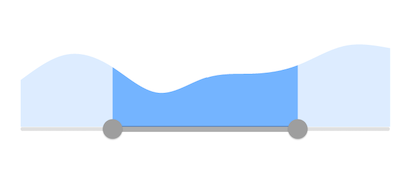
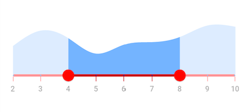

# Disabled state in range selector

This section helps to learn about the disabled state in the Flutter range selector.

## Disabled state

You can render the range selector in disabled state using [`enabled`](https://pub.dev/documentation/syncfusion_flutter_sliders/latest/sliders/SfRangeSelector/enabled.html) property. The default value of [`enabled`](https://pub.dev/documentation/syncfusion_flutter_sliders/latest/sliders/SfRangeSelector/enabled.html) property is `true`.




final double _min = 2.0;
final double _max = 10.0;
SfRangeValues _initialValues = SfRangeValues(5.0, 8.0);

final List<Data> _chartData = <Data>[
    Data(x:2.0, y: 2.2),
    Data(x:3.0, y: 3.4),
    Data(x:4.0, y: 2.8),
    Data(x:5.0, y: 1.6),
    Data(x:6.0, y: 2.3),
    Data(x:7.0, y: 2.5),
    Data(x:8.0, y: 2.9),
    Data(x:9.0, y: 3.8),
    Data(x:10.0, y: 3.7),
];

@override
Widget build(BuildContext context) {
  return MaterialApp(
      home: Scaffold(
          body: Center(
              child: SfRangeSelector(
                    min: _min,
                    max: _max,
                    enabled: false,
                    initialValues: _initialValues,
                    child: Container(
                    height: 130,
                    child: SfCartesianChart(
                        margin: const EdgeInsets.all(0),
                        primaryXAxis: NumericAxis(minimum: _min,
                            maximum: _max,
                            isVisible: false,),
                        primaryYAxis: NumericAxis(isVisible: false),
                        plotAreaBorderWidth: 0,
                        series: <SplineAreaSeries<Data, double>>[
                            SplineAreaSeries<Data, double>(
                                color: Color.fromARGB(255, 126, 184, 253),
                                dataSource: _chartData,
                                    xValueMapper: (Data sales, _) => sales.x,
                                    yValueMapper: (Data sales, _) => sales.y)
                            ],
                        ),
                   ),
              ),
          )
      )
  );
}







class Data {
  Data({this.x, this.y});
  final double x;
  final double y;
}




## Disabled color

You can change,

* The color of the active and inactive track in disabled state using the [`disabledActiveTrackColor`](https://pub.dev/documentation/syncfusion_flutter_core/latest/theme/SfRangeSelectorThemeData/disabledActiveTrackColor.html) and [`disabledInactiveTrackColor`](https://pub.dev/documentation/syncfusion_flutter_core/latest/theme/SfRangeSelectorThemeData/disabledInactiveTrackColor.html) properties.
* The color of the active and inactive major ticks in disabled state using the [`disabledActiveTickColor`](https://pub.dev/documentation/syncfusion_flutter_core/latest/theme/SfRangeSelectorThemeData/disabledActiveTickColor.html) and [`disabledInactiveTickColor`](https://pub.dev/documentation/syncfusion_flutter_core/latest/theme/SfRangeSelectorThemeData/disabledInactiveTickColor.html) properties.
* The color of the active and inactive minor ticks in disabled state using the [`disabledActiveMinorTickColor`](https://pub.dev/documentation/syncfusion_flutter_core/latest/theme/SfRangeSelectorThemeData/disabledActiveMinorTickColor.html) and [`disabledInactiveMinorTickColor`](https://pub.dev/documentation/syncfusion_flutter_core/latest/theme/SfRangeSelectorThemeData/disabledInactiveMinorTickColor.html) properties.
* The color of the active and inactive divisors in disabled state using the [`disabledActiveDivisorColor`](https://pub.dev/documentation/syncfusion_flutter_core/latest/theme/SfRangeSelectorThemeData/disabledActiveDivisorColor.html) and [`disabledInactiveDivisorColor`](https://pub.dev/documentation/syncfusion_flutter_core/latest/theme/SfRangeSelectorThemeData/disabledInactiveDivisorColor.html) properties.
* The color of the thumb in disabled state using the [`disabledThumbColor`](https://pub.dev/documentation/syncfusion_flutter_core/latest/theme/SfRangeSelectorThemeData/disabledThumbColor.html) property.

N> You must import the `theme.dart` library from the [`Core`](https://pub.dev/packages/syncfusion_flutter_core) package to use [`SfRangeSelectorTheme`](https://pub.dev/documentation/syncfusion_flutter_core/latest/theme/SfRangeSelectorTheme-class.html).




final double _min = 2.0;
final double _max = 10.0;
SfRangeValues _initialValues = SfRangeValues(4.0, 8.0);

final List<Data> _chartData = <Data>[
    Data(x:2.0, y: 2.2),
    Data(x:3.0, y: 3.4),
    Data(x:4.0, y: 2.8),
    Data(x:5.0, y: 1.6),
    Data(x:6.0, y: 2.3),
    Data(x:7.0, y: 2.5),
    Data(x:8.0, y: 2.9),
    Data(x:9.0, y: 3.8),
    Data(x:10.0, y: 3.7),
];

@override
  Widget build(BuildContext context) {
    return MaterialApp(
        home: Scaffold(
            body: Center(
              child: SfRangeSelectorTheme(
                data: SfRangeSelectorThemeData(
                     disabledActiveTrackColor: Colors.red[900],
                     disabledInactiveTrackColor: Colors.red[200],
                     disabledActiveTickColor: Colors.red[900],
                     disabledInactiveTickColor: Colors.red[200],
                     disabledActiveMinorTickColor: Colors.red[900],
                     disabledInactiveMinorTickColor: Colors.red[200],
                     disabledActiveDivisorColor: Colors.blue[900],
                     disabledInactiveDivisorColor: Colors.blue[200],
                     disabledThumbColor: Colors.red,
                     trackHeight: 4,
                ),
                child:  SfRangeSelector(
                  min: _min,
                  max: _max,
                  interval: 1,
                  showLabels: true,
                  enabled: false,
                  showTicks: true,
                  showDivisors: true,
                  initialValues: _initialValues,
                  child: Container(
                    height: 130,
                    child: SfCartesianChart(
                      margin: const EdgeInsets.all(0),
                      primaryXAxis: NumericAxis(minimum: _min,
                          maximum: _max,
                          isVisible: false),
                      primaryYAxis: NumericAxis(isVisible: false),
                      plotAreaBorderWidth: 0,
                      series: <SplineAreaSeries<Data, double>>[
                          SplineAreaSeries<Data, double>(
                            color: Color.fromARGB(255, 126, 184, 253),
                            dataSource: _chartData,
                            xValueMapper: (Data sales, _) => sales.x,
                            yValueMapper: (Data sales, _) => sales.y)
                      ],
                    ),
                  ),
                ),
              ),
            )
        )
    );
}







class Data {
  Data({this.x, this.y});
  final double x;
  final double y;
}




