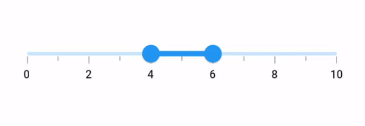
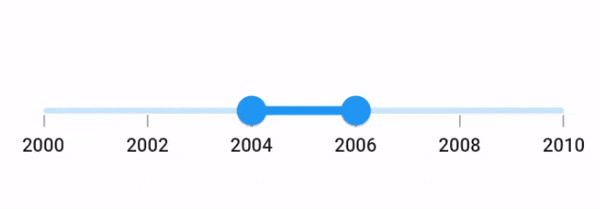

# Range slider interval
This section explains about how to add the interval for numeric and date range slider.

## Numeric interval

Range slider elements like labels, ticks and divisors are rendered based on the [`interval`](https://pub.dev/documentation/syncfusion_flutter_sliders/latest/sliders/SfRangeSlider/interval.html), [`min`](https://pub.dev/documentation/syncfusion_flutter_sliders/latest/sliders/SfRangeSlider/min.html) and [`max`](https://pub.dev/documentation/syncfusion_flutter_sliders/latest/sliders/SfRangeSlider/max.html) properties. The default value is `null` and it must be greater than 0.

For example, if [`min`](https://pub.dev/documentation/syncfusion_flutter_sliders/latest/sliders/SfRangeSlider/min.html) is 0.0 and [`max`](https://pub.dev/documentation/syncfusion_flutter_sliders/latest/sliders/SfRangeSlider/max.html) is 10.0 and [`interval`](https://pub.dev/documentation/syncfusion_flutter_sliders/latest/sliders/SfRangeSlider/interval.html) is 2.0, the range slider will render the labels, major ticks, and divisors at 0.0, 2.0, 4.0 and so on.




SfRangeValues _values = SfRangeValues(4.0, 6.0);

@override
Widget build(BuildContext context) {
  return MaterialApp(
      home: Scaffold(
          body: Center(
              child: SfRangeSlider(
                    min: 0.0,
                    max: 10.0,
                    interval: 2,
                    showTicks: true,
                    showLabels: true,
                    values: _values,
                    onChanged: (SfRangeValues newValues) {
                        setState(() {
                            _values = newValues;
                        });
                   },
               ),
          )
      )
  );
}




N>
* Refer the [`showDivisors`](https://pub.dev/documentation/syncfusion_flutter_sliders/latest/sliders/SfRangeSlider/showDivisors.html) to know about the rendering of divisors at given interval.
* Refer the [`showTicks`](https://pub.dev/documentation/syncfusion_flutter_sliders/latest/sliders/SfRangeSlider/showTicks.html) to know about the rendering of major ticks at given interval.
* Refer the [`showLabels`](https://pub.dev/documentation/syncfusion_flutter_sliders/latest/sliders/SfRangeSlider/showLabels.html) to know about the rendering of labels at given interval.

## Date interval

The type of date interval. It can be years to seconds. It is mandatory for date [`SfRangeSlider`](https://pub.dev/documentation/syncfusion_flutter_sliders/latest/sliders/SfRangeSlider-class.html). The default value of [`dateIntervalType`](https://pub.dev/documentation/syncfusion_flutter_sliders/latest/sliders/SfRangeSlider/dateIntervalType.html) property is `null`.

For date values, the range slider does not have auto interval support. So, it is mandatory to set [`interval`](https://pub.dev/documentation/syncfusion_flutter_sliders/latest/sliders/SfRangeSlider/interval.html), [`dateIntervalType`](https://pub.dev/documentation/syncfusion_flutter_sliders/latest/sliders/SfRangeSlider/dateIntervalType.html), and [`dateFormat`](https://pub.dev/documentation/syncfusion_flutter_sliders/latest/sliders/SfRangeSlider/dateFormat.html) for date values.

For example, if [`min`](https://pub.dev/documentation/syncfusion_flutter_sliders/latest/sliders/SfRangeSlider/min.html) is `DateTime(2000, 01, 01)` and [`max`](https://pub.dev/documentation/syncfusion_flutter_sliders/latest/sliders/SfRangeSlider/max.html) is `DateTime(2005, 01, 01)` and [`interval`](https://pub.dev/documentation/syncfusion_flutter_sliders/latest/sliders/SfRangeSlider/interval.html) is `1`, [`dateIntervalType`](https://pub.dev/documentation/syncfusion_flutter_sliders/latest/sliders/SfRangeSlider/dateIntervalType.html) is `DateIntervalType.years`, [`dateFormat`](https://pub.dev/documentation/syncfusion_flutter_sliders/latest/sliders/SfRangeSlider/dateFormat.html) is `DateFormat.y()` then the range slider will render the labels, major ticks, and divisors at 2000, 2001, 2002 and so on.




SfRangeValues _values = SfRangeValues(DateTime(2002, 01, 01), DateTime(2003, 01, 01));

@override
Widget build(BuildContext context) {
  return MaterialApp(
      home: Scaffold(
          body: Center(
              child:  SfRangeSlider(
                    min: DateTime(2000, 01, 01, 00),
                    max: DateTime(2004, 12, 31, 24),
                    values: _values,
                    interval: 1,
                    showLabels: true,
                    showTicks: true,
                    dateFormat: DateFormat.y(),
                    dateIntervalType: DateIntervalType.years,
                    onChanged: (SfRangeValues newValues) {
                        setState(() {
                            _values = newValues;
                        });
                   },
              ),
          )
      )
  );
}




## Step size

You can move the thumb in discrete manner for numeric values using the [`stepSize`](https://pub.dev/documentation/syncfusion_flutter_sliders/latest/sliders/SfRangeSlider/stepSize.html) property in the range slider.




SfRangeValues _values = SfRangeValues(4.0, 6.0);

@override
Widget build(BuildContext context) {
  return MaterialApp(
      home: Scaffold(
          body: Center(
              child: SfRangeSlider(
                  min: 0.0,
                  max: 10.0,
                  interval: 2,
                  stepSize: 2,
                  showTicks: true,
                  minorTicksPerInterval: 1,
                  showLabels: true,
                  values: _values,
                  onChanged: (SfRangeValues newValues) {
                      setState(() {
                          _values = newValues;
                      });
                  },
              ),
          )
      )
  );
}




## Step duration

You can move the thumb in discrete manner for date values based on the value provided in the [`stepDuration`](https://pub.dev/documentation/syncfusion_flutter_sliders/latest/sliders/SfRangeSlider/stepDuration.html) property in the range slider.




SfRangeValues _values = SfRangeValues(DateTime(2004, 01, 01), DateTime(2006, 01, 01));

@override
Widget build(BuildContext context) {
  return MaterialApp(
      home: Scaffold(
          body: Center(
            child: SfRangeSlider(
              min: DateTime(2000, 01, 01),
              max: DateTime(2010, 01, 01),
              interval: 2,
              stepDuration: SliderStepDuration(years: 2),
              dateFormat: DateFormat.y(),
              dateIntervalType: DateIntervalType.years,
              showTicks: true,
              showLabels: true,
              values: _values,
              onChanged: (SfRangeValues newValues) {
                setState(() {
                  _values = newValues;
                });
              },
            ),
          )
      )
  );
}




## Enable interval selection

You can select a particular interval by tapping when setting the [`enableIntervalSelection`](https://pub.dev/documentation/syncfusion_flutter_sliders/latest/sliders/SfRangeSlider/enableIntervalSelection.html) property as `true`. Both thumbs will be moved to the current interval with smooth animation.




SfRangeValues _values = SfRangeValues(DateTime(2004, 01, 01), DateTime(2006, 01, 01));

@override
Widget build(BuildContext context) {
  return MaterialApp(
      home: Scaffold(
          body: Center(
            child: SfRangeSlider(
              min: DateTime(2000, 01, 01),
              max: DateTime(2010, 01, 01),
              interval: 2,
              enableIntervalSelection: true,
              dateFormat: DateFormat.y(),
              dateIntervalType: DateIntervalType.years,
              showTicks: true,
              showLabels: true,
              showTooltip: true,
              values: _values,
              onChanged: (SfRangeValues newValues) {
                setState(() {
                  _values = newValues;
                });
              },
            ),
          )
      )
  );
}




