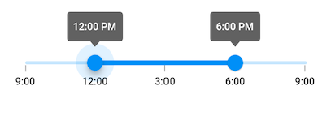

# Tooltip features in range slider

This section helps to learn about how to add tooltip in the range slider.

## Show tooltip

You can enable tooltips for both thumbs. It is used to clearly indicate the current selection of the ranges during interaction. By default, tooltip text is formatted with either `numberFormat` or `dateFormat`.




SfRangeValues _values = SfRangeValues(4.0, 6.0);

@override
Widget build(BuildContext context) {
  return MaterialApp(
      home: Scaffold(
          body: Center(
              child: SfRangeSlider(
                    min: 0.0,
                    max: 10.0,
                    interval: 2,
                    showTicks: true,
                    showLabels: true,
                    showTooltip: true,
                    values: _values,
                    onChanged: (SfRangeValues newValues) {
                        setState(() {
                            _values = newValues;
                        });
                   },
              ),
          )
      )
  );
}




N>
* The `tooltipTextFormatterCallback` for changing the default tooltip text.
* The `SfRangeSliderThemeData` to customize the appearance of the tooltip text.

## TooltipTextFormatterCallback

You can format or change the whole tooltip label text. Its arguments contains the following parameters:

* actualValue – either `DateTime` or `double` based on given `values`.
* formattedText – If the actual value is `double`, it is formatted by `numberFormat` and if the actual value is `DateTime`, it is formatted by `dateFormat`.




SfRangeValues _values = SfRangeValues(DateTime(2010, 01, 01, 12, 00, 00), DateTime(2010, 01, 01, 18, 00, 00));

@override
Widget build(BuildContext context) {
  return MaterialApp(
      home: Scaffold(
          body: Center(
              child: SfRangeSlider(
                    min: DateTime(2010, 01, 01, 9, 00, 00),
                    max: DateTime(2010, 01, 01, 21, 05, 00),
                    values: _values,
                    interval: 3,
                    showTicks: true,
                    showLabels: true,
                    showTooltip: true,
                    dateFormat: DateFormat('h:mm a'),
                    dateIntervalType: DateIntervalType.hours,
                    tooltipTextFormatterCallback: (dynamic actualValue, String formattedText) {
                        return DateFormat('h:mm a').format(actualValue);
                    },
                    onChanged: (SfRangeValues newValues) {
                        setState(() {
                            _values = newValues;
                        });
                    },
              ),
          )
      )
  );
}




