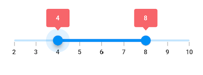
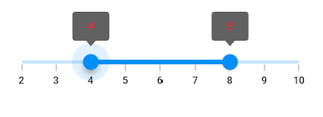

# Tooltip features in range slider

This section helps to learn about how to add tooltip in the range slider.

## Show tooltips

You can enable tooltips for both thumbs. It is used to clearly indicate the current selection of the ranges during interaction. By default, tooltip text is formatted with either [`numberFormat`](https://pub.dev/documentation/syncfusion_flutter_sliders/latest/sliders/SfRangeSlider/numberFormat.html) or [`dateFormat`](https://pub.dev/documentation/syncfusion_flutter_sliders/latest/sliders/SfRangeSlider/dateFormat.html).




SfRangeValues _values = SfRangeValues(4.0, 6.0);

@override
Widget build(BuildContext context) {
  return MaterialApp(
      home: Scaffold(
          body: Center(
              child: SfRangeSlider(
                    min: 0.0,
                    max: 10.0,
                    interval: 2,
                    showTicks: true,
                    showLabels: true,
                    showTooltip: true,
                    values: _values,
                    onChanged: (SfRangeValues newValues) {
                        setState(() {
                            _values = newValues;
                        });
                   },
              ),
          )
      )
  );
}




N>
* Refer the [`tooltipTextFormatterCallback`](https://pub.dev/documentation/syncfusion_flutter_sliders/latest/sliders/SfRangeSlider/tooltipTextFormatterCallback.html) for changing the default tooltip text.
* Refer the [`SfRangeSliderThemeData`](https://pub.dev/documentation/syncfusion_flutter_core/latest/theme/SfRangeSliderThemeData-class.html) for customizing the appearance of the tooltip text.

## Tooltip text format

By default it is formatted based on [`numberFormat`](https://pub.dev/documentation/syncfusion_flutter_sliders/latest/sliders/SfRangeSlider/numberFormat.html) property and [`dateFormat`](https://pub.dev/documentation/syncfusion_flutter_sliders/latest/sliders/SfRangeSlider/dateFormat.html) property based on whether it is date type [`SfRangeSlider`](https://help.syncfusion.com/flutter/range-slider/getting-started#set-date-range) or numeric [`SfRangeSlider`](https://help.syncfusion.com/flutter/range-slider/getting-started#set-numeric-range).

You can format or change the whole tooltip label text using the [`tooltipTextFormatterCallback`](https://pub.dev/documentation/syncfusion_flutter_sliders/latest/sliders/SfRangeSlider/tooltipTextFormatterCallback.html). Its arguments are,

* actualValue – either `DateTime` or `double` based on given [`values`](https://pub.dev/documentation/syncfusion_flutter_sliders/latest/sliders/SfRangeSlider/values.html).
* formattedText – If the actual value is `double`, it is formatted by [`numberFormat`](https://pub.dev/documentation/syncfusion_flutter_sliders/latest/sliders/SfRangeSlider/numberFormat.html) and if the actual value is `DateTime`, it is formatted by [`dateFormat`](https://pub.dev/documentation/syncfusion_flutter_sliders/latest/sliders/SfRangeSlider/dateFormat.html).




SfRangeValues _values = SfRangeValues(DateTime(2010, 01, 01, 12, 00, 00), DateTime(2010, 01, 01, 18, 00, 00));

@override
Widget build(BuildContext context) {
  return MaterialApp(
      home: Scaffold(
          body: Center(
              child: SfRangeSlider(
                    min: DateTime(2010, 01, 01, 9, 00, 00),
                    max: DateTime(2010, 01, 01, 21, 05, 00),
                    values: _values,
                    interval: 3,
                    showTicks: true,
                    showLabels: true,
                    showTooltip: true,
                    dateFormat: DateFormat('h:mm'),
                    dateIntervalType: DateIntervalType.hours,
                    tooltipTextFormatterCallback: (dynamic actualValue, String formattedText) {
                        return DateFormat('h:mm a').format(actualValue);
                    },
                    onChanged: (SfRangeValues newValues) {
                        setState(() {
                            _values = newValues;
                        });
                    },
              ),
          )
      )
  );
}




## Tooltip color

You can change the background color of the tooltip in the range slider using the [`tooltipBackgroundColor`](https://pub.dev/documentation/syncfusion_flutter_core/latest/theme/SfRangeSliderThemeData/tooltipBackgroundColor.html) property.

N> You must import the `theme.dart` library from the [`Core`](https://pub.dev/packages/syncfusion_flutter_core) package to use [`SfRangeSliderTheme`](https://pub.dev/documentation/syncfusion_flutter_core/latest/theme/SfRangeSliderTheme-class.html).




SfRangeValues _values = SfRangeValues(4.0, 8.0);

@override
Widget build(BuildContext context) {
  return MaterialApp(
      home: Scaffold(
          body: Center(
              child: SfRangeSliderTheme(
                    data: SfRangeSliderThemeData(
                        tooltipBackgroundColor: Colors.red[300],
                    ),
                    child:  SfRangeSlider(
                        min: 2.0,
                        max: 10.0,
                        interval: 1,
                        showTicks: true,
                        showLabels: true,
                        showTooltip: true,
                        values: _values,
                        onChanged: (SfRangeValues newValues){
                            setState(() {
                                _values = newValues;
                            });
                        },
                    ),
              )
          )
      )
  );
}




## Tooltip label style

You can change the appearance of the tooltip text in the range slider using the [`tooltipTextStyle`](https://pub.dev/documentation/syncfusion_flutter_core/latest/theme/SfRangeSliderThemeData/tooltipTextStyle.html) property.

N> You must import the `theme.dart` library from the [`Core`](https://pub.dev/packages/syncfusion_flutter_core) package to use [`SfRangeSliderTheme`](https://pub.dev/documentation/syncfusion_flutter_core/latest/theme/SfRangeSliderTheme-class.html).




SfRangeValues _values = SfRangeValues(4.0, 8.0);

@override
Widget build(BuildContext context) {
  return MaterialApp(
      home: Scaffold(
          body: Center(
              child: SfRangeSliderTheme(
                    data: SfRangeSliderThemeData(
                        tooltipTextStyle: TextStyle(color: Colors.red, fontSize: 16, fontStyle: FontStyle.italic),
                    ),
                    child:  SfRangeSlider(
                     min: 2.0,
                     max: 10.0,
                     interval: 1,
                     showTicks: true,
                     showLabels: true,
                     showTooltip: true,
                     values: _values,
                     onChanged: (SfRangeValues newValues){
                            setState(() {
                                _values = newValues;
                            });
                        },
                    ),
              )
          )
      )
  );
}




