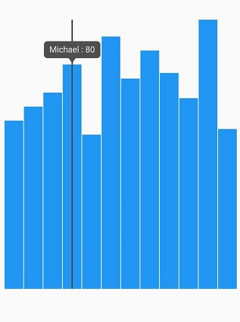

# Axis customization in Sparkline charts

You can customize axis value types and min and max values of the sparkline.

## Change axis type of the sparkline

You can customize the spark line chart with custom data source. Here, we can use [`SfSparkLineChart.custom`]() widget. By using this widget can we customize the different axis such as `numeric` , `DateTime`, `Category`.

### Numeric Axis

To use the numeric values i.e to bind the custom data source use the [`SfSparkBarChart.custom()`]() method and map the x, y values to [`xValueMapper`]() and [`yValueMapper`]() respectively. Here you have to specify the length of the data using [`dataCount`]() property.

 

    @override
    Widget build(BuildContext context) {
      return Scaffold(
        body: Padding(
          padding: EdgeInsets.all(5),
          child: SfSparkBarChart.custom(
            axisLineWidth: 0,
            dataCount: 7,
            xValueMapper: (index) => data[index].xval,
            yValueMapper: (index) => data[index].yval, 
          )
        ),
      );
    }
  
    final List<SalesData> data = [
      SalesData(xval: 1, yval: 190),
      SalesData(xval: 2, yval: 165),
      SalesData(xval: 3, yval: 158),
      SalesData(xval: 4, yval: 175),
      SalesData(xval: 5, yval: 200),
      SalesData(xval: 6, yval: 180),
      SalesData(xval: 7, yval: 210),
    ];
 
    class SalesData {
      SalesData({this.xval, this.yval});
      final dynamic xval;
      final double yval;
    }



### DateTime Axis

To use the date-time values i.e to bind the custom data source use the [`SfSparkBarChart.custom()`]() method and map the x, y values to [`xValueMapper`]() and [`yValueMapper`]() respectively. Here you have to specify the length of the data using [`dataCount`]() property.

 

    @override
    Widget build(BuildContext context) {
      return Scaffold(
        body: Padding(
          padding: EdgeInsets.all(5),
          child: SfSparkBarChart.custom(
            axisLineWidth: 0,
            dataCount: 23,
            xValueMapper: (index) => data[index].xval,
            yValueMapper: (index) => data[index].yval, 
          )
        ),
      );
    }
    final List<SalesData> data = [
      SalesData(xval: DateTime(2018, 0, 1), yval: 4),
      SalesData(xval: DateTime(2018, 0, 2), yval: 4.5),
      SalesData(xval: DateTime(2018, 0, 3), yval: 8),
      SalesData(xval: DateTime(2018, 0, 4), yval: 7),
      SalesData(xval: DateTime(2018, 0, 5), yval: 6),
      SalesData(xval: DateTime(2018, 0, 8), yval: 8),
      SalesData(xval: DateTime(2018, 0, 9), yval: 8),
      SalesData(xval: DateTime(2018, 0, 10), yval: 6.5),
      SalesData(xval: DateTime(2018, 0, 11), yval: 4),
      SalesData(xval: DateTime(2018, 0, 12), yval: 5.5),
      SalesData(xval: DateTime(2018, 0, 15), yval: 8),
      SalesData(xval: DateTime(2018, 0, 16), yval: 6),
      SalesData(xval: DateTime(2018, 0, 17), yval: 6.5),
      SalesData(xval: DateTime(2018, 0, 18), yval: 7.5),
      SalesData(xval: DateTime(2018, 0, 19), yval: 7.5),
      SalesData(xval: DateTime(2018, 0, 22), yval: 4),
      SalesData(xval: DateTime(2018, 0, 23), yval: 8),
      SalesData(xval: DateTime(2018, 0, 24), yval: 6),
      SalesData(xval: DateTime(2018, 0, 25), yval: 7.5),
      SalesData(xval: DateTime(2018, 0, 26), yval: 4.5),
      SalesData(xval: DateTime(2018, 0, 29), yval: 6),
      SalesData(xval: DateTime(2018, 0, 30), yval: 5),
      SalesData(xval: DateTime(2018, 0, 31), yval: 7),
      ];
 
    class SalesData {
      SalesData({this.xval, this.yval});
      final dynamic xval;
      final double yval;
    }



### Category Axis

To use the category values i.e to bind the custom data source use the [`SfSparkBarChart.custom()`]() method and map the x, y values to [`xValueMapper`]() and [`yValueMapper`]() respectively. Here you have to specify the length of the data using [`dataCount`]() property.

 

    @override
    Widget build(BuildContext context) {
      return Scaffold(
        body: Padding(
          padding: EdgeInsets.all(5),
          child: SfSparkLineChart.custom(
            axisLineWidth: 0,
            dataCount: 12,
            xValueMapper: (index) => data[index].xval,
            yValueMapper: (index) => data[index].yval, 
          )
        ),
      );
    }
    final List<SalesData> data = [
      SalesData(xval: 'Robert', yval: 60),
      SalesData(xval: 'Andrew', yval: 65),
      SalesData(xval: 'Suyama', yval: 70),
      SalesData(xval: 'Michael', yval: 80),
      SalesData(xval: 'Janet', yval: 55),
      SalesData(xval: 'Davolio', yval: 90),
      SalesData(xval: 'Fuller', yval: 75),
      SalesData(xval: 'Nancy', yval: 85),
      SalesData(xval: 'Margaret', yval: 77),
      SalesData(xval: 'Steven', yval: 68),
      SalesData(xval: 'Laura', yval: 96),
      SalesData(xval: 'Elizabeth', yval: 57)
    ];  
 
    class SalesData {
      SalesData({this.xval, this.yval});
      final dynamic xval;
      final double yval;
    }



### Axis line customization

Axis line of the spark charts can be customized using the following properties.

* [axisCrossesAt]() - Specifies the horizontal axis line position. The default value is `0`.
* [axisLineColor]() - Specifies the color of the axis line.
* [axisLineWidth]() - Specifies the width of the axis line.
* [axisLineDashArray]() - Specifies the axis line dash array.

 

    @override
    Widget build(BuildContext context) {
      return Scaffold(
        body: Padding(
          padding: EdgeInsets.all(5),
          child: SfSparkLineChart.custom(
            axisLineWidth: 2,
            axisLineDashArray: <double>[5,3],
            axisCrossesAt: 174,
            dataCount: 7,
            xValueMapper: (index) => data[index].xval,
            yValueMapper: (index) => data[index].yval, 
          )
        ),
      );
    }

    final List<SalesData> data = [
      SalesData(xval: 1, yval: 190),
      SalesData(xval: 2, yval: 165),
      SalesData(xval: 3, yval: 158),
      SalesData(xval: 4, yval: 175),
      SalesData(xval: 5, yval: 200),
      SalesData(xval: 6, yval: 180),
      SalesData(xval: 7, yval: 210),
    ]; 



