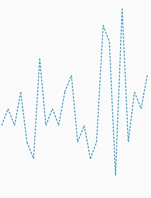
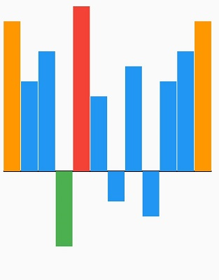

# Spark charts types

## Line chart

[`SfSparkLineChart`]() is used for identifying patterns and trends in the data such as seasonal effects, large changes and turning points over a period of time. 

The following properties are used to customize the appearance:

* [`color`]() - Specifies the spark line color.
* [`data`]()  - Used to bind the data to spark line charts.
* [`axisCrossesAt`]() - Specifies the axis line's position.
* [`axisLineColor`]() - Specifies the color of the axis line.
* [`axisLineWidth`]() - Specifies the width of the axis line.
* [`axisLineDashArray`] - Specifies the dash array value of the axis line.
* [`marker`]() - Represents the marker settings of spark line chart.
* [`labelDisplayMode`]() - Specifies the spark line data label.
* [`labelStyle`]() - Specifies the spark line data label.
* [`trackball`]() - Represents the track ball options of spark line chart.
* [`plotBand`]() - Represents the plot band settings for spark line chart.
* [`isInversed`]() - Specifies whether to inverse the spark line chart.
* [`highPointColor`]() - Specifies the high point color.
* [`lowPointColor`]() - Specifies the low point color.
* [`negativePointColor`]() - Specifies the negative point color.
* [`firstPointColor`]() - Specifies the first point color.
* [`lastPointColor`]() - Specifies the last point color.
* [`width`]() - Specifies the width of the line series.

 

    @override
    Widget build(BuildContext context) {
      return Scaffold(
        body: Center(
          child: SfSparkLineChart(
            data: <double>[
                5, 6, 5, 7, 4, 3, 9, 5, 6, 5, 7, 8, 4, 5, 3, 4, 11, 10, 2, 12, 4, 7, 6, 8
            ],
            highPointColor: Colors.red,
            lowPointColor: Colors.green,
            firstPointColor: Colors.orange,
            lastPointColor: Colors.orange,
            width: 3,
            marker: SparkChartMarker(
              displayMode: SparkChartMarkerDisplayMode.all
            ),
          )
        )
      );
    }



### Dashed line

The [`dashArray`]() property of [`SfSparkLineChart`]() is used to render line chart with dashes. Odd value is considered as rendering size and even value is considered as gap.

 

    @override
    Widget build(BuildContext context) {
      return Scaffold(
        body: Center(
          child:  SfSparkLineChart(
            data: <double>[
                        5, 6, 5, 7, 4, 3, 9, 5, 6, 5, 7, 8, 4, 5, 3, 4, 11, 10, 2, 12, 4, 7, 6, 8
                      ],
            dashArray: <double>[5,3],
          )
        )
      );
    }



## Area chart

[`SfSparkAreaChart`]() is used to emphasize a change in values. This is primarily used when the magnitude of the trend is to be communicated rather than individual data values.

The following properties are used to customize the appearance:

* [`color`]() - Specifies the fill color of spark area chart.
* [`data`]()  - Used to bind the data to spark area charts.
* [`axisCrossesAt`]() - Specifies the axis line's position.
* [`axisLineColor`]() - Specifies the color of the axis line.
* [`axisLineWidth`]() - Specifies the width of the axis line.
* [`axisLineDashArray`] - Specifies the dash array value of the axis line.
* [`marker`]() - Represents the marker settings of spark area chart.
* [`labelDisplayMode`]() - Specifies the spark area data label.
* [`labelStyle`]() - Specifies the spark area data label.
* [`trackball`]() - Represents the track ball options of spark area chart.
* [`plotBand`]() - Represents the plot band settings for spark area chart.
* [`isInversed`]() - Specifies whether to inverse the spark area chart.
* [`highPointColor`]() - Specifies the high point color.
* [`lowPointColor`]() - Specifies the low point color.
* [`negativePointColor`]() - Specifies the negative point color.
* [`firstPointColor`]() - Specifies the first point color.
* [`lastPointColor`]() - Specifies the last point color.
* [`borderWidth`]() – Changes the stroke width of the spark area chart.
* [`borderColor`]() – Changes the stroke color of the spark area chart.

 

    @override
    Widget build(BuildContext context) {
      return Scaffold(
        body: Center(
          child:  SfSparkAreaChart(
            data: <double>[
                34, 36, 32, 35, 40, 38, 33, 37, 34, 31, 30
            ],
            borderColor: Colors.red.withOpacity(0.8),
            borderWidth: 2,
            marker: SparkChartMarker(
              displayMode: SparkChartMarkerDisplayMode.high
            ),
          )
        )
      );
    }



## Bar Sparkline chart

[`SfSparkBarChart`]() is used to render the sparkline series as Bar.The following properties are used to customize the appearance:

* [`color`]() - Specifies the fill color of the spark bar chart.
* [`data`]()  - Used to bind the data to spark are charts.
* [`axisCrossesAt`]() - Specifies the axis line's position.
* [`axisLineColor`]() - Specifies the color of the axis line.
* [`axisLineWidth`]() - Specifies the width of the axis line.
* [`axisLineDashArray`] - Specifies the dash array value of the axis line.
* [`marker`]() - Represents the marker settings of spark bar chart.
* [`labelDisplayMode`]() - Specifies the spark bar data label.
* [`labelStyle`]() - Specifies the spark bar data label.
* [`trackball`]() - Represents the track ball options of spark bar chart.
* [`plotBand`]() - Represents the plot band settings for spark bar chart.
* [`isInversed`]() - Specifies whether to inverse the spark line chart.
* [`highPointColor`]() - Specifies the high point color.
* [`lowPointColor`]() - Specifies the low point color.
* [`negativePointColor`]() - Specifies the negative point color.
* [`firstPointColor`]() - Specifies the first point color.
* [`lastPointColor`]() - Specifies the last point color.
* [`borderWidth`]() – Changes the stroke width of the series.
* [`borderColor`]() – Changes the stroke color of the series.

 

    @override
    Widget build(BuildContext context) {
      return Scaffold(
        body: Center(
          child:  SfSparkBarChart(
            data: <double>[
              10, 6, 8, -5, 11, 5, -2, 7, -3, 6, 8, 10
            ],
            highPointColor: Colors.red,
            lowPointColor: Colors.green,
            firstPointColor: Colors.orange,
            lastPointColor: Colors.orange,
          )
        )
      );
    }



## WinLoss Sparkline chart

[`SfSparkWinLossChart`]() is used to show whether each value is positive or negative visualizing a Win/Loss scenario. 

The following properties are used to customize the appearance:

* [`color`]() - Specifies the spark line color.
* [`data`]()  - Create the spark line chart with custom data source.
* [`axisCrossesAt`]() - Specifies the axis line's position.
* [`axisLineColor`]() - Specifies the color of the axis line.
* [`axisLineWidth`]() - Specifies the width of the axis line.
* [`axisLineDashArray`] - Specifies the dash array value of the axis line.
* [`trackball`]() - Represents the track ball options of spark bar chart.
* [`isInversed`]() - Specifies whether to inverse the spark line chart.
* [`highPointColor`]() - Specifies the high point color.
* [`lowPointColor`]() - Specifies the low point color.
* [`negativePointColor`]() - Specifies the negative point color.
* [`firstPointColor`]() - Specifies the first point color.
* [`lastPointColor`]() - Specifies the last point color.
* [`borderWidth`]() – Changes the stroke width of the win loss chart.
* [`borderColor`]() – Changes the stroke color of the win loss chart.
* [`tiePointColor`]() - Specifies the tie point color of win loss chart. color.

 

    @override
    Widget build(BuildContext context) {
      return Scaffold(
        body: Center(
          child:  SfSparkWinLossChart(
            data: <double>[
              12, 15, -10, 13, 15, 6, -12, 17, 13, 0, 8, -10
            ],
          )
        )
      );
    }



