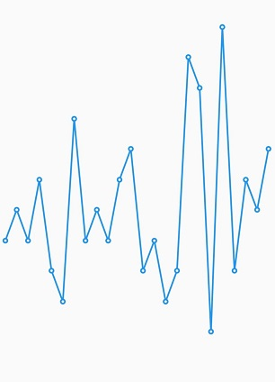

# Marker and data label

## Marker

[`SparklineMarker`]() are used to highlight the data point in [`SfSparkLineChart`](), [`SfSparkBarChart`]() and [`SfSparkAreaChart`](). 

You can use the following properties to customize the appearance:

* [`displayMode`]() - Toggles the visibility of the marker. Defaults to `none`
* [`borderWidth`]() - Represents the border width of the marker.
* [`color`]() - used to change the color of the marker.
* [`borderColor`]() - used to change the borderColor of the marker.

 

    @override
    Widget build(BuildContext context) {
      return Scaffold(
        body: Center(
          child:  SfSparkLineChart(
                    marker: SparkChartMarker((displayMode: SparkChartMarkerDisplayMode.all,
                    )),
            data: <double>[
                        5,
                        6,
                        5,
                        7,
                        4,
                        3,
                        9,
                        5,
                        6,
                        5,
                        7,
                        8,
                        4,
                        5,
                        3,
                        4,
                        11,
                        10,
                        2,
                        12,
                        4,
                        7,
                        6,
                        8
                      ],
               )
             )
           );
         }

    class SalesData {
    SalesData(this.month, this.sales);
    final String month;
    final double sales;
    }



### Customizing marker shapes

Markers can be assigned with different shapes using the [`shape`]() property. By default, markers are rendered with circle shape. The shapes of markers are listed below.

* circle,
* diamond,
* square,
* triangle,
* invertedTriangle

 

    @override
    Widget build(BuildContext context) {
      return Scaffold(
        body: Center(
          child:  SfSparkLineChart(
                    marker: SparkChartMarker(shape: MarkerShape.square,displayMode: SparkChartMarkerDisplayMode.all)),
            data: <double>[
                        5,
                        6,
                        5,
                        7,
                        4,
                        3,
                        9,
                        5,
                        6,
                        5,
                        7,
                        8,
                        4,
                        5,
                        3,
                        4,
                        11,
                        10,
                        2,
                        12,
                        4,
                        7,
                        6,
                        8
                      ],
               )
             )
           );
         }

    class SalesData {
    SalesData(this.month, this.sales);
    final String month;
    final double sales;
    }



## Data label

Data labels are used to display values of data points to improve the readability.

### Enable data label

To enable data label for sparkline series, provide [`labelDisplayMode`]() property in sparkline chart widget.

Following possible values are available in sparkline chart:

* [`none`]() - does not allow to display data points on any side.
* [`all`]() - allows to display data labels on all points.
* [`high`]() - allows to display data labels on high points.
* [`low`]() - allows to display data labels on low points.
* [`last`]() - allows to display data labels on last points.
* [`first`]() - allows to display data labels on first points.

 

    @override
    Widget build(BuildContext context) {
      return Scaffold(
        body: Center(
          child:  SfSparkLineChart(
                   labelDisplayMode: LabelDisplayMode.all,
            data: <double>[
                        5,
                        6,
                        5,
                        7,
                        4,
                        3,
                        9,
                        5,
                        6,
                        5,
                        7,
                        8,
                        4,
                        5,
                        3,
                        4,
                        11,
                        10,
                        2,
                        12,
                        4,
                        7,
                        6,
                        8
                      ],
               )
             )
           );
         }

    class SalesData {
    SalesData(this.month, this.sales);
    final String month;
    final double sales;
    }



  

