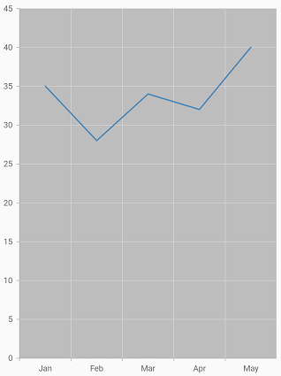

# Theme for Syncfusion widgets

The Syncfusion theme widget allows you to apply colors, font-styles, etc in the application level across all the Syncfusion Flutter widgets with a uniform approach and provide a consistent look.

## Using SfTheme widget

The [`SfTheme`](https://pub.dev/documentation/syncfusion_flutter_core/latest/theme/SfTheme-class.html)  widget is used to apply theme at one place to all of the applicable Syncfusion Flutter widgets. This widget is used to configure theme data for all widgets using [`SfThemeData`](https://pub.dev/documentation/syncfusion_flutter_core/latest/theme/SfThemeData-class.html) class. The [`SfThemeData`](https://pub.dev/documentation/syncfusion_flutter_core/latest/theme/SfThemeData-class.html) holds the color and typography values for light and dark themes.

The [`SfTheme`](https://pub.dev/documentation/syncfusion_flutter_core/latest/theme/SfTheme-class.html) widget is available in the [`syncfusion_flutter_core`](https://pub.dev/packages/syncfusion_flutter_core) package. Since all our widgets are core dependent, you don't need to include the core as a separate package. For example, here we have included the [`syncfusion_flutter_charts`](https://pub.dev/packages/syncfusion_flutter_charts) package in the pub spec file for the purpose of depicting the working model of the theme widget.

 

    dependencies:

    syncfusion_flutter_charts: ^xx.x.xx



N> Here **xx.x.xx** denotes the current version of [`Syncfusion Flutter Chart`](https://pub.dev/packages/syncfusion_flutter_charts/versions) widget.

To use the theme widgets, import the following library in your Dart code.

 

    import 'package:syncfusion_flutter_core/theme.dart';



Once the required package has been imported, initialize [`SfTheme`](https://pub.dev/documentation/syncfusion_flutter_core/latest/theme/SfTheme-class.html) widget and then add any widget as a child. The theme data applied in this [`SfTheme`](https://pub.dev/documentation/syncfusion_flutter_core/latest/theme/SfTheme-class.html) widget is applied to all the Syncfusion widgets that are descendant of this [`SfTheme`](https://pub.dev/documentation/syncfusion_flutter_core/latest/theme/SfTheme-class.html) widget. For demonstration purposes, [`SfCartesianChart`](https://pub.dev/documentation/syncfusion_flutter_charts/latest/charts/SfCartesianChart-class.html) has been added as a child of [`SfTheme`](https://pub.dev/documentation/syncfusion_flutter_core/latest/theme/SfTheme-class.html) widget in the below code snippet.

 

    @override
    Widget build(BuildContext context) {
        return Scaffold(
            body: Center(
                child: SfTheme(
                    data: SfThemeData(
                            chartThemeData: SfChartThemeData(
                                plotAreaBackgroundColor: Colors.grey[400]
                            ) 
                    ),
                    child: SfCartesianChart()
                )
            )
        );
    }



In the above code snippet, [`chartThemeData`](https://pub.dev/documentation/syncfusion_flutter_core/latest/theme/SfThemeData/chartThemeData.html) property has been configured with [`SfChartThemeData`](https://pub.dev/documentation/syncfusion_flutter_core/latest/theme/SfChartThemeData-class.html) instance. Similarly, the [`SfThemeData`](https://pub.dev/documentation/syncfusion_flutter_core/latest/theme/SfThemeData-class.html) class has theme data properties for other widgets also. Refer the following table to know about the theme data classes that are applicable for respective widgets.

<table>
    <tr>
        <td>
            <b>Theme data class</b>
        </td>
        <td>
           <b>Applicable widgets</b>
        </td>
    </tr>
    <tr>
        <td>
            <a href="https://pub.dev/documentation/syncfusion_flutter_core/latest/theme/SfBarcodeThemeData-class.html">SfBarcodeThemeData</a>
        </td>
        <td>
           <a href="https://pub.dev/documentation/syncfusion_flutter_barcodes/latest/barcodes/SfBarcodeGenerator-class.html">SfBarcodeGenerator</a>
        </td>
    </tr>
    <tr>
        <td>
            <a href="https://pub.dev/documentation/syncfusion_flutter_core/latest/theme/SfCalendarThemeData-class.html">SfCalendarThemeData</a>
        </td>
        <td>
            <a href="https://pub.dev/documentation/syncfusion_flutter_calendar/latest/calendar/SfCalendar-class.html">SfCalendar</a>
        </td>
    </tr>
    <tr>
        <td>
         <a href="https://pub.dev/documentation/syncfusion_flutter_core/latest/theme/SfChartThemeData-class.html">SfChartThemeData</a>
        </td>
        <td>
             <a href="https://pub.dev/documentation/syncfusion_flutter_charts/latest/charts/SfCartesianChart-class.html">SfCartesianChart</a>  
             <a href="https://pub.dev/documentation/syncfusion_flutter_charts/latest/charts/SfCircularChart-class.html">SfCircularChart</a> 
             <a href="https://pub.dev/documentation/syncfusion_flutter_charts/latest/charts/SfPyramidChart-class.html">SfPyramidChart</a> 
             <a href="https://pub.dev/documentation/syncfusion_flutter_charts/latest/charts/SfFunnelChart-class.html">SfFunnelChart</a>
        </td>
    </tr>
	<tr>
        <td>
            <a href="https://pub.dev/documentation/syncfusion_flutter_core/latest/theme/SfDateRangePickerThemeData-class.html">SfDateRangePickerThemeData</a>
        </td>
        <td>
            <a href="https://pub.dev/documentation/syncfusion_flutter_datepicker/latest/datepicker/SfDateRangePicker-class.html">SfDateRangePicker</a>
        </td>
    </tr>
    <tr>
       <td>
            <a href="https://pub.dev/documentation/syncfusion_flutter_core/latest/theme/SfMapsThemeData-class.html">SfMapsThemeData</a>
        </td>
        <td>
           <a href="https://pub.dev/documentation/syncfusion_flutter_maps/latest/maps/SfMaps-class.html">SfMaps</a>
        </td>
    </tr>
    <tr>
       <td>
            <a href="https://pub.dev/documentation/syncfusion_flutter_core/latest/theme/SfGaugeThemeData-class.html">SfGaugeThemeData</a>
        </td>
        <td>
           <a href="https://pub.dev/documentation/syncfusion_flutter_gauges/latest/gauges/SfRadialGauge-class.html">SfRadialGauge</a>
        </td>
    </tr>
    <tr>
       <td>
            <a href="https://pub.dev/documentation/syncfusion_flutter_core/latest/theme/SfSliderThemeData-class.html">SfSliderThemeData</a>
        </td>
        <td>
           <a href="https://pub.dev/documentation/syncfusion_flutter_sliders/latest/sliders/SfSlider-class.html">SfSlider</a>
        </td>
    </tr>
    <tr>
        <td>
          <a href="https://pub.dev/documentation/syncfusion_flutter_core/latest/theme/SfRangeSliderThemeData-class.html">SfRangeSliderThemeData</a>
        </td>
        <td>
            <a href="https://pub.dev/documentation/syncfusion_flutter_sliders/latest/sliders/SfRangeSlider-class.html">SfRangeSlider</a>
        </td>
  </tr>
  <tr>
       <td>
            <a href="https://pub.dev/documentation/syncfusion_flutter_core/latest/theme/SfRangeSelectorThemeData-class.html">SfRangeSelectorThemeData</a>
        </td>
        <td>
           <a href="https://pub.dev/documentation/syncfusion_flutter_sliders/latest/sliders/SfRangeSelector-class.html">SfRangeSelector</a>
        </td>
    </tr>
</table>

## Dark theme

Syncfusion Flutter widgets provide support for light and dark themes. As the name suggests, these themes will have colors with light and dark color contrasts, respectively. 

By default, the light theme will be applied. You can apply a dark theme using the [`brightness`](https://pub.dev/documentation/syncfusion_flutter_core/latest/theme/SfThemeData/brightness.html) property.

 

    @override
    Widget build(BuildContext context) {
        return Scaffold(
            body: Center(
                child: SfTheme(
                    data: SfThemeData(
                        brightness: Brightness.dark
                    ),
                    child: SfCartesianChart()
                )  
            )          
        );
    }



## Specialized theme widget

Using the [`SfTheme`](https://pub.dev/documentation/syncfusion_flutter_core/latest/theme/SfTheme-class.html) widget you can apply theme across all the Syncfusion Flutter widgets at one place. If you wish to apply a specific theme to a specific widget alone, this can be achieved using the specialized theme widget. 

Initialize the specialized theme widget and then add respective widget as a child. For example, [`SfChartTheme`](https://pub.dev/documentation/syncfusion_flutter_core/latest/theme/SfChartTheme-class.html) (specialized) widget in case of [`SfCartesianChart`](https://pub.dev/documentation/syncfusion_flutter_charts/latest/charts/SfCartesianChart-class.html), [`SfCircularChart`](https://pub.dev/documentation/syncfusion_flutter_charts/latest/charts/SfCircularChart-class.html), [`SfPyramidChart`](https://pub.dev/documentation/syncfusion_flutter_charts/latest/charts/SfPyramidChart-class.html), [`SfPyramidChart`](https://pub.dev/documentation/syncfusion_flutter_charts/latest/charts/SfPyramidChart-class.html) widgets.The theme data applied in this specialized widget is applied to all its applicable widgets that are descendant of this widget. For demonstration purpose, [`SfCartesianChart`](https://pub.dev/documentation/syncfusion_flutter_charts/latest/charts/SfCartesianChart-class.html) has been added as child of [`SfChartTheme`](https://pub.dev/documentation/syncfusion_flutter_core/latest/theme/SfChartTheme-class.html) widget in the below code snippet.

 

    @override
    Widget build(BuildContext context) {
        return Scaffold(
            body: SfChartTheme(
                data: SfChartThemeData(
                        brightness: Brightness.dark, 
                        backgroundColor: Colors.blue[300]
                ),
                child: SfCartesianChart()
            )
        );
    }



In the above code snippet, [`data`](https://pub.dev/documentation/syncfusion_flutter_core/latest/theme/SfChartTheme/data.html) property has been configured with [`SfChartThemeData`](https://pub.dev/documentation/syncfusion_flutter_core/latest/theme/SfChartThemeData-class.html) instance.
Here, the [`SfChartThemeData`](https://pub.dev/documentation/syncfusion_flutter_core/latest/theme/SfChartThemeData-class.html) includes the properties required to customize the [`SfCartesianChart`](https://pub.dev/documentation/syncfusion_flutter_charts/latest/charts/SfCartesianChart-class.html), [`SfCircularChart`](https://pub.dev/documentation/syncfusion_flutter_charts/latest/charts/SfCircularChart-class.html), [`SfPyramidChart`](https://pub.dev/documentation/syncfusion_flutter_charts/latest/charts/SfPyramidChart-class.html), and [`SfFunnelChart`](https://pub.dev/documentation/syncfusion_flutter_charts/latest/charts/SfFunnelChart-class.html) widgets.
Similarly, refer the following table to know about the other specialized theme widget classes that are applicable for respective widgets.

<table>
    <tr>
        <td>
           <b>Theme widget class</b>
        </td>
        <td>
           <b>Applicable widgets</b>
        </td>
    </tr>
    <tr>
        <td>
            <a href="https://pub.dev/documentation/syncfusion_flutter_core/latest/theme/SfBarcodeTheme-class.html">SfBarcodeTheme</a>
        </td>
        <td>
           <a href="https://pub.dev/documentation/syncfusion_flutter_barcodes/latest/barcodes/SfBarcodeGenerator-class.html">SfBarcodeGenerator</a>
        </td>
    </tr>
    <tr>
        <td>
            <a href="https://pub.dev/documentation/syncfusion_flutter_core/latest/theme/SfCalendarTheme-class.html">SfCalendarTheme</a>
        </td>
        <td>
            <a href="https://pub.dev/documentation/syncfusion_flutter_calendar/latest/calendar/SfCalendar-class.html">SfCalendar</a>
        </td>
    </tr>
    <tr>
        <td>
         <a href="https://pub.dev/documentation/syncfusion_flutter_core/latest/theme/SfChartTheme-class.html">SfChartTheme</a>
        </td>
        <td>
             <a href="https://pub.dev/documentation/syncfusion_flutter_charts/latest/charts/SfCartesianChart-class.html">SfCartesianChart</a>  
             <a href="https://pub.dev/documentation/syncfusion_flutter_charts/latest/charts/SfCircularChart-class.html">SfCircularChart</a> 
             <a href="https://pub.dev/documentation/syncfusion_flutter_charts/latest/charts/SfPyramidChart-class.html">SfPyramidChart</a> 
             <a href="https://pub.dev/documentation/syncfusion_flutter_charts/latest/charts/SfFunnelChart-class.html">SfFunnelChart</a>
        </td>
    </tr>
	<tr>
        <td>
            <a href="https://pub.dev/documentation/syncfusion_flutter_core/latest/theme/SfDateRangePickerTheme-class.html">SfDateRangePickerTheme</a>
        </td>
        <td>
            <a href="https://pub.dev/documentation/syncfusion_flutter_datepicker/latest/datepicker/SfDateRangePicker-class.html">SfDateRangePicker</a>
        </td>
    </tr>
    <tr>
       <td>
            <a href="https://pub.dev/documentation/syncfusion_flutter_core/latest/theme/SfMapsTheme-class.html">SfMapsTheme</a>
        </td>
        <td>
           <a href="https://pub.dev/documentation/syncfusion_flutter_maps/latest/maps/SfMaps-class.html">SfMaps</a>
        </td>
    </tr>
    <tr>
       <td>
            <a href="https://pub.dev/documentation/syncfusion_flutter_core/latest/theme/SfGaugeTheme-class.html">SfGaugeTheme</a>
        </td>
        <td>
           <a href="https://pub.dev/documentation/syncfusion_flutter_gauges/latest/gauges/SfRadialGauge-class.html">SfRadialGauge</a>
        </td>
    </tr>
    <tr>
       <td>
            <a href="https://pub.dev/documentation/syncfusion_flutter_core/latest/theme/SfSliderTheme-class.html">SfSliderTheme</a>
        </td>
        <td>
           <a href="https://pub.dev/documentation/syncfusion_flutter_sliders/latest/sliders/SfSlider-class.html">SfSlider</a>
        </td>
    </tr>
    <tr>
        <td>
          <a href="https://pub.dev/documentation/syncfusion_flutter_core/latest/theme/SfRangeSliderTheme-class.html">SfRangeSliderTheme</a>
        </td>
        <td>
            <a href="https://pub.dev/documentation/syncfusion_flutter_sliders/latest/sliders/SfRangeSlider-class.html">SfRangeSlider</a>
        </td>
  </tr>
  <tr>
       <td>
            <a href="https://pub.dev/documentation/syncfusion_flutter_core/latest/theme/SfRangeSelectorTheme-class.html">SfRangeSelectorTheme</a>
        </td>
        <td>
           <a href="https://pub.dev/documentation/syncfusion_flutter_sliders/latest/sliders/SfRangeSelector-class.html">SfRangeSelector</a>
        </td>
    </tr>
</table>

N> When dark or light theme is applied to the material app, and Syncfusion theme widgets are not initialized in your application, then based on the theme applied to the material app, the appropriate theme will be applied to Syncfusion widgets.