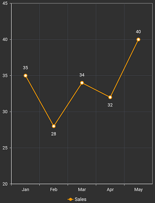

# Theme for Syncfusion widgets

## Theme

The Syncfusion theme widget allows you to apply colors, font-styles, etc in the application level across all the Syncfusion Flutter widgets with a uniform approach and provide a consistent look.

### How to use syncfusion_flutter_core package

The theme widget is available in the [`syncfusion_flutter_core`](https://pub.dev/packages/syncfusion_flutter_core) package. Since all our widgets are core dependent, you don't need to include the core as a separate package. Here for example purpose to depict the theme widget working model, we have included the [`syncfusion_flutter_charts`](https://pub.dev/packages/syncfusion_flutter_charts) package in the pub spec file.

 

    dependencies:

    syncfusion_flutter_charts: ^xx.x.xx



N> Here **xx.x.xx** denotes the current version of [`Syncfusion Flutter Chart`](https://pub.dev/packages/syncfusion_flutter_charts/versions) widget.

**Get packages**

Run the following command to get the required packages.

 

    $ flutter pub get



**Import package**

To use the theme widgets, import the following library in your Dart code.

 

    import 'package:syncfusion_flutter_core/theme.dart';



## Applying light and dark themes

Syncfusion Flutter widgets provide support for light and dark themes. As the name suggests, these themes will have colors with light and dark color contrasts, respectively. 

By default, the light theme will be applied. You can apply a dark theme using the brightness property.

 

    @override
    Widget build(BuildContext context) {
        return Scaffold(
            body: Center(
                child: SfTheme(
                    data: SfThemeData(
                        brightness: Brightness.dark
                    ),
                    child: SfCartesianChart())
            
        );
    }



## Individual theme widget

Using the [`SfTheme`](https://pub.dev/documentation/syncfusion_flutter_core/latest/theme/SfTheme-class.html) widget you can apply theme across all the Syncfusion Flutter widgets with a uniform approach. If you wish to apply a specific theme to a specific widget alone, this can be achieved using the individual theme widget. For example, [`SfChartTheme`](https://pub.dev/documentation/syncfusion_flutter_core/latest/theme/SfChartTheme-class.html) widget in case of [`SfCartesianChart`](https://pub.dev/documentation/syncfusion_flutter_charts/latest/charts/SfCartesianChart-class.html), [`SfCircularChart`](https://pub.dev/documentation/syncfusion_flutter_charts/latest/charts/SfCircularChart-class.html), [`SfPyramidChart`](https://pub.dev/documentation/syncfusion_flutter_charts/latest/charts/SfPyramidChart-class.html), [`SfPyramidChart`](https://pub.dev/documentation/syncfusion_flutter_charts/latest/charts/SfPyramidChart-class.html) widgets and [`SfCalendarTheme`](https://pub.dev/documentation/syncfusion_flutter_core/latest/theme/SfCalendarTheme-class.html) in case of [`SfCalendar`](https://pub.dev/documentation/syncfusion_flutter_calendar/latest/calendar/SfCalendar-class.html) widget. In the below example, we have used [`SfCartesianChart`](https://pub.dev/documentation/syncfusion_flutter_charts/latest/charts/SfCartesianChart-class.html) widget.

 

     @override
    Widget build(BuildContext context) {
        return Scaffold(
            body: SfChartTheme(
                data: SfChartThemeData(
                    brightness: Brightness.dark, 
                    backgroundColor: Colors.blue[300]),
                child: SfCartesianChart()));
  }



N> When dark or light theme is applied to the material app, and Syncfusion theme widgets are not initialized in your application, then based on the theme applied to the material app, the appropriate theme will be applied to Syncfusion widgets.