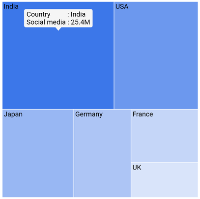
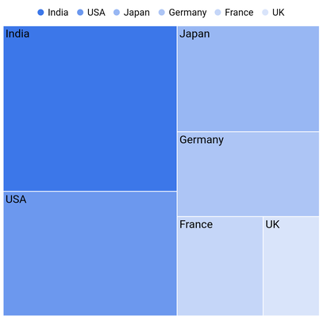

# Getting Started with Flutter Treemap (SfTreemap)
This section explains the steps required to add the treemap widget and its elements such as tooltip, assignable colors based on region, and legends. This section covers only basic features needed to know to get started with Syncfusion treemap.

## Add Flutter treemap to an application
Create a simple project using the instructions given in the [Getting Started with your first Flutter app](https://flutter.dev/docs/get-started/test-drive?tab=vscode#create-app) documentation.

**Add dependency**

Add the Syncfusion Flutter treemap dependency to your pubspec.yaml file.



dependencies:

syncfusion_flutter_treemap: ^xx.x.xx



N> Here **xx.x.xx** denotes the current version of [`Syncfusion Flutter Treemap`](https://pub.dev/packages/syncfusion_flutter_treemap/versions) package.

**Get packages**

Run the following command to get the required packages.



$ flutter pub get



**Import package**

Import the following package in your Dart code.




import 'package:syncfusion_flutter_treemap/treemap.dart';




## Initialize maps

After importing the package, initialize the treemap widget as a child of any widget.




@override
Widget build(BuildContext context) {
  return Scaffold(
    body: Center(
      child: SfTreemap(),
    ),
  );
}




## Populate data source

To visualize the treemap, populate the quantitative analysis data source and set its count to the [`dataCount`] property, map the quantitative value of the underlying data to the [`weightValueMapper`] property, and define the grouping order based on the value of the [`TreemapLevel.groupMapper`] property of [`levels`] collection in the [`SfTreemap`].




List<PopulationModel> _dataSource;

@override
void initState() {
   _dataSource = <PopulationModel>[
      PopulationModel('Asia', 25.4),
      PopulationModel('South America', 19.11),
      PopulationModel('North America', 13.3),
      PopulationModel('Europe', 10.65),
      PopulationModel('Africa', 7.54),
      PopulationModel('Australia', 4.93),
   ];
   super.initState();
}

@override
Widget build(BuildContext context) {
  return Scaffold(
     body: SfTreemap(
        dataCount: _dataSource.length,
        weightValueMapper: (int index) {
          return _dataSource[index].populationInMillions;
        },
        levels: [
          TreemapLevel(
            groupMapper: (int index) {
              return _dataSource[index].continent;
            },
            color: Colors.teal[200],
            padding: const EdgeInsets.all(1.5),
          ),
        ],
      ),
   );
}

class PopulationModel {
  const PopulationModel(this.continent, this.populationInMillions);

  final String continent;
  final double populationInMillions;
}




N>
* Refer the [`SfTreemap.levels`], for adding flat or hierarchical structured treemap.
* Refer the [`SfTreemap.colorMappers`], for customizing the tiles color.

Add label builder

You can add labels for the treemap using the [`labelBuilder`] property of the [`TreemapLevel`] in the [`levels`] collection property in the [`SfTreemap`] to show information about the particular tile.




List<PopulationModel> _dataSource;

@override
void initState() {
   _dataSource = <PopulationModel>[
      PopulationModel('Asia', 25.4),
      PopulationModel('South America', 19.11),
      PopulationModel('North America', 13.3),
      PopulationModel('Europe', 10.65),
      PopulationModel('Africa', 7.54),
      PopulationModel('Australia', 4.93),
   ];
   super.initState();
}

@override
Widget build(BuildContext context) {
  return Scaffold(
     body: SfTreemap(
        dataCount: _dataSource.length,
        weightValueMapper: (int index) {
          return _dataSource[index].populationInMillions;
        },
        levels: [
          TreemapLevel(
            groupMapper: (int index) {
              return _dataSource[index].continent;
            },
            color: Colors.teal[200],
            padding: const EdgeInsets.all(1.5),
            labelBuilder: (BuildContext context, TreemapTile tile) {
               return Text('${tile.group}');
             },
           ),
        ],
      ),
   );
}

class PopulationModel {
  const PopulationModel(this.continent, this.populationInMillions);

  final String continent;
  final double populationInMillions;
}




Add tooltip

You can add tooltip for the treemap using the [`tooltipBuilder`] property of the [`TreemapLevel`] in the [`levels`] collection property in the [`SfTreemap`].




List<PopulationModel> _dataSource;

@override
void initState() {
   _dataSource = <PopulationModel>[
      PopulationModel('Asia', 25.4),
      PopulationModel('South America', 19.11),
      PopulationModel('North America', 13.3),
      PopulationModel('Europe', 10.65),
      PopulationModel('Africa', 7.54),
      PopulationModel('Australia', 4.93),
   ];
   super.initState();
}

@override
Widget build(BuildContext context) {
  return Scaffold(
     body: SfTreemap(
        dataCount: _dataSource.length,
        weightValueMapper: (int index) {
          return _dataSource[index].populationInMillions;
        },
        levels: [
          TreemapLevel(
            groupMapper: (int index) {
              return _dataSource[index].continent;
            },
            color: Colors.teal[200],
            padding: const EdgeInsets.all(1.5),
            labelBuilder: (BuildContext context, TreemapTile tile) {
               return Text('${tile.group}');
            },
            tooltipBuilder: (BuildContext context, TreemapTile tile) {
               return Padding(
                  padding: const EdgeInsets.all(10),
                     child: Text('Continent   : ${tile.group}\nPopulation : ${tile.weight}M',
                         style: TextStyle(color: Colors.white)),
                     );
                },
            ),
        ],
      ),
   );
}

class PopulationModel {
  const PopulationModel(this.continent, this.populationInMillions);

  final String continent;
  final double populationInMillions;
}




Add legend

You can show clear information about the data plotted on the treemap and it can be added using the [`legend`] property in the [`SfTreemap`].




List<PopulationModel> _dataSource;

@override
void initState() {
   _dataSource = <PopulationModel>[
      PopulationModel('Asia', 25.4),
      PopulationModel('South America', 19.11),
      PopulationModel('North America', 13.3),
      PopulationModel('Europe', 10.65),
      PopulationModel('Africa', 7.54),
      PopulationModel('Australia', 4.93),
   ];
   super.initState();
}

@override
Widget build(BuildContext context) {
  return Scaffold(
     body: SfTreemap(
        dataCount: _dataSource.length,
        weightValueMapper: (int index) {
          return _dataSource[index].populationInMillions;
        },
        levels: [
          TreemapLevel(
            groupMapper: (int index) {
              return _dataSource[index].continent;
            },
            color: Colors.teal[200],
            padding: const EdgeInsets.all(1.5),
            labelBuilder: (BuildContext context, TreemapTile tile) {
              return Text('${tile.group}');
            },
          ),
        ],
        legend: TreemapLegend(),
      ),
   );
}

class PopulationModel {
  const PopulationModel(this.continent, this.populationInMillions);

  final String continent;
  final double populationInMillions;
}




