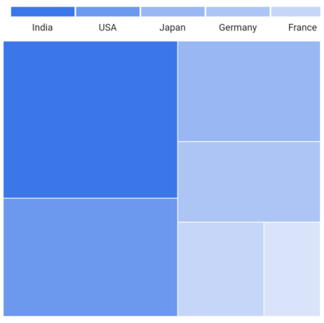
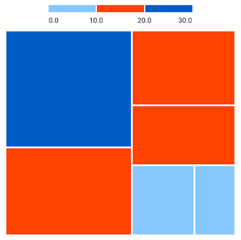
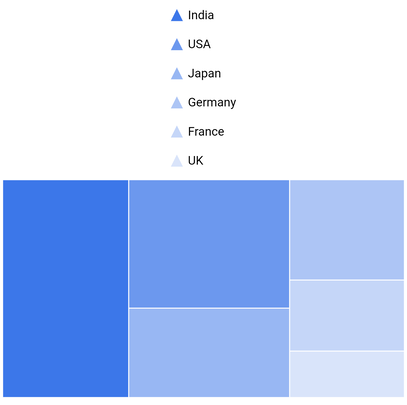
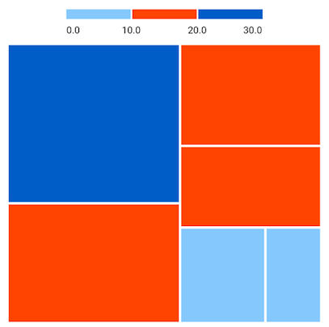
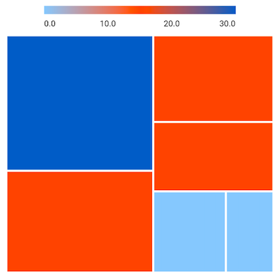
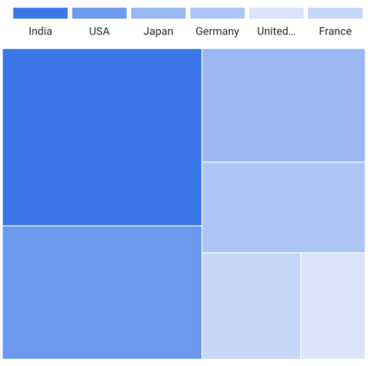
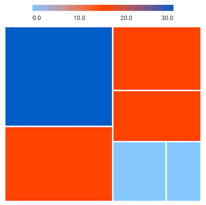
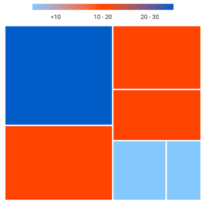
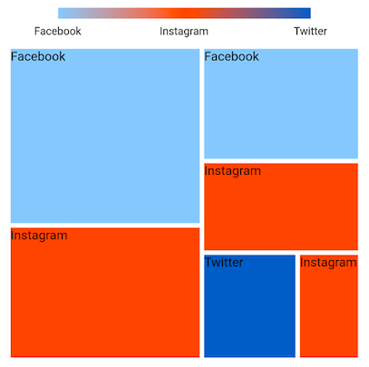

# Legend in the Flutter Treemap

You can provide clear information on the data plotted on the treemap using legend.

## Enable default legend

You can show legend by initializing the `SfTreemap.legend` property. By default, the legend item's text is rendered based on the value of `TreemapLevel.groupMapper` property. The default value of the `legend` property is `null` and hence the legend will not be shown by default.




List<SocialMediaUsers> _source;

@override
void initState() {
   _source = <SocialMediaUsers>[
      SocialMediaUsers('India', 'Facebook', 25.4),
      SocialMediaUsers('USA', 'Instagram', 19.11),
      SocialMediaUsers('Japan', 'Facebook', 13.3),
      SocialMediaUsers('Germany', 'Instagram', 10.65),
      SocialMediaUsers('France', 'Twitter', 7.54),
      SocialMediaUsers('UK', 'Instagram', 4.93),
   ];
   super.initState();
}

@override
Widget build(BuildContext context) {
  return Scaffold(
     body: SfTreemap(
        dataCount: _source.length,
        weightValueMapper: (int index) {
          return _source[index].usersInMillions;
        },
        levels: [
          TreemapLevel(
            padding: const EdgeInsets.all(1.5),
            groupMapper: (int index) {
              return _source[index].country;
            },
          ),
        ],
        legend: TreemapLegend(),
     ),
  );
}

class SocialMediaUsers {
  const SocialMediaUsers(this.country, this.socialMedia, this.usersInMillions);

  final String country;
  final String socialMedia;
  final double usersInMillions;
}




N>
* Refer the `TreemapLegend.bar`, for showing bar shape legend.

## Bar shape legend

You can show bar shape legend by initializing the `SfTreemap.legend` property as `TreemapLegend.bar`. By default, the legend item's text is rendered based on the value of `TreemapLevel.groupMapper` property.




List<SocialMediaUsers> _source;

@override
void initState() {
   _source = <SocialMediaUsers>[
      SocialMediaUsers('India', 'Facebook', 25.4),
      SocialMediaUsers('USA', 'Instagram', 19.11),
      SocialMediaUsers('Japan', 'Facebook', 13.3),
      SocialMediaUsers('Germany', 'Instagram', 10.65),
      SocialMediaUsers('France', 'Twitter', 7.54),
      SocialMediaUsers('UK', 'Instagram', 4.93),
   ];
   super.initState();
}

@override
Widget build(BuildContext context) {
  return Scaffold(
     body: SfTreemap(
        dataCount: _source.length,
        weightValueMapper: (int index) {
          return _source[index].usersInMillions;
        },
        levels: [
          TreemapLevel(
            padding: const EdgeInsets.all(1.5),
            groupMapper: (int index) {
              return _source[index].country;
            },
          ),
        ],
        legend: TreemapLegend.bar(),
     ),
  );
}

class SocialMediaUsers {
  const SocialMediaUsers(this.country, this.socialMedia, this.usersInMillions);

  final String country;
  final String socialMedia;
  final double usersInMillions;
}




N>
* Refer the `TreemapLegend`, for showing default legend.

## Icon and text customization

The icons color and text of the legend is applied based on the `TreemapLevel.color` and `TreemapLevel.groupMapper` properties respectively by default. It is possible to customize the legend icons color and texts using the `TreemapColorMapper.color` based on the `TreemapColorMapper.value` or `TreemapColorMapper.from` and `TreemapColorMapper.to` properties. You can also customize the legend item's text using the `TreemapColorMapper.legendItemText` when setting the `TreemapColorMapper.range` color mapper constructor.




List<SocialMediaUsers> _source;
List<TreemapColorMapper> _colorMappers;

@override
void initState() {
   _source = <SocialMediaUsers>[
      SocialMediaUsers('India', 'Facebook', 25.4),
      SocialMediaUsers('USA', 'Instagram', 19.11),
      SocialMediaUsers('Japan', 'Facebook', 13.3),
      SocialMediaUsers('Germany', 'Instagram', 10.65),
      SocialMediaUsers('France', 'Twitter', 7.54),
      SocialMediaUsers('UK', 'Instagram', 4.93),
   ];

   _colorMappers = <TreemapColorMapper>[
      TreemapColorMapper.range(0, 10, Colors.blue[200]),
      TreemapColorMapper.range(10, 20, Colors.deepOrange),
      TreemapColorMapper.range(20, 30, Colors.blue[800]),
   ];
   super.initState();
}

@override
Widget build(BuildContext context) {
  return Scaffold(
     body: SfTreemap(
        dataCount: _source.length,
        weightValueMapper: (int index) {
          return _source[index].usersInMillions;
        },
        levels: [
          TreemapLevel(
            padding: const EdgeInsets.all(1.5),
            groupMapper: (int index) {
              return _source[index].country;
            },
            colorValueMapper: (TreemapTile tile) {
              return tile.weight;
            },
          ),
        ],
        colorMappers: _colorMappers,
        legend: TreemapLegend.bar(),
     ),
  );
}

class SocialMediaUsers {
  const SocialMediaUsers(this.country, this.socialMedia, this.usersInMillions);

  final String country;
  final String socialMedia;
  final double usersInMillions;
}




## Position

You can position the legend items in different directions using the `TreemapLegend.position` property. The default value of the `position` property is `TreemapLegendPosition.top`. The possible values are `left`, `right`, `top`, and `bottom`.




List<SocialMediaUsers> _source;

@override
void initState() {
   _source = <SocialMediaUsers>[
      SocialMediaUsers('India', 'Facebook', 25.4),
      SocialMediaUsers('USA', 'Instagram', 19.11),
      SocialMediaUsers('Japan', 'Facebook', 13.3),
      SocialMediaUsers('Germany', 'Instagram', 10.65),
      SocialMediaUsers('France', 'Twitter', 7.54),
      SocialMediaUsers('UK', 'Instagram', 4.93),
   ];
   super.initState();
}

@override
Widget build(BuildContext context) {
  return Scaffold(
     body: SfTreemap(
        dataCount: _source.length,
        weightValueMapper: (int index) {
          return _source[index].usersInMillions;
        },
        levels: [
          TreemapLevel(
            padding: const EdgeInsets.all(2.5),
            groupMapper: (int index) {
              return _source[index].country;
            },
          ),
        ],
        legend: TreemapLegend(
          position: TreemapLegendPosition.bottom,
        ),
     ),
  );
}

class SocialMediaUsers {
  const SocialMediaUsers(this.country, this.socialMedia, this.usersInMillions);

  final String country;
  final String socialMedia;
  final double usersInMillions;
}




N>
* Refer the `offset`, for placing the legend in custom position.

## Offset

You can place the legend in custom position using the `TreemapLegend.offset` property. The default value of the `offset` property is `null`.

If the property `TreemapLegend.offset` has been set with the property `TreemapLegend.position` as top, then the legend will be placed in top but with absolute position, i.e. legend will not take dedicated position for it and will be drawn at the top of the map.




List<SocialMediaUsers> _source;

@override
void initState() {
   _source = <SocialMediaUsers>[
      SocialMediaUsers('India', 'Facebook', 25.4),
      SocialMediaUsers('USA', 'Instagram', 19.11),
      SocialMediaUsers('Japan', 'Facebook', 13.3),
      SocialMediaUsers('Germany', 'Instagram', 10.65),
      SocialMediaUsers('France', 'Twitter', 7.54),
      SocialMediaUsers('UK', 'Instagram', 4.93),
   ];
   super.initState();
}

@override
Widget build(BuildContext context) {
  return Scaffold(
     body: SfTreemap(
        dataCount: _source.length,
        weightValueMapper: (int index) {
          return _source[index].usersInMillions;
        },
        levels: [
          TreemapLevel(
            padding: const EdgeInsets.all(1.5),
            groupMapper: (int index) {
              return _source[index].country;
            },
          ),
        ],
        legend: TreemapLegend(
          offset: Offset(70, 250),
        ),
     ),
  );
}

class SocialMediaUsers {
  const SocialMediaUsers(this.country, this.socialMedia, this.usersInMillions);

  final String country;
  final String socialMedia;
  final double usersInMillions;
}




## Overflow mode

<b>For default legend</b>

You can wrap or scroll the legend items using the `TreemapLegend.overflowMode` property. The default value of the `overflowMode` property is `TreemapLegendOverflowMode.wrap`. The possible values are `scroll` and `wrap`.

If the legend position is `left` or `right`, then the default scroll direction is `vertical`.

If the legend position is `top` or `bottom`, then the default scroll direction is `horizontal`.




List<SocialMediaUsers> _source;

@override
void initState() {
   _source = <SocialMediaUsers>[
      SocialMediaUsers('India', 'Facebook', 25.4),
      SocialMediaUsers('USA', 'Instagram', 19.11),
      SocialMediaUsers('Japan', 'Facebook', 13.3),
      SocialMediaUsers('China', 'Facebook', 12.3),
      SocialMediaUsers('Germany', 'Instagram', 10.65),
      SocialMediaUsers('France', 'Twitter', 7.54),
      SocialMediaUsers('South America', 'Twitter', 5.54),
      SocialMediaUsers('United Kingdom', 'Instagram', 4.93),
   ];
   super.initState();
}

@override
Widget build(BuildContext context) {
  return Scaffold(
     body: SfTreemap(
        dataCount: _source.length,
        weightValueMapper: (int index) {
          return _source[index].usersInMillions;
        },
        levels: [
          TreemapLevel(
            padding: const EdgeInsets.all(1.5),
            groupMapper: (int index) {
              return _source[index].country;
            },
          ),
        ],
        legend: TreemapLegend(
          overflowMode: TreemapLegendOverflowMode.scroll,
        ),
      ),
   );
}

class SocialMediaUsers {
  const SocialMediaUsers(this.country, this.socialMedia, this.usersInMillions);

  final String country;
  final String socialMedia;
  final double usersInMillions;
}




<b>For bar legend</b>

You can wrap or scroll the bar legend items using the `TreemapLegend.overflowMode` property. The default value of the `overflowMode` property is `TreemapLegendOverflowMode.scroll`. The possible values are `scroll` and `wrap`.

If the legend position is `left` or `right`, then the default scroll direction is `vertical`.

If the legend position is `top` or `bottom`, then the default scroll direction is `horizontal`.




List<SocialMediaUsers> _source;

@override
void initState() {
   _source = <SocialMediaUsers>[
      SocialMediaUsers('India', 'Facebook', 25.4),
      SocialMediaUsers('USA', 'Instagram', 19.11),
      SocialMediaUsers('Japan', 'Facebook', 13.3),
      SocialMediaUsers('Germany', 'Instagram', 10.65),
      SocialMediaUsers('France', 'Twitter', 7.54),
      SocialMediaUsers('UK', 'Instagram', 4.93),
   ];
   super.initState();
}

@override
Widget build(BuildContext context) {
   return Scaffold(
      body: SfTreemap(
        dataCount: _source.length,
        weightValueMapper: (int index) {
          return _source[index].usersInMillions;
        },
        levels: [
          TreemapLevel(
            padding: const EdgeInsets.all(1.5),
            groupMapper: (int index) {
              return _source[index].country;
            },
          ),
        ],
        legend: TreemapLegend.bar(
          overflowMode: TreemapLegendOverflowMode.scroll,
        ),
      ),
   );
}

class SocialMediaUsers {
  const SocialMediaUsers(this.country, this.socialMedia, this.usersInMillions);

  final String country;
  final String socialMedia;
  final double usersInMillions;
}




N>
* Refer the `iconSize`, for changing the size of the icon.

## Text style

You can customize the legend item's text style using the `TreemapLegend.textStyle` property.




List<SocialMediaUsers> _source;

@override
void initState() {
   _source = <SocialMediaUsers>[
      SocialMediaUsers('India', 'Facebook', 25.4),
      SocialMediaUsers('USA', 'Instagram', 19.11),
      SocialMediaUsers('Japan', 'Facebook', 13.3),
      SocialMediaUsers('Germany', 'Instagram', 10.65),
      SocialMediaUsers('France', 'Twitter', 7.54),
      SocialMediaUsers('UK', 'Instagram', 4.93),
   ];
   super.initState();
}

@override
Widget build(BuildContext context) {
  return Scaffold(
     body: SfTreemap(
        dataCount: _source.length,
        weightValueMapper: (int index) {
          return _source[index].usersInMillions;
        },
        levels: [
          TreemapLevel(
            padding: const EdgeInsets.all(1.5),
            groupMapper: (int index) {
              return _source[index].country;
            },
          ),
        ],
        legend: TreemapLegend(
          textStyle: TextStyle(
            color: Colors.red,
            fontSize: 14,
            fontWeight: FontWeight.bold,
            fontStyle: FontStyle.italic,
          ),
        ),
      ),
   );
}

class SocialMediaUsers {
  const SocialMediaUsers(this.country, this.socialMedia, this.usersInMillions);

  final String country;
  final String socialMedia;
  final double usersInMillions;
}




## Default legend appearance customization

You can customize the legend items using the following properties.

* **iconType** - Used to change the icon shape. The default value of the `iconType` argument in the `constructor` is `TreemapIconType.circle`. The possible values are `circle`, `rectangle`, `triangle`, and `diamond`.
* **iconSize** - Used to change the size of the icon. The default value of `iconSize` argument in the `constructor` is `Size(8.0, 8.0)`.
* **spacing** - Used to provide space between the each legend items. The default value of the `spacing` argument in the `constructor`is `10.0`.
* **direction** - Used to arrange the legend items in either horizontal or vertical direction. The default value of `direction` property is `horizontal`, if the value of the `position` property is `top`, `bottom` and defaults to `vertical`, if the value of the `position` property is `left` or `right`.
* **padding** - Used to set padding around the legend. The default value of the `padding` property is `EdgeInsets.all(10.0)`.




List<SocialMediaUsers> _source;

@override
void initState() {
   _source = <SocialMediaUsers>[
      SocialMediaUsers('India', 'Facebook', 25.4),
      SocialMediaUsers('USA', 'Instagram', 19.11),
      SocialMediaUsers('Japan', 'Facebook', 13.3),
      SocialMediaUsers('Germany', 'Instagram', 10.65),
      SocialMediaUsers('France', 'Twitter', 7.54),
      SocialMediaUsers('UK', 'Instagram', 4.93),
   ];
   super.initState();
}

@override
Widget build(BuildContext context) {
  return Scaffold(
     body: SfTreemap(
        dataCount: _source.length,
        weightValueMapper: (int index) {
          return _source[index].usersInMillions;
        },
        levels: [
          TreemapLevel(
            padding: const EdgeInsets.all(1.5),
            groupMapper: (int index) {
              return _source[index].country;
            },
          ),
        ],
        legend: TreemapLegend(
          iconType: TreemapIconType.triangle,
          iconSize: Size(12.0, 12.0),
          spacing: 15,
          padding: EdgeInsets.all(12.0),
          direction: Axis.vertical,
        ),
      ),
   );
}

class SocialMediaUsers {
  const SocialMediaUsers(this.country, this.socialMedia, this.usersInMillions);

  final String country;
  final String socialMedia;
  final double usersInMillions;
}




N>
* Refer the `position`, for setting the position of the legend.

## Bar legend segment painting style

### Solid

You can set solid color for the bar by using the `TreemapLegendPaintingStyle.solid`. By defaults `TreemapLegendPaintingStyle` will be `solid`.




List<SocialMediaUsers> _source;
List<TreemapColorMapper> _colorMappers;

@override
void initState() {
   _source = <SocialMediaUsers>[
      SocialMediaUsers('India', 'Facebook', 25.4),
      SocialMediaUsers('USA', 'Instagram', 19.11),
      SocialMediaUsers('Japan', 'Facebook', 13.3),
      SocialMediaUsers('Germany', 'Instagram', 10.65),
      SocialMediaUsers('France', 'Twitter', 7.54),
      SocialMediaUsers('UK', 'Instagram', 4.93),
   ];

   _colorMappers = <TreemapColorMapper>[
      TreemapColorMapper.range(0, 10, Colors.blue[200]),
      TreemapColorMapper.range(10, 20, Colors.deepOrange),
      TreemapColorMapper.range(20, 30, Colors.blue[800]),
   ];
   super.initState();
}

@override
Widget build(BuildContext context) {
  return Scaffold(
     body: SfTreemap(
        dataCount: _source.length,
        weightValueMapper: (int index) {
          return _source[index].usersInMillions;
        },
        levels: [
          TreemapLevel(
            padding: const EdgeInsets.all(1.5),
            groupMapper: (int index) {
              return _source[index].country;
            },
            colorValueMapper: (TreemapTile tile) {
              return tile.weight;
            },
          ),
        ],
        colorMappers: _colorMappers,
        legend: TreemapLegend.bar(
          segmentPaintingStyle: TreemapLegendPaintingStyle.solid,
        ),
      ),
   );
}

class SocialMediaUsers {
  const SocialMediaUsers(this.country, this.socialMedia, this.usersInMillions);

  final String country;
  final String socialMedia;
  final double usersInMillions;
}




### Gradient

You can set gradient color for the bar by using the `TreemapLegendPaintingStyle.gradient`.




List<SocialMediaUsers> _source;
List<TreemapColorMapper> _colorMappers;

@override
void initState() {
   _source = <SocialMediaUsers>[
      SocialMediaUsers('India', 'Facebook', 25.4),
      SocialMediaUsers('USA', 'Instagram', 19.11),
      SocialMediaUsers('Japan', 'Facebook', 13.3),
      SocialMediaUsers('Germany', 'Instagram', 10.65),
      SocialMediaUsers('France', 'Twitter', 7.54),
      SocialMediaUsers('UK', 'Instagram', 4.93),
   ];

   _colorMappers = <TreemapColorMapper>[
      TreemapColorMapper.range(0, 10, Colors.blue[200]),
      TreemapColorMapper.range(10, 20, Colors.deepOrange),
      TreemapColorMapper.range(20, 30, Colors.blue[800]),
   ];
   super.initState();
}

@override
Widget build(BuildContext context) {
  return Scaffold(
     body: SfTreemap(
        dataCount: _source.length,
        weightValueMapper: (int index) {
          return _source[index].usersInMillions;
        },
        levels: [
          TreemapLevel(
            padding: const EdgeInsets.all(1.5),
            groupMapper: (int index) {
              return _source[index].country;
            },
            colorValueMapper: (TreemapTile tile) {
              return tile.weight;
            },
          ),
        ],
        colorMappers: _colorMappers,
        legend: TreemapLegend.bar(
          segmentPaintingStyle: TreemapLegendPaintingStyle.solid,
        ),
      ),
   );
}

class SocialMediaUsers {
  const SocialMediaUsers(this.country, this.socialMedia, this.usersInMillions);

  final String country;
  final String socialMedia;
  final double usersInMillions;
}




## Bar legend appearance customization

You can customize the legend items using the following properties.

* **segmentSize** - Used to change the size of individual bar segments. When gradient paint style is applied, `segmentSize` argument in the `constructor` will update the whole bar. The default value of the `segmentSize` property is `Size(80.0, 12.0)`.
* **labelOverflow** - Used to remove or trim the legend labels based on the bar legend size.The default value of the `labelOverflow` argument in the `constructor` will be `TreemapLabelOverflow.visible`.
* **edgeLabelsPlacement** - Used to place the edge labels either inside or outside of the bar legend. The default value of the `edgeLabelsPlacement` argument in the `constructor` will be `TreemapLegendEdgeLabelsPlacement.inside`.
* **spacing** - Used to provide space between the each legend items. The default value of the `spacing` is `2.0`. This is not applicable for gradient legend.
* **direction** - Used to arrange the legend items in either horizontal or vertical direction. The default value of `direction` property is `horizontal`, if the value of the `position` property is `top`, `bottom` and defaults to `vertical`, if the value of the `position` property is `left` or `right`.
* **padding** - Used to set padding around the legend. The default value of the `padding` property is `EdgeInsets.all(10.0)`.




List<SocialMediaUsers> _source;

@override
void initState() {
   _source = <SocialMediaUsers>[
      SocialMediaUsers('India', 'Facebook', 25.4),
      SocialMediaUsers('USA', 'Instagram', 19.11),
      SocialMediaUsers('Japan', 'Facebook', 13.3),
      SocialMediaUsers('Germany', 'Instagram', 10.65),
      SocialMediaUsers('United Kingdom', 'Instagram', 4.93),
      SocialMediaUsers('France', 'Twitter', 7.54),
   ];
   super.initState();
}

@override
Widget build(BuildContext context) {
  return Scaffold(
     body: SfTreemap(
        dataCount: _source.length,
        weightValueMapper: (int index) {
          return _source[index].usersInMillions;
        },
        levels: [
          TreemapLevel(
            padding: const EdgeInsets.all(1.5),
            groupMapper: (int index) {
              return _source[index].country;
            },
          ),
        ],
        legend: TreemapLegend.bar(
          segmentSize: Size(60, 12),
          labelOverflow: TreemapLabelOverflow.ellipsis,
          edgeLabelsPlacement: TreemapLegendEdgeLabelsPlacement.center,
          padding: EdgeInsets.all(12),
          direction: Axis.horizontal,
          spacing: 5,
        ),
      ),
   );
}

class SocialMediaUsers {
  const SocialMediaUsers(this.country, this.socialMedia, this.usersInMillions);

  final String country;
  final String socialMedia;
  final double usersInMillions;
}




## Bar legend labels placement

You can place the labels either between the segments or on the segments using the `labelsPlacement` property.

<b>Labels placement for range color mapper</b>

The labels are positioned between the segments when setting range color mapper without setting color mapper `TreemapColorMapper.name` property. The `TreemapColorMapper.from` value of the first item is positioned at starting point of the first segment and the `TreemapColorMapper.to` value of the first item is placed at the first segment end position. For other segments, the values of `TreemapColorMapper.to` is positioned as label between the other segments.




List<SocialMediaUsers> _source;
List<TreemapColorMapper> _colorMappers;

@override
void initState() {
   _source = <SocialMediaUsers>[
      SocialMediaUsers('India', 'Facebook', 25.4),
      SocialMediaUsers('USA', 'Instagram', 19.11),
      SocialMediaUsers('Japan', 'Facebook', 13.3),
      SocialMediaUsers('Germany', 'Instagram', 10.65),
      SocialMediaUsers('France', 'Twitter', 7.54),
      SocialMediaUsers('UK', 'Instagram', 4.93),
   ];

   _colorMappers = <TreemapColorMapper>[
      TreemapColorMapper.range(0, 10, Colors.blue[200]),
      TreemapColorMapper.range(10, 20, Colors.deepOrange),
      TreemapColorMapper.range(20, 30, Colors.blue[800]),
   ];
   super.initState();
}

@override
Widget build(BuildContext context) {
  return Scaffold(
     body: SfTreemap(
        dataCount: _source.length,
        weightValueMapper: (int index) {
          return _source[index].usersInMillions;
        },
        levels: [
          TreemapLevel(
            padding: const EdgeInsets.all(1.5),
            groupMapper: (int index) {
              return _source[index].country;
            },
            colorValueMapper: (TreemapTile tile) {
              return tile.weight;
            },
          ),
        ],
        colorMappers: _colorMappers,
        legend: TreemapLegend.bar(
          labelsPlacement: TreemapLegendLabelsPlacement.betweenItems,
          segmentPaintingStyle: TreemapLegendPaintingStyle.gradient,
        ),
      ),
   );
}

class SocialMediaUsers {
  const SocialMediaUsers(this.country, this.socialMedia, this.usersInMillions);

  final String country;
  final String socialMedia;
  final double usersInMillions;
}




The labels are positioned between the segments when setting range color mapper along with setting color mapper `TreemapColorMapper.name` property. The `TreemapColorMapper.from` value of the first item is positioned at starting point of the first segment and the `TreemapColorMapper.name` value of the first item is placed at the first segment end position. For Other segments, the value of `TreemapColorMapper.name` is positioned as label between the segments.




List<SocialMediaUsers> _source;
List<TreemapColorMapper> _colorMappers;

@override
void initState() {
   _source = <SocialMediaUsers>[
      SocialMediaUsers('India', 'Facebook', 25.4),
      SocialMediaUsers('USA', 'Instagram', 19.11),
      SocialMediaUsers('Japan', 'Facebook', 13.3),
      SocialMediaUsers('Germany', 'Instagram', 10.65),
      SocialMediaUsers('France', 'Twitter', 7.54),
      SocialMediaUsers('UK', 'Instagram', 4.93),
   ];

   _colorMappers = <TreemapColorMapper>[
      TreemapColorMapper.range(0, 10, Colors.blue[200], name: '<10'),
      TreemapColorMapper.range(10, 20, Colors.deepOrange, name: '10 - 20'),
      TreemapColorMapper.range(20, 30, Colors.blue[800], name: '20 - 30'),
   ];
   super.initState();
}

@override
Widget build(BuildContext context) {
  return Scaffold(
     body: SfTreemap(
        dataCount: _source.length,
        weightValueMapper: (int index) {
          return _source[index].usersInMillions;
        },
        levels: [
          TreemapLevel(
            padding: const EdgeInsets.all(1.5),
            groupMapper: (int index) {
              return _source[index].country;
            },
            colorValueMapper: (TreemapTile tile) {
              return tile.weight;
            },
          ),
        ],
        colorMappers: _colorMappers,
        legend: TreemapLegend.bar(
          labelsPlacement: TreemapLegendLabelsPlacement.betweenItems,
          segmentPaintingStyle: TreemapLegendPaintingStyle.gradient,
        ),
      ),
   );
}

class SocialMediaUsers {
  const SocialMediaUsers(this.country, this.socialMedia, this.usersInMillions);

  final String country;
  final String socialMedia;
  final double usersInMillions;
}




The labels are positioned at the center of the segments when setting the `labelsPlacement` property to `TreemapLegendLabelsPlacement.onItem`. The labels will based on the value of `TreemapColorMapper.name` property. If the value of `TreemapColorMapper.name` property is null, labels will be based on the values of `TreemapColorMapper.from` and `TreemapColorMapper.to` properties.




List<SocialMediaUsers> _source;
List<TreemapColorMapper> _colorMappers;

@override
void initState() {
   _source = <SocialMediaUsers>[
      SocialMediaUsers('India', 'Facebook', 25.4),
      SocialMediaUsers('USA', 'Instagram', 19.11),
      SocialMediaUsers('Japan', 'Facebook', 13.3),
      SocialMediaUsers('Germany', 'Instagram', 10.65),
      SocialMediaUsers('France', 'Twitter', 7.54),
      SocialMediaUsers('UK', 'Instagram', 4.93),
   ];

   _colorMappers = <TreemapColorMapper>[
      TreemapColorMapper.range(0, 10, Colors.blue[200], name: '<10'),
      TreemapColorMapper.range(10, 20, Colors.deepOrange, name: '10 - 20'),
      TreemapColorMapper.range(20, 30, Colors.blue[800], name: '20 - 30'),
   ];
   super.initState();
}

@override
Widget build(BuildContext context) {
  return Scaffold(
     body: SfTreemap(
        dataCount: _source.length,
        weightValueMapper: (int index) {
          return _source[index].usersInMillions;
        },
        levels: [
          TreemapLevel(
            padding: const EdgeInsets.all(1.5),
            groupMapper: (int index) {
              return _source[index].country;
            },
            colorValueMapper: (TreemapTile tile) {
              return tile.weight;
            },
          ),
        ],
        colorMappers: _colorMappers,
        legend: TreemapLegend.bar(
          labelsPlacement: TreemapLegendLabelsPlacement.onItem,
          edgeLabelsPlacement: TreemapLegendEdgeLabelsPlacement.center,
          segmentPaintingStyle: TreemapLegendPaintingStyle.gradient,
        ),
      ),
   );
}

class SocialMediaUsers {
  const SocialMediaUsers(this.country, this.socialMedia, this.usersInMillions);

  final String country;
  final String socialMedia;
  final double usersInMillions;
}




<b>Labels placement for equal color mapper</b>

The `labelsPlacement` option is not applicable for the legend label applied with equal color mapper. By default, the labels are positioned at center of the segment.




List<SocialMediaUsers> _source;
List<TreemapColorMapper> _colorMappers;

@override
void initState() {
   _source = <SocialMediaUsers>[
      SocialMediaUsers('India', 'Facebook', 25.4),
      SocialMediaUsers('USA', 'Instagram', 19.11),
      SocialMediaUsers('Japan', 'Facebook', 13.3),
      SocialMediaUsers('Germany', 'Instagram', 10.65),
      SocialMediaUsers('France', 'Twitter', 7.54),
      SocialMediaUsers('UK', 'Instagram', 4.93),
   ];

   _colorMappers = <TreemapColorMapper>[
      TreemapColorMapper.value('Facebook', Colors.blue[200]),
      TreemapColorMapper.value('Instagram', Colors.deepOrange),
      TreemapColorMapper.value('Twitter', Colors.blue[800]),
   ];
   super.initState();
}

@override
Widget build(BuildContext context) {
  return Scaffold(
     body: SfTreemap(
        dataCount: _source.length,
        weightValueMapper: (int index) {
          return _source[index].usersInMillions;
        },
        levels: [
          TreemapLevel(
            padding: const EdgeInsets.all(2.5),
            groupMapper: (int index) {
              return _source[index].country;
            },
            labelBuilder: (BuildContext context, TreemapTile tile) {
              return Text(_source[tile.indices[0]].socialMedia);
            },
            colorValueMapper: (TreemapTile tile) {
              return _source[tile.indices[0]].socialMedia;
            },
          ),
        ],
        colorMappers: _colorMappers,
        legend: TreemapLegend.bar(
          edgeLabelsPlacement: TreemapLegendEdgeLabelsPlacement.center,
          segmentPaintingStyle: TreemapLegendPaintingStyle.gradient,
        ),
      ),
   );
}

class SocialMediaUsers {
  const SocialMediaUsers(this.country, this.socialMedia, this.usersInMillions);

  final String country;
  final String socialMedia;
  final double usersInMillions;
}




