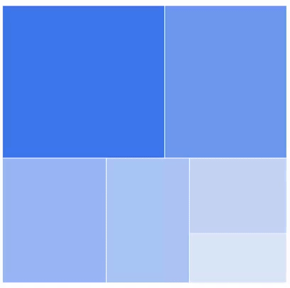
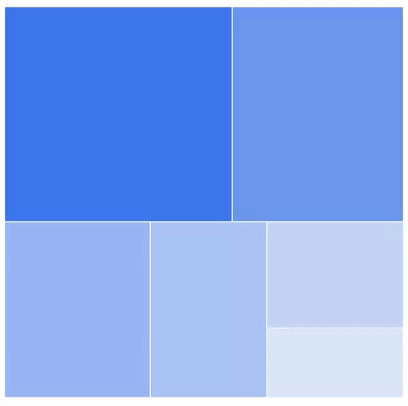

# Selection in the Flutter Maps

You can select a tile in order to highlight that area on a treemap. You can use the callback for performing any action during tile selection.

## Enable tile selection

You can enable tile selection on a treemap using the `SfTreemap.onSelectionChanged` property. The descendant tiles of the selected tile are also selected along with the selected tile when doing selecting for hierarchical level.

The `onSelectionChanged` callback is used to pass the details of the selected tile when the user is selecting a tile by tapping.




List<SocialMediaUsers> _source;

@override
void initState() {
  _source = <SocialMediaUsers>[
      SocialMediaUsers('India', 'Facebook', 25.4),
      SocialMediaUsers('USA', 'Instagram', 19.11),
      SocialMediaUsers('Japan', 'Facebook', 13.3),
      SocialMediaUsers('Germany', 'Instagram', 10.65),
      SocialMediaUsers('France', 'Twitter', 7.54),
      SocialMediaUsers('UK', 'Instagram', 4.93),
   ];
   super.initState();
}

@override
Widget build(BuildContext context) {
  return Scaffold(
     body: SfTreemap(
        dataCount: _source.length,
        weightValueMapper: (int index) {
          return _source[index].usersInMillions;
        },
        onSelectionChanged: (TreemapTile) {},
        levels: [
          TreemapLevel(
            groupMapper: (int index) {
              return _source[index].country;
            },
          ),
        ],
      ),
   );
}

class SocialMediaUsers {
  const SocialMediaUsers(this.country, this.socialMedia, this.usersInMillions);

  final String country;
  final String socialMedia;
  final double usersInMillions;
}




N>
* Refer the `TreemapSelectionSettings`, for customizing the selected tile's appearance.

## Appearance customization

You can customize the below appearance of the selected tile.

* **Background color** - Change the background color of the selected tile using the `TreemapSelectionSettings.color` property.
* **Border** - Change the border color, border stroke width using the `BorderSide.color` and `BorderSide.width` properties in the `RoundedRectangleBorder`. Also apply rounded border using the `RoundedRectangleBorder.borderRadius` property.




List<SocialMediaUsers> _source;

@override
void initState() {
   _source = <SocialMediaUsers>[
      SocialMediaUsers('India', 'Facebook', 25.4),
      SocialMediaUsers('USA', 'Instagram', 19.11),
      SocialMediaUsers('Japan', 'Facebook', 13.3),
      SocialMediaUsers('Germany', 'Instagram', 10.65),
      SocialMediaUsers('France', 'Twitter', 7.54),
      SocialMediaUsers('UK', 'Instagram', 4.93),
   ];
   super.initState();
}

@override
Widget build(BuildContext context) {
  return Scaffold(
     body: SfTreemap(
        dataCount: _source.length,
        weightValueMapper: (int index) {
          return _source[index].usersInMillions;
        },
        onSelectionChanged: (TreemapTile) {},
        selectionSettings: TreemapSelectionSettings(
          color: Colors.orange,
          border: RoundedRectangleBorder(
            side: BorderSide(
              color: Colors.deepOrange,
              width: 1,
            ),
            borderRadius: BorderRadius.circular(10),
          ),
        ),
        levels: [
          TreemapLevel(
            groupMapper: (int index) {
              return _source[index].country;
            },
          ),
        ],
      ),
   );
}

class SocialMediaUsers {
  const SocialMediaUsers(this.country, this.socialMedia, this.usersInMillions);

  final String country;
  final String socialMedia;
  final double usersInMillions;
}




