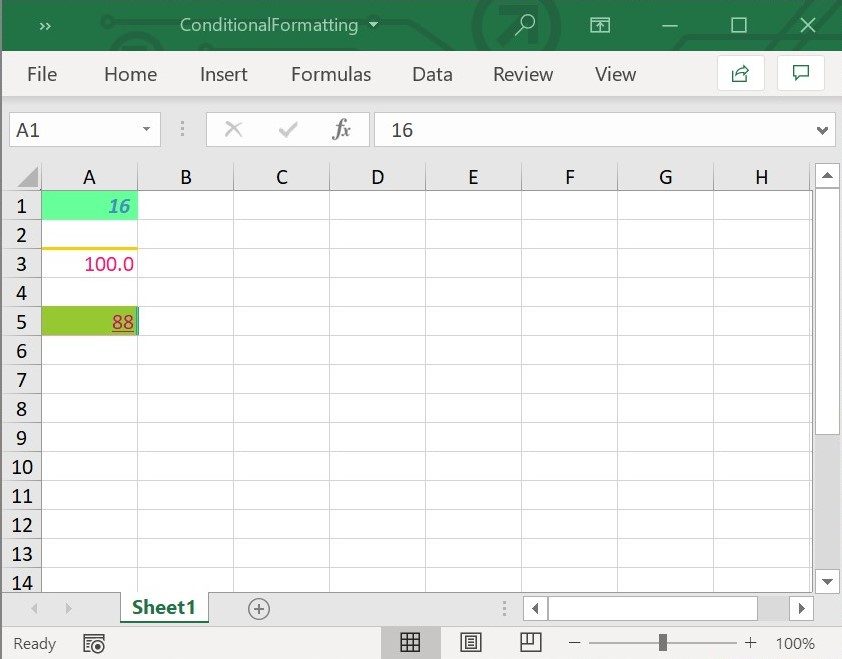
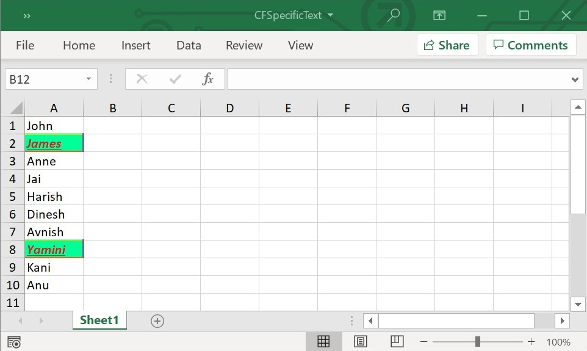
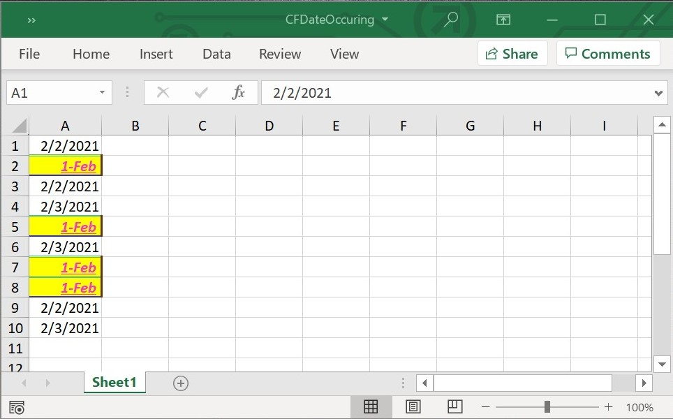
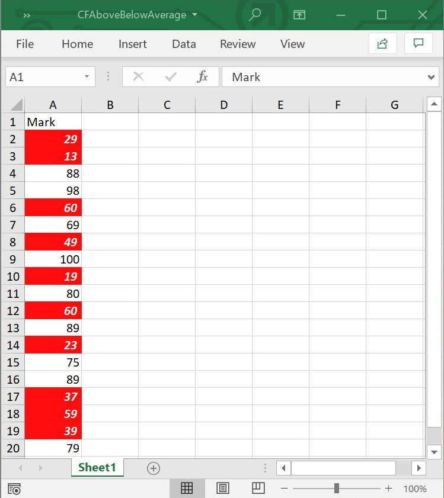

# Working with Conditional Formatting

Conditional formatting allows to format the contents of a cell dynamically. This can be defined and applied in XlsIO through the **ConditionalFormat** class.

## Create a Conditional Format 

The ConditionalFormats represents a collection of conditional formats for a single or multiple Range. One or more conditional formats can be added to the range as follows.



//Applying conditional formatting to "A1".
final ConditionalFormats conditions =
  sheet.getRangeByName('A1').conditionalFormats;
final ConditionalFormat condition1 = conditions.addCondition();



The target range should meet the criteria, which is set using the **ConditionalFormat** class. The desired format type is set through the **ExcelCFType** enumerator, which are the supported conditional format types in XlsIO. Refer to the following code.



//Represents conditional format rule that the value in target range should be between 10 and 20
condition1.formatType = ExcelCFType.cellValue;
condition1.operator = ExcelComparisonOperator.between;
condition1.firstFormula = '10';
condition1.secondFormula = '20';
sheet.getRangeByIndex(1, 1).setText('Enter a number between 10 and 20');



When the criteria set for the target range is satisfied, the defined formats (like the one below) are applied in the order of priority. For more details about conditional format priority, see [Manage conditional formatting rule precedence](https://support.microsoft.com/en-us/office/video-manage-conditional-formatting-6b69364e-dc79-4fe4-bd94-1883e40848f9).



//Setting format properties to be applied when the above condition is met
condition1.backColor = '#209301';
condition1.isBold = true;
condition1.isItalic = true;



The following code creates and applies various different conditional formats for different ranges in XlsIO.



// Create a new Excel Document.
final Workbook workbook = Workbook();

// Accessing sheet via index.
final Worksheet sheet = workbook.worksheets[0];

//Applying conditional formatting to "A1".
ConditionalFormats conditions = sheet.getRangeByName('A1').conditionalFormats;
final ConditionalFormat condition1 = conditions.addCondition();

//Represents conditional format rule that the value in target range should be between 10 and 20
condition1.formatType = ExcelCFType.cellValue;
condition1.operator = ExcelComparisonOperator.between;
condition1.firstFormula = '10';
condition1.secondFormula = '20';
sheet.getRangeByIndex(1, 1).setText('Enter a number between 10 and 20');

//Setting format properties to be applied when the above condition is met.
condition1.backColor = '#66FF99';
condition1.isBold = true;
condition1.isItalic = true;

//Applying conditional formatting to "A3".
conditions = sheet.getRangeByName('A3').conditionalFormats;
final ConditionalFormat condition2 = conditions.addCondition();

//Represents conditional format rule that the cell value should be 100.
condition2.formatType = ExcelCFType.cellValue;
condition2.operator = ExcelComparisonOperator.equal;
condition2.firstFormula = '100';
sheet.getRangeByIndex(3, 1).setText('Enter the Number as 100');

//Setting format properties to be applied when the above condition is met.
condition2.fontColor = '#FF1574';
condition2.topBorderStyle = LineStyle.thick;
condition2.topBorderColor = '#FFCC00';
condition2.numberFormat = '0.0';

//Applying conditional formatting to "A5".
conditions = sheet.getRangeByName('A5').conditionalFormats;
final ConditionalFormat condition3 = conditions.addCondition();

//Represents conditional format rule that the cell value greater or equal to 50.
condition3.formatType = ExcelCFType.cellValue;
condition3.operator = ExcelComparisonOperator.greaterOrEqual;
condition3.firstFormula = '50';
sheet
  .getRangeByIndex(5, 1)
  .setText('Enter the number value greater than or equal to 50.');

//Setting format properties to be applied when the above condition is met.
condition3.backColor = '#F16709';
condition3.fontColor = '#17D4E3';
condition3.underline = true;
condition3.rightBorderStyle = LineStyle.double;
condition3.rightBorderColor = '#3333FF';

//save and dispose.
final List<int> bytes = workbook.saveAsStream();
File('ConditionalFormatting.xlsx').writeAsBytes(bytes);
workbook.dispose();



N> The conditional formats for a single range should be added in descending order in Flutter XlsIO.

When proper criteria is met, the output file looks as follows:

## Using FormulaR1C1 property in Conditional Formats

Flutter XlsIO sets the formula for the conditional format in R1C1-style notation. 

The following code example illustrates this.



// Create a new Excel Document.
final Workbook workbook = Workbook();

// Accessing sheet via index.
final Worksheet sheet = workbook.worksheets[0];

//Applying conditional formatting to "A1:D4".
final ConditionalFormats conditions =
    sheet.getRangeByName('A1:D4').conditionalFormats;
final ConditionalFormat condition1 = conditions.addCondition();
condition1.firstFormulaR1C1 = '=R[1]C[0]';
condition1.secondFormulaR1C1 = '=R[1]C[1]';

//save and dispose.
final List<int> bytes = workbook.saveAsStream();
File('FormulaR1C1.xlsx').writeAsBytes(bytes);
workbook.dispose();



## Format Specific Text values

Specific text Conditional Formatting is used to format the Excel range contains given text using **ExcelCFType** enumeration and **text** property. 

The below code example shows how to format specific text using conditional formatting in Flutter XlsIO.



// create a Excel document.
final Workbook workbook = Workbook();

// Accessing sheet via index.
final Worksheet sheet = workbook.worksheets[0];

// Applying conditional formatting.
final ConditionalFormats conditions =
    sheet.getRangeByName('A1:A10').conditionalFormats;
final ConditionalFormat condition1 = conditions.addCondition();
condition1.formatType = ExcelCFType.specificText;
condition1.operator = ExcelComparisonOperator.containsText;
condition1.text = 'm';
condition1.backColor = '#00FF99';
condition1.fontColor = '#CE2622';
condition1.isItalic = true;
condition1.isBold = true;
condition1.underline = true;
condition1.bottomBorderStyle = LineStyle.medium;
condition1.bottomBorderColor = '#FB5825';
condition1.topBorderStyle = LineStyle.double;
condition1.topBorderColor = '#CCFD31';
condition1.rightBorderStyle = LineStyle.thick;
condition1.rightBorderColor = '#A44C9A';
condition1.leftBorderStyle = LineStyle.thin;
condition1.leftBorderColor = '#CC00CC';

// Setting value in the cell.
sheet.getRangeByIndex(1, 1).setText('John');
sheet.getRangeByIndex(2, 1).setText('James');
sheet.getRangeByIndex(3, 1).setText('Anne');
sheet.getRangeByIndex(4, 1).setText('Jai');
sheet.getRangeByIndex(5, 1).setText('Harish');
sheet.getRangeByIndex(6, 1).setText('Dinesh');
sheet.getRangeByIndex(7, 1).setText('Avnish');
sheet.getRangeByIndex(8, 1).setText('Yamini');
sheet.getRangeByIndex(9, 1).setText('Kani');
sheet.getRangeByIndex(10, 1).setText('Anu');

//save and dispose.
final List<int> bytes = workbook.saveAsStream();
File('CFSpecificText.xlsx').writeAsBytes(bytes);
workbook.dispose();



The following screenshot represents generated Excel file with specific text conditional format in Flutter XlsIO.

## Format Date occurring values

Date occurring Conditional Formatting is used to format the Excel range contains given date using **ExcelCFType** and **CFTimePeriods** enumeration. 

The below code example shows how to format date occurring conditional formatting in Flutter XlsIO.



// create a Excel document.
final Workbook workbook = Workbook();

// Accessing sheet via index.
final Worksheet sheet = workbook.worksheets[0];

// Applying conditional formatting.
final ConditionalFormats conditions =
  sheet.getRangeByName('A1:A10').conditionalFormats;
final ConditionalFormat condition = conditions.addCondition();

//Represents conditional format rule that the date occurring contains yesterday.
condition.formatType = ExcelCFType.timePeriod;
condition.timePeriodType = CFTimePeriods.yesterday;

//Setting format properties to be applied when the above condition is met.
condition.backColor = '#FFFF00';
condition.fontColor = '#FF33CC';
condition.isItalic = true;
condition.isBold = true;
condition.underline = true;
condition.bottomBorderStyle = LineStyle.medium;
condition.bottomBorderColor = '#2F2BD3';
condition.topBorderStyle = LineStyle.double;
condition.topBorderColor = '#44BA9B';
condition.rightBorderStyle = LineStyle.thick;
condition.rightBorderColor = '#663300';
condition.leftBorderStyle = LineStyle.thin;
condition.leftBorderColor = '#823B89';
condition.numberFormat = 'd-mmm';

// Setting value in the cell.
final now = DateTime.now();
sheet
  .getRangeByIndex(1, 1)
  .setDateTime(DateTime(now.year, now.month, now.day));
sheet
  .getRangeByIndex(2, 1)
  .setDateTime(DateTime(now.year, now.month, now.day - 1));
sheet
  .getRangeByIndex(3, 1)
  .setDateTime(DateTime(now.year, now.month, now.day));
sheet
  .getRangeByIndex(4, 1)
  .setDateTime(DateTime(now.year, now.month, now.day + 1));
sheet
  .getRangeByIndex(5, 1)
  .setDateTime(DateTime(now.year, now.month, now.day - 1));
sheet
  .getRangeByIndex(6, 1)
  .setDateTime(DateTime(now.year, now.month, now.day + 1));
sheet
  .getRangeByIndex(7, 1)
  .setDateTime(DateTime(now.year, now.month, now.day - 1));
sheet
  .getRangeByIndex(8, 1)
  .setDateTime(DateTime(now.year, now.month, now.day - 1));
sheet
  .getRangeByIndex(9, 1)
  .setDateTime(DateTime(now.year, now.month, now.day));
sheet
  .getRangeByIndex(10, 1)
  .setDateTime(DateTime(now.year, now.month, now.day + 1));

sheet.autoFitColumn(1);

//save and dispose.
final List<int> bytes = workbook.saveAsStream();
File('CFDateoccurring.xlsx').writeAsBytes(bytes);
workbook.dispose();



The following screenshot represents generated Excel file with date occurring conditional format in Flutter XlsIO.

## Format Unique and Duplicate Values

Format unique and duplicate values of an Excel range using conditional formatting. The values, Unique and Duplicate of the enumeration **ExcelCFType** helps to achieve the requirement.

The below code example shows how to format unique and duplicate values using conditional formatting in XlsIO.



// create a Excel document.
final Workbook workbook = Workbook();

// Accessing sheet via index.
final Worksheet sheet = workbook.worksheets[0];

// Setting value in the cell.
sheet.getRangeByIndex(1, 1).setText('Country');
sheet.getRangeByIndex(2, 1).setText('Northern America');
sheet.getRangeByIndex(3, 1).setText('Southern Europe');
sheet.getRangeByIndex(4, 1).setText('Eastern Africa');
sheet.getRangeByIndex(5, 1).setText('Oceania');
sheet.getRangeByIndex(6, 1).setText('Central Asia');
sheet.getRangeByIndex(7, 1).setText('Middle Africa');
sheet.getRangeByIndex(8, 1).setText('Southern Asia');
sheet.getRangeByIndex(9, 1).setText('Northern Africa');
sheet.getRangeByIndex(10, 1).setText('SouthEast Asia');
sheet.getRangeByIndex(11, 1).setText('The Caribbean');

sheet.getRangeByIndex(1, 2).setText('Internet Usage (%)');
sheet.getRangeByIndex(2, 2).setNumber(88);
sheet.getRangeByIndex(3, 2).setNumber(67);
sheet.getRangeByIndex(4, 2).setNumber(87);
sheet.getRangeByIndex(5, 2).setNumber(60);
sheet.getRangeByIndex(6, 2).setNumber(78);
sheet.getRangeByIndex(7, 2).setNumber(88);
sheet.getRangeByIndex(8, 2).setNumber(95);
sheet.getRangeByIndex(9, 2).setNumber(88);
sheet.getRangeByIndex(10, 2).setNumber(91);
sheet.getRangeByIndex(11, 2).setNumber(70);

sheet.autoFitColumn(1);
sheet.autoFitColumn(2);

// Applying conditional formatting.
final ConditionalFormats conditions =
  sheet.getRangeByName('B1:B11').conditionalFormats;
final ConditionalFormat condition = conditions.addCondition();

//Represents conditional format rule that contains duplicate value.
condition.formatType = ExcelCFType.duplicate;

//Setting format properties to be applied when the above condition is met.
condition.backColor = '#FF8C53';
condition.isItalic = true;
condition.bottomBorderStyle = LineStyle.medium;
condition.bottomBorderColor = '#2F2BD3';

//save and dispose.
final List<int> bytes = workbook.saveAsStream();
File('CFUniqueDuplicate.xlsx').writeAsBytes(bytes);
workbook.dispose();



The following screenshot represents generated Excel file with date occurring conditional format in Flutter XlsIO.

## Format Top or Bottom Values

Top/Bottom rule in conditional formatting is used to highlight the top or bottom ranked cells in a data range. Top/Bottom conditional formatting rule can be created and customized using the `TopBottom` class in Flutter XlsIO.

The properties of `TopBottom` class are:

* **type** - Specifies whether the rank is evaluated from the top or bottom.
* **percent** - Specifies whether the rank is determined by a percentage value.
* **rank** - Specifies the maximum number or percentage of cells to be highlighted.

### Top/Bottom ‘n’ rank values

The below code example shows how to format top 8 rank values from the given data range using `TopBottom` `type` and `rank` properties in XlsIO.



// create a Excel document.
final Workbook workbook = Workbook();

// Accessing sheet via index.
final Worksheet sheet = workbook.worksheets[0];

// Setting value in the cell.
sheet.getRangeByIndex(1, 1).setText('Mark');
sheet.getRangeByIndex(2, 1).setNumber(29);
sheet.getRangeByIndex(3, 1).setNumber(13);
sheet.getRangeByIndex(4, 1).setNumber(88);
sheet.getRangeByIndex(5, 1).setNumber(98);
sheet.getRangeByIndex(6, 1).setNumber(60);
sheet.getRangeByIndex(7, 1).setNumber(69);
sheet.getRangeByIndex(8, 1).setNumber(49);
sheet.getRangeByIndex(9, 1).setNumber(100);
sheet.getRangeByIndex(10, 1).setNumber(19);
sheet.getRangeByIndex(11, 1).setNumber(80);
sheet.getRangeByIndex(12, 1).setNumber(60);
sheet.getRangeByIndex(13, 1).setNumber(89);
sheet.getRangeByIndex(14, 1).setNumber(23);
sheet.getRangeByIndex(15, 1).setNumber(75);
sheet.getRangeByIndex(16, 1).setNumber(89);
sheet.getRangeByIndex(17, 1).setNumber(37);
sheet.getRangeByIndex(18, 1).setNumber(59);
sheet.getRangeByIndex(19, 1).setNumber(39);
sheet.getRangeByIndex(20, 1).setNumber(79);

// Applying conditional formatting.
final ConditionalFormats conditions =
  sheet.getRangeByName('A1:A20').conditionalFormats;
final ConditionalFormat condition = conditions.addCondition();

//Applying top or bottom rule in the conditional formatting.
condition.formatType = ExcelCFType.topBottom;
final TopBottom topBottom = condition.topBottom;

//Set type as Top for TopBottom rule.
topBottom.type = ExcelCFTopBottomType.top;

//Set rank value for the TopBottom rule.
topBottom.rank = 8;

//Setting format properties to be applied when the above condition is met.
condition.backColor = '#934ADD';
condition.isBold = true;

//save and dispose.
final List<int> bytes = workbook.saveAsStream();
File('CFTopBottom.xlsx').writeAsBytes(bytes);
workbook.dispose();



The following screenshot represents the Excel file generated with TopBottom conditional format with `rank` set to 8 in XlsIO.

N> `TopBottom` `rank` value should be in a range between 1 and 1000.

### Top/Bottom ‘n’% rank values

The below code example shows how to format top 50 percentage rank values from the given data range using `TopBottom` `type`, `rank` and `percent` properties in XlsIO



// create a Excel document.
final Workbook workbook = Workbook();

// Accessing sheet via index.
final Worksheet sheet = workbook.worksheets[0];

// Setting value in the cell.
sheet.getRangeByIndex(1, 1).setText('Mark');
sheet.getRangeByIndex(2, 1).setNumber(29);
sheet.getRangeByIndex(3, 1).setNumber(13);
sheet.getRangeByIndex(4, 1).setNumber(88);
sheet.getRangeByIndex(5, 1).setNumber(98);
sheet.getRangeByIndex(6, 1).setNumber(60);
sheet.getRangeByIndex(7, 1).setNumber(69);
sheet.getRangeByIndex(8, 1).setNumber(49);
sheet.getRangeByIndex(9, 1).setNumber(100);
sheet.getRangeByIndex(10, 1).setNumber(19);
sheet.getRangeByIndex(11, 1).setNumber(80);
sheet.getRangeByIndex(12, 1).setNumber(60);
sheet.getRangeByIndex(13, 1).setNumber(89);
sheet.getRangeByIndex(14, 1).setNumber(23);
sheet.getRangeByIndex(15, 1).setNumber(75);
sheet.getRangeByIndex(16, 1).setNumber(89);
sheet.getRangeByIndex(17, 1).setNumber(37);
sheet.getRangeByIndex(18, 1).setNumber(59);
sheet.getRangeByIndex(19, 1).setNumber(39);
sheet.getRangeByIndex(20, 1).setNumber(79);

// Applying conditional formatting.
final ConditionalFormats conditions =
    sheet.getRangeByName('A1:A20').conditionalFormats;
final ConditionalFormat condition = conditions.addCondition();

//Applying top or bottom rule in the conditional formatting.
condition.formatType = ExcelCFType.topBottom;
final TopBottom topBottom = condition.topBottom;

//Set type as Top for TopBottom rule.
topBottom.type = ExcelCFTopBottomType.bottom;

//Set true to Percent property for TopBottom rule.
topBottom.percent = true;

//Set rank value for the TopBottom rule.
topBottom.rank = 50;

//Setting format properties to be applied when the above condition is met.
condition.backColor = '#934ADD';
condition.isItalic = true;

//save and dispose.
final List<int> bytes = workbook.saveAsStream();
File('CFTopBottomPercent.xlsx').writeAsBytes(bytes);
workbook.dispose();



The following screenshot represents the Excel file generated with TopBottom conditional format with `percent` value set to 50 in Flutter XlsIO.

N> `TopBottom` `Rank` value should be in a range between 1 and 100 when set true to `Percent` property.

## Format Above or Below Average Values

Above/Below average rule in conditional formatting is used to highlight the cells which contains above/below the average values in a data range. Above/Below conditional formatting rule can be created and customized using the `AboveBelowAverage` class in Flutter XlsIO.

The properties of `AboveBelowAverage` are:

* **averageType** - Specifies whether the conditional formatting rule looks for cell values that are above average or below average or standard deviation.
* **stdDevValue** - Specifies standard deviation number for `AboveBelowAverage` conditional formatting rule.

The below code example shows how to format a range with values that are below average using `AboveBelowAverage` `AverageType` property in XlsIO.



// create a Excel document.
final Workbook workbook = Workbook();

// Accessing sheet via index.
final Worksheet sheet = workbook.worksheets[0];

// Setting value in the cell.
sheet.getRangeByIndex(1, 1).setText('Mark');
sheet.getRangeByIndex(2, 1).setNumber(29);
sheet.getRangeByIndex(3, 1).setNumber(13);
sheet.getRangeByIndex(4, 1).setNumber(88);
sheet.getRangeByIndex(5, 1).setNumber(98);
sheet.getRangeByIndex(6, 1).setNumber(60);
sheet.getRangeByIndex(7, 1).setNumber(69);
sheet.getRangeByIndex(8, 1).setNumber(49);
sheet.getRangeByIndex(9, 1).setNumber(100);
sheet.getRangeByIndex(10, 1).setNumber(19);
sheet.getRangeByIndex(11, 1).setNumber(80);
sheet.getRangeByIndex(12, 1).setNumber(60);
sheet.getRangeByIndex(13, 1).setNumber(89);
sheet.getRangeByIndex(14, 1).setNumber(23);
sheet.getRangeByIndex(15, 1).setNumber(75);
sheet.getRangeByIndex(16, 1).setNumber(89);
sheet.getRangeByIndex(17, 1).setNumber(37);
sheet.getRangeByIndex(18, 1).setNumber(59);
sheet.getRangeByIndex(19, 1).setNumber(39);
sheet.getRangeByIndex(20, 1).setNumber(79);

// Applying conditional formatting.
final ConditionalFormats conditions =
  sheet.getRangeByName('A1:A20').conditionalFormats;
final ConditionalFormat condition = conditions.addCondition();

//Applying above or below average rule in the conditional formatting.
condition.formatType = ExcelCFType.aboveBelowAverage;
final AboveBelowAverage aboveBelowAverage = condition.aboveBelowAverage;

//Set AverageType as Below for AboveBelowAverage rule.
aboveBelowAverage.averageType = ExcelCFAverageType.below;

//Set color for Conditional Formattting.
condition.backColor = '#FF0D0D';
condition.fontColor = '#FFFFFF';
condition.isItalic = true;
condition.isBold = true;

//save and dispose.
final List<int> bytes = workbook.saveAsStream();
File('CFAboveBelowAverage.xlsx').writeAsBytes(bytes);
workbook.dispose();



The following screenshot represents the Excel file generated with `AboveBelowAverage` conditional format with `averageType` set as `below` in XlsIO.

### Above or Below Standard Deviation values

The below code example shows how to format a range with values above standard deviation, using `AboveBelowAverage` `averageType` and `stdDevValue` properties in XlsIO.



// create a Excel document.
final Workbook workbook = Workbook();

// Accessing sheet via index.
final Worksheet sheet = workbook.worksheets[0];

// Setting value in the cell.
sheet.getRangeByIndex(1, 1).setText('Mark');
sheet.getRangeByIndex(2, 1).setNumber(29);
sheet.getRangeByIndex(3, 1).setNumber(13);
sheet.getRangeByIndex(4, 1).setNumber(88);
sheet.getRangeByIndex(5, 1).setNumber(98);
sheet.getRangeByIndex(6, 1).setNumber(60);
sheet.getRangeByIndex(7, 1).setNumber(69);
sheet.getRangeByIndex(8, 1).setNumber(49);
sheet.getRangeByIndex(9, 1).setNumber(100);
sheet.getRangeByIndex(10, 1).setNumber(19);
sheet.getRangeByIndex(11, 1).setNumber(80);
sheet.getRangeByIndex(12, 1).setNumber(60);
sheet.getRangeByIndex(13, 1).setNumber(89);
sheet.getRangeByIndex(14, 1).setNumber(23);
sheet.getRangeByIndex(15, 1).setNumber(75);
sheet.getRangeByIndex(16, 1).setNumber(89);
sheet.getRangeByIndex(17, 1).setNumber(37);
sheet.getRangeByIndex(18, 1).setNumber(59);
sheet.getRangeByIndex(19, 1).setNumber(39);
sheet.getRangeByIndex(20, 1).setNumber(79);

// Applying conditional formatting.
final ConditionalFormats conditions =
    sheet.getRangeByName('A1:A20').conditionalFormats;
final ConditionalFormat condition = conditions.addCondition();

//Applying above or below average rule in the conditional formatting.
condition.formatType = ExcelCFType.aboveBelowAverage;
final AboveBelowAverage aboveBelowAverage = condition.aboveBelowAverage;

//Set AverageType as AboveStdDev for AboveBelowAverage rule.
aboveBelowAverage.averageType = ExcelCFAverageType.aboveStdDev;

//Set value to StdDevValue property for AboveBelowAverage rule.
aboveBelowAverage.stdDevValue = 1;

//Set color for Conditional Formattting.
condition.backColor = '#FF0D0D';
condition.fontColor = '#FFFFFF';
condition.isItalic = true;
condition.isBold = true;

//save and dispose.
final List<int> bytes = workbook.saveAsStream();
File('CFAboveBelowAverageStd.xlsx').writeAsBytes(bytes);
workbook.dispose();



The following screenshot represents the Excel file generated with `AboveBelowAverage` conditional format when `averageType` is set as `aboveStdDev` in XlsIO.

N> `AboveBelowAverage` `stdDevValue` can be applied only if the `averageType` is `aboveStdDev` or `belowStdDev`. The `stdDevValue` value should be in a range between 1 and 3.

## Advanced Conditional Format Types 

In conjunction with basic conditional formatting, the new formatting visualizations such as **Color** **Scales**, **Icon** **Sets** and **Data** **Bars**, are supported in Flutter XlsIO.

Color Scales let you create visual effects in your data to see how the value of a cell is compared with the values in a range of cells. A color scale uses cell shading, as opposed to bars, to communicate relative values, beyond the relative size of the value of a cell.

Creation of color scales and its formatting rules using the **ColorScale** class in Flutter XlsIO is illustrated as follows.



//Create color scales for the data in specified range
final ConditionalFormats conditionalFormats =
    sheet.getRangeByName('B1:B11').conditionalFormats;
final ConditionalFormat conditionalFormat = conditionalFormats.addCondition();
conditionalFormat.formatType = ExcelCFType.colorScale;
final ColorScale colorScale = conditionalFormat.colorScale;

//Sets 3 - color scale
colorScale.setConditionCount(3);
colorScale.criteria[0].formatColor = '#9933FF';
colorScale.criteria[0].type = ConditionValueType.lowestValue;
colorScale.criteria[0].value = '0';

colorScale.criteria[1].formatColor = '#4FE372';
colorScale.criteria[1].type = ConditionValueType.percentile;
colorScale.criteria[1].value = '50';

colorScale.criteria[2].formatColor = '#F06506';
colorScale.criteria[2].type = ConditionValueType.highestValue;
colorScale.criteria[2].value = '0';

conditionalFormat.firstFormulaR1C1 = '=R[1]C[0]';
conditionalFormat.secondFormulaR1C1 = '=R[1]C[1]';



### Icon Sets

Icon sets present data in three to five categories that are distinguished by a threshold value. Each icon represents a range of values and each cell is annotated with the icon that represents that range.

Icon sets can be created and customized in Flutter XlsIO as follows.



//Create icon sets for the data in specified range
final ConditionalFormats conditionalFormats = sheet.getRangeByName('C1:C11').conditionalFormats;
final ConditionalFormat conditionalFormat = conditionalFormats.addCondition();
conditionalFormat.formatType = ExcelCFType.iconSet;
final IconSet iconSet = conditionalFormat.iconSet;

//Apply three symbols icon and hide the data in the specified range
iconSet.iconSet = ExcelIconSetType.threeSymbols;
iconSet.iconCriteria[1].type = ConditionValueType.percent;
iconSet.iconCriteria[1].value = "50";
iconSet.iconCriteria[2].type = ConditionValueType.percent;
iconSet.iconCriteria[2].value = "50";
iconSet.showIconOnly = true;



### Custom Icon Sets

You can customize the icon set by changing the IconSet and Index properties for each icon criteria.

Custom Icon sets can be created and customized in Flutter XlsIO as follows.





### Data Bars

Here, the values in each of the selected cells are compared, and a data bar is drawn in each cell representing the value of that cell relative to the other cells in the selected range. This bar provides a clear visual cue for users, making it easier to pick out larger and smaller values in a range.

This can be set and manipulated using the DataBar class as follows.



//Create data bars for the data in specified range.
final ConditionalFormats conditionalFormats = sheet.getRangeByName('D1:D11').conditionalFormats;
final ConditionalFormat conditionalFormat = conditionalFormats.addCondition();
conditionalFormat.formatType = ExcelCFType.dataBar;
final DataBar dataBar = conditionalFormat.dataBar;

//Set the constraints
dataBar.minPoint.type = ConditionValueType.lowestValue;
dataBar.maxPoint.type = ConditionValueType.highestValue;

//Set color for DataBar
dataBar.barColor = '#FF7C80';

//Hide the data bar values
dataBar.showValue = false;



The application of these visualizations to a sample data and its output file is represented in the following code example.



// Create a new Excel Document.
final Workbook workbook = Workbook();

// Accessing sheet via index.
final Worksheet sheet = workbook.worksheets[0];

sheet.getRangeByName('A1').setText('Name');
sheet.getRangeByName('A2').setText('Andy');
sheet.getRangeByName('A3').setText('Jim');
sheet.getRangeByName('A4').setText('Zuke');
sheet.getRangeByName('A5').setText('Mark');
sheet.getRangeByName('A6').setText('Steve');
sheet.getRangeByName('A7').setText('Shan');
sheet.getRangeByName('A8').setText('John');
sheet.getRangeByName('A9').setText('Anne');
sheet.getRangeByName('A10').setText('Jessi');
sheet.getRangeByName('A11').setText('Olive');
sheet.getRangeByName('B1').setText('Mark-1');
sheet.getRangeByName('B2').number = 35;
sheet.getRangeByName('B3').number = 41;
sheet.getRangeByName('B4').number = 84;
sheet.getRangeByName('B5').number = 90;
sheet.getRangeByName('B6').number = 100;
sheet.getRangeByName('B7').number = 37;
sheet.getRangeByName('B8').number = 20;
sheet.getRangeByName('B9').number = 46;
sheet.getRangeByName('B10').number = 87;
sheet.getRangeByName('B11').number = 78;
sheet.getRangeByName('C1').setText('Mark-2');
sheet.getRangeByName('C2').number = 45;
sheet.getRangeByName('C3').number = 78;
sheet.getRangeByName('C4').number = 67;
sheet.getRangeByName('C5').number = 100;
sheet.getRangeByName('C6').number = 89;
sheet.getRangeByName('C7').number = 67;
sheet.getRangeByName('C8').number = 37;
sheet.getRangeByName('C9').number = 40;
sheet.getRangeByName('C10').number = 88;
sheet.getRangeByName('C11').number = 35;
sheet.getRangeByName('D1').setText('Mark-3');
sheet.getRangeByName('D2').number = 39;
sheet.getRangeByName('D3').number = 78;
sheet.getRangeByName('D4').number = 45;
sheet.getRangeByName('D5').number = 89;
sheet.getRangeByName('D6').number = 87;
sheet.getRangeByName('D7').number = 94;
sheet.getRangeByName('D8').number = 48;
sheet.getRangeByName('D9').number = 65;
sheet.getRangeByName('D10').number = 49;
sheet.getRangeByName('D11').number = 88;

//Create color scales for the data in specified range
ConditionalFormats conditionalFormats =
    sheet.getRangeByName('B1:B11').conditionalFormats;
ConditionalFormat conditionalFormat = conditionalFormats.addCondition();
conditionalFormat.formatType = ExcelCFType.colorScale;
final ColorScale colorScale = conditionalFormat.colorScale;

//Sets 3 - color scale
colorScale.setConditionCount(3);
colorScale.criteria[0].formatColor = '#2C36F6';
colorScale.criteria[0].type = ConditionValueType.lowestValue;
colorScale.criteria[0].value = '0';

colorScale.criteria[1].formatColor = '#4FE372';
colorScale.criteria[1].type = ConditionValueType.percentile;
colorScale.criteria[1].value = '50';

colorScale.criteria[2].formatColor = '#F06506';
colorScale.criteria[2].type = ConditionValueType.highestValue;
colorScale.criteria[2].value = '0';

conditionalFormat.firstFormulaR1C1 = '=R[1]C[0]';
conditionalFormat.secondFormulaR1C1 = '=R[1]C[1]';

//Create icon sets for the data in specified range.
conditionalFormats = sheet.getRangeByName('C1:C11').conditionalFormats;
conditionalFormat = conditionalFormats.addCondition();
conditionalFormat.formatType = ExcelCFType.iconSet;
final IconSet iconSet = conditionalFormat.iconSet;

//Apply three symbols icon and hide the data in the specified range.
iconSet.iconSet = ExcelIconSetType.threeSymbols;
iconSet.iconCriteria[1].type = ConditionValueType.percent;
iconSet.iconCriteria[1].value = "50";
iconSet.iconCriteria[2].type = ConditionValueType.percent;
iconSet.iconCriteria[2].value = "50";
iconSet.showIconOnly = true;

//Create data bars for the data in specified range.
conditionalFormats = sheet.getRangeByName('D1:D11').conditionalFormats;
conditionalFormat = conditionalFormats.addCondition();
conditionalFormat.formatType = ExcelCFType.dataBar;
final DataBar dataBar = conditionalFormat.dataBar;

//Set the constraints
dataBar.minPoint.type = ConditionValueType.lowestValue;
dataBar.maxPoint.type = ConditionValueType.highestValue;

//Set color for DataBar
dataBar.barColor = '#FF7C80';

//Hide the data bar values
dataBar.showValue = false;

// save and dispose.
final List<int> bytes = workbook.saveAsStream();
File('ConditionalFormatting.xlsx').writeAsBytes(bytes);
workbook.dispose();



