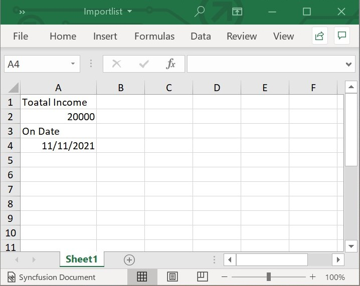

# Importing Data to Worksheets
Flutter XlsIO provides the ability to import data into a worksheet using List\<Object>.

## Import Data from List\<Object>

Using **importList** method, we can import list of data with different data types.

The following code snippet shows how to import a list of data vertically into the worksheet using **importList()** method.



// Create a new Excel Document.
final Workbook workbook = Workbook();

// Accessing sheet via index.
final Worksheet sheet = workbook.worksheets[0];

//Initialize the list<Object>
final List<Object> list = [
  'Toatal Income',
  20000,
  'On Date',
  DateTime(2021, 11, 11)
];

// Represent the starting row.
final int firstRow = 1;

// Represent the starting column.
final int firstColumn = 1;

// Represents that the data should be imported vertically.
final bool isVertical = true;

//Import the Object list to Sheet
sheet.importList(list, firstRow, firstColumn, isVertical);

sheet.autoFitColumn(1);

// Save and dispose workbook.
final List<int>? bytes = workbook.saveAsStream();
File('Importlist.xlsx').writeAsBytes(bytes!);
workbook.dispose();



The following screenshot represents the Excel file generated by vertically importing data from a List<Object> into the Excel worksheet using the Flutter XlsIO.

The following code snippet shows how to import a list of data horizontally into the worksheet using **importList()** method.



// Create a new Excel Document.
final Workbook workbook = Workbook();

// Accessing sheet via index.
final Worksheet sheet = workbook.worksheets[0];

//Initialize the list<Object>
final List<Object> list = [
  'Toatal Income',
  20000,
  'On Date',
  DateTime(2021, 11, 11)
];

// Represent the starting row.
final int firstRow = 1;

// Represent the starting column.
final int firstColumn = 1;

// Represents that the data should be imported horizontally.
final bool isVertical = false;

//Import the Object list to Sheet
sheet.importList(list, firstRow, firstColumn, isVertical);

sheet.getRangeByIndex(1, 1, 1, 4).autoFitColumns();

// Save and dispose workbook.
final List<int>? bytes = workbook.saveAsStream();
File('Importlist.xlsx').writeAsBytes(bytes!);
workbook.dispose();



The following screenshot represents the Excel file generated by horizontally importing data from a List<Object> into the Excel worksheet using the Flutter XlsIO.

